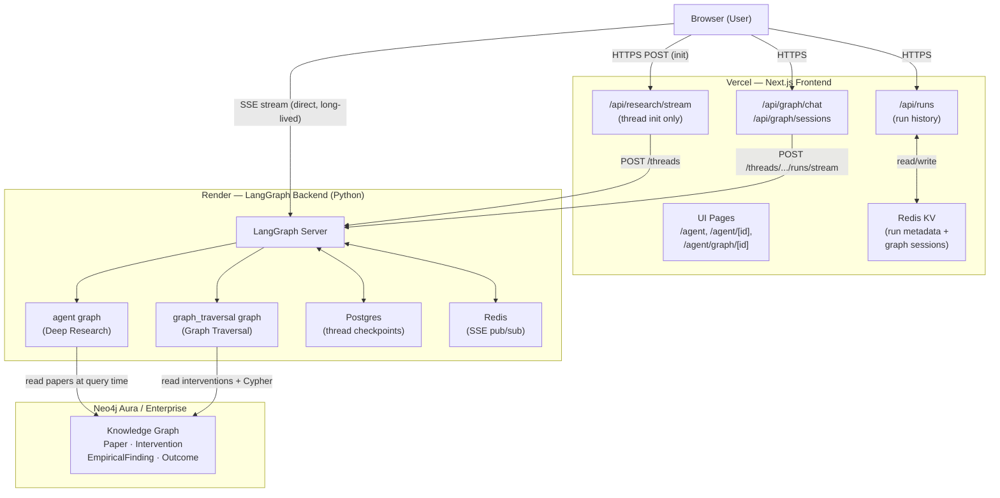
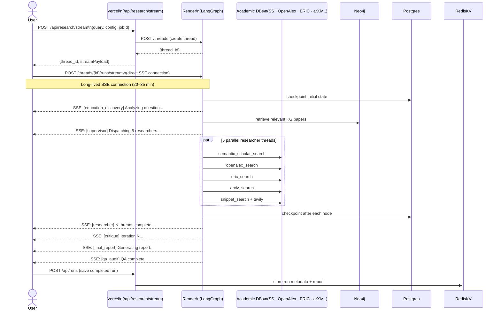
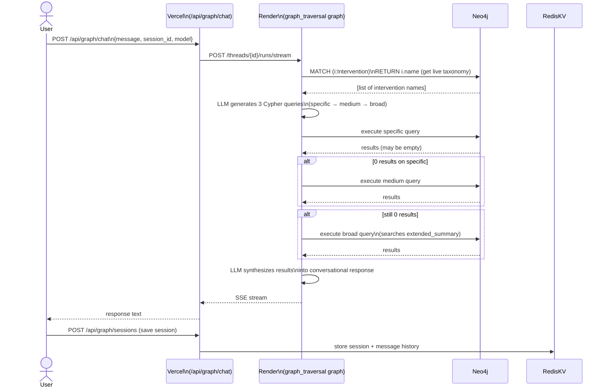
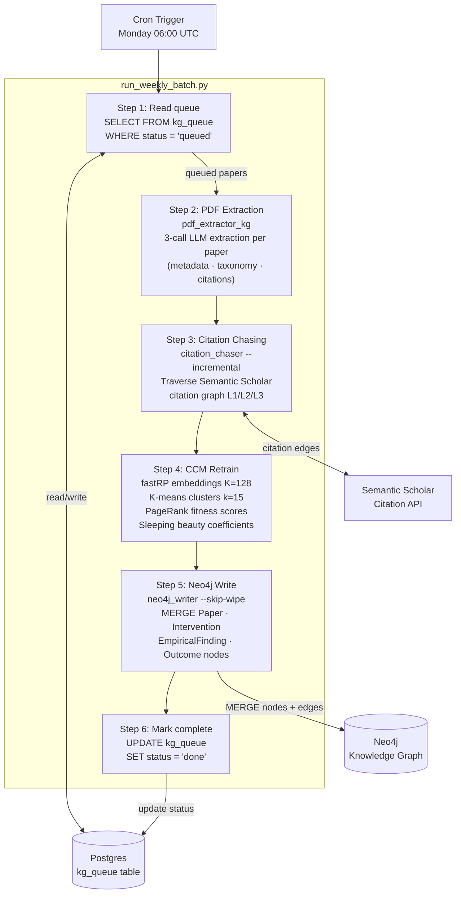
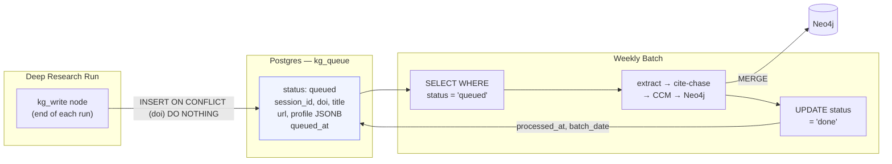
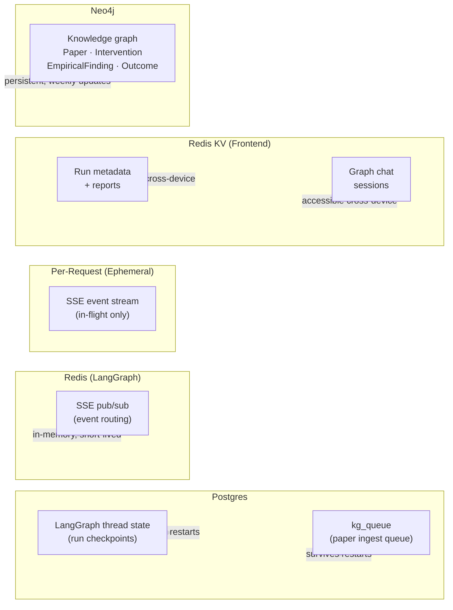

# EduAgent — Architecture Diagrams

---

## Diagram 1: High-Level System Overview

---

## Diagram 2: Deep Research Run — Request Flow

---

## Diagram 3: Graph Traversal — Request Flow

---

## Diagram 4: Weekly KG Batch Pipeline

---

## Diagram 5: Paper Queue Flow (Research Run → Weekly Batch)

---

## Diagram 6: Data Persistence Overview

---

## Component Summary

| Component | Current Host | Role |
|---|---|---|
| Next.js Frontend | Vercel | UI, API proxy, run history |
| LangGraph Backend | Render | Deep Research + Graph Traversal execution |
| Postgres | Render add-on | LangGraph checkpoints + KG ingest queue |
| Redis (backend) | Render add-on | LangGraph SSE pub/sub |
| Redis KV (frontend) | Vercel KV | Run metadata + graph session history |
| Neo4j | AuraDB (→ Gates Enterprise) | AI-in-education knowledge graph |
| Weekly Batch | Manual (→ Render Cron / Nomad periodic) | KG update pipeline |
