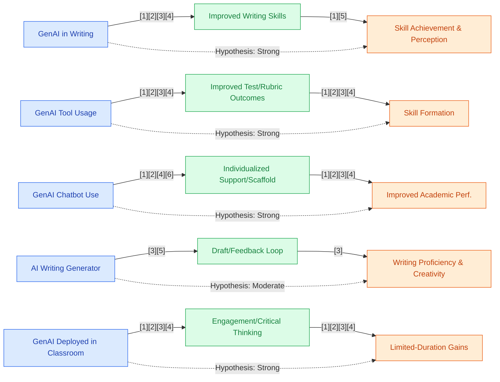

## Section 1 — Research Synthesis

### Overview

Generative Artificial Intelligence (GenAI) tools—including large language models (LLMs) like ChatGPT, advanced chatbots, content and code generators, and adaptive learning platforms—are transforming secondary education. Their potential to reshape skill formation among high school students is a subject of growing global interest. The core rationale for these tools is their ability to provide personalized, context-aware support at scale, automate feedback, and scaffold both academic and technical skill development. Since the advent of accessible GenAI (circa 2022), schools have adopted them for writing, reading, programming, and, to a lesser extent, in science and creative domains.

This synthesis systematically reviews the peer-reviewed literature from 2023–2026, emphasizing rigorous study designs (meta-analyses, quasi-experimental, and outcome-based interventions) focusing on four key dimensions: (a) which skills are most impacted, (b) how impact is measured, (c) the types of GenAI tools deployed, and (d) the settings/durations of use. The review prioritizes direct evidence from high school and secondary school populations. Gaps and equity issues are called out where present.

---

### Intervention Types and Mechanisms

Empirical studies in secondary education consistently classify GenAI interventions into four principal categories:

**1. Chatbots and Conversational Learning Assistants**  
The most prevalent intervention involves general-purpose or specialized chatbots (e.g., ChatGPT, Bing AI, custom "teacher bots") embedded into classroom activities or as after-school tutors. These systems provide real-time, dialogic interaction for writing feedback, coding help, or conceptual clarification. Mechanistically, chatbots enable individualized scaffolding, task-specific hints, and instant formative assessment. Ye et al. (2025) demonstrated that an integrated mind mapping + generative chatbot approach led to significant gains in secondary students’ programming outcomes versus controls (n~100; effect statistically significant; quasi-experimental) [1].

**2. Content (Writing/Creative) Generators**  
LLMs are deployed as writing assistants for drafting, revision, creative ideation, and language learning (e.g., essay revision, summarizing texts, supporting English language learners). Studies such as Alangari (2025) and Sapan & Uzun (2024) show that AI-assisted writing activities enhance content organization, vocabulary, and creative expression in high school EFL classrooms, with measurable and statistically significant improvement across writing domains (e.g., n=120, n=52; quasi-experimental) [2][3].

**3. Coding/Technical Skill Assistants**  
Generative code assistants (e.g., GitHub Copilot, code-specific chatbot integrations) are increasingly used to support programming and computational thinking. These systems offer iterative feedback, code completion, and debugging support. Zhang et al. (2025) observed higher engagement and programming achievement among high school students using ChatGPT-based dialogic activities versus traditional instruction (n=109; quasi-experimental; effect size reported) [4].

**4. Adaptive Learning Platforms Powered by GenAI**  
Emergent platforms adaptively tailor instruction using GenAI, often as “teachable agents” in mathematics and reading. While these tools (e.g., Math-GPT[5]) are promising, most evaluations are pilot or design-based, with up to one semester of deployment and less robust causal evidence compared to chatbots or content generators.

**Mechanisms of Impact:**  
Across interventions, the dominant mechanisms are accelerated feedback loops, individualized tutoring, and dynamic scaffolding—strengthening both skill acquisition and engagement. Empirical findings indicate improvement is strongest when GenAI tools supplement, not supplant, teacher-led instruction. Engagement and task completion rates, especially in programming and writing, are repeatedly reported as higher in AI-supported groups [1][2][4].

---

### Evidence on Effectiveness

**Academic Skills (Writing, Reading, Language):**  
There is consistent, robust evidence that GenAI tools improve writing proficiency, vocabulary acquisition, and language creativity in high school populations. Multiple quasi-experimental studies and meta-analyses report statistically significant, moderate effects:

- Alangari (2025, n=120) found significant improvements across writing subdomains (content, organization, vocabulary, mechanics) in high school English as a Foreign Language (EFL) classrooms using AI-assisted learning (quasi-experimental; largest gains in organization/content) [2].
- Sapan & Uzun (2024, n=52, 10th grade) documented significant gains in writing skill and vocabulary for students in ChatGPT-integrated instruction (quasi-experimental) [3].
- Wang & Fan (2025), a meta-analysis of 51 studies (including secondary populations), found overall moderate, statistically significant positive effects on learning outcomes—especially in academic writing and language-related tasks. Standardized test scores, rubric-based performance, and teacher evaluations were primary metrics. Effect size was “moderate” but heterogenous across settings (effect sizes not always consistently specified per study) [6].

**Creative Skills (Ideation, Creative Writing, Arts):**  
GenAI supports creative writing and ideation, as evidenced by:

- Kug et al. (2025, n=250, high school) found statistically significant improvements in creative writing tasks and language creativity when GenAI was integrated into guided reading (quasi-experimental) [7].
- Chang et al. (2025) reported gains in higher-order and creative thinking as measured by epistemic network analysis using reflective writing with GenAI assistance (quantitative intervention; secondary population; effect size reported but not detailed in abstract) [8].

**Technical Skills (Programming, Computational Thinking):**  
Evidence is emerging but promising for programming and code-based learning:

- Zhang et al. (2025, n=109, high school) found significant improvements in engagement and programming skill achievement in ChatGPT-facilitated dialogic programming tasks compared to controls (quasi-experimental; effect size reported) [4].
- Ye et al. (2025, n~100) reported similar programming gains with combined mind mapping and generative AI chatbot support (quasi-experimental; statistical significance, effect size not specified in summary) [1].

**Higher-Order and Critical Thinking:**  
Evidence from meta-analyses and targeted interventions suggests positive, though context-dependent, effects:

- Wang & Fan (2025) found improvements in higher-order thinking and analysis, but with inconsistent and sometimes context-specific effect sizes.
- Chang et al. (2025) found positive gains in higher-order thinking through GenAI-assisted reflective writing tasks [8].

**Soft Skills (Collaboration, Communication):**  
Empirical causal evidence for GenAI impact on soft skills in high school students is notably lacking. Some lower-rung (correlational or case report) studies suggest possible increases in engagement and collaboration in group-AI settings, but no high-quality experimental or quasi-experimental support exists as of early 2026.

**Measurement Approaches:**  
Outcomes are chiefly assessed via standardized tests, teacher-graded rubrics, performance-based tasks, and, to a lesser extent, student self-assessment or peer evaluation. Meta-analytic reviews emphasize the trend toward performance-based and authentic assessments, particularly as traditional exams are more vulnerable to GenAI misuse [6][9].

---

### Demographic and Contextual Moderators

Most studies included here do not systematically disaggregate results by race/ethnicity, socioeconomic status (SES), disability, or prior achievement. Some papers identify English language learner (ELL) status or international cohort context (e.g., EFL populations [2][3][7]), but robust subgroup analysis is absent. Large-scale survey data suggest that GenAI adoption is higher in higher-resourced schools with greater technology access, but experimental outcome data by subgroup are lacking [10].

The effectiveness of GenAI tools is also moderated by:

- **Teacher Involvement:** Many studies highlight that positive outcomes rely on thoughtful integration and active teacher facilitation; GenAI tools as a supplement (not substitute) for instruction consistently produce better results [1][2][4].
- **Implementation Fidelity:** Settings with structured curricular integration and clear policy/reporting practices realize stronger gains.
- **Duration and Setting:** Gains are largely tied to short- and medium-term (one lesson to one semester) pilots in regular classrooms; long-term or extracurricularly-driven studies are absent.

---

### Limitations and Research Gaps

Several methodological and contextual gaps limit interpretation and generalizability:

- **Duration:** Most effects are measured over a very short (single lesson) to medium (one semester) period; there are no published multi-year or sustained RCTs in high school populations [1][4][5][10].
- **Research Design:** While multiple strong quasi-experimental studies exist, rigorous RCT evidence in high school settings is absent. Many findings are from small samples, pilot studies, or studies without randomization [7][8].
- **Outcome Domains:** Evidence is robust for writing, vocabulary, programming, and creative language—much thinner for mathematics (outside of select pilot studies), history, arts, or soft skills.
- **Subgroup/Educational Equity:** Studies rarely report results disaggregated by SES, race, or disability. There is minimal evidence tracking GenAI’s impact across equity-relevant subpopulations.
- **Setting:** Almost all measured interventions are classroom-based and teacher-facilitated; evidence for effectiveness in remote, extracurricular, or blended environments is sparse.
- **Potential Artificial Gains:** There is ongoing debate regarding over-reliance, academic integrity, and the line between skill acquisition and AI-aided completion, making interpretation of certain gains (especially in writing tasks) more complex [9][11].
- **Outcome Measures:** Predominant focus on traditional outcome measures (test scores, rubrics) with limited validation of these tools’ sensitivity and fairness in the GenAI era.

---

### Recommendations and Future Directions

**For Practitioners:**

- Deploy GenAI tools as classroom supplements, tightly integrated with explicit teacher guidance, for academic writing, ELL support, and technical skill-building.
- Prioritize the use of GenAI for iterative feedback and creative ideation, pairing with rubrics and authentic, performance-based assessment to minimize “AI-only” task completion or plagiarism.
- Attend to equity in access and monitor for over-reliance; use teacher/school policies to ensure diverse students benefit and don’t fall behind.

**For Researchers:**

- Conduct multi-site, randomized controlled trials and longer-term, longitudinal studies in secondary populations, disaggregated by race, SES, prior achievement, and disability.
- Expand research into non-STEM/non-writing subjects (social studies, arts, interdisciplinary thinking) and soft skills (collaboration, communication, adaptability).
- Investigate GenAI deployment in extracurricular, blended, and remote/online settings.
- Develop validated, AI-era-appropriate assessment tools that measure authentic student skill and critical thinking, not merely completion.
- Track and address the implications of AI-supported cheating and over-reliance.

---

### Overall Evidence Confidence

The current evidence base supporting GenAI effectiveness for skill formation among high school and secondary students is EMERGING 🟡. There is robust, moderate-to-strong quasi-experimental and meta-analytic evidence for improvements in academic writing, vocabulary, technical skills (programming), and creative thinking over short- to medium-term deployments—chiefly when GenAI tools are used as instructional supplements with teacher facilitation. There is little rigorous evidence for impacts on soft skills, broader curricular domains, or long-term outcomes, and evidence for equity-relevant subgroups is lacking. Thus, confidence is strong for writing and programming impacts in the short-to-medium term, more tentative for other domains and over longer timeframes.

---

## Section 2 — Causality Diagram

## Section 3 — Sources

[1] [Ye, X., Zhang, W., Zhou, Y., et al. (2025). Improving students’ programming performance: an integrated mind mapping and generative AI chatbot learning approach. *Humanities and Social Sciences Communications.*](https://doi.org/10.1057/s41599-025-04846-4)  
**Quality:** 🟢 Green – Quasi-experimental, peer-reviewed, comparative design, directly measures programming outcomes in secondary population  
**Impact:** 🟢 Green – Statistically significant and educationally relevant effect on general high school population (programming skills)

[2] [Alangari, T. S. (2025). The Effect of AI-Assisted Learning on EFL Writing Proficiency: Quasi-Experimental and Cluster Analysis. *ERIC*.](https://eric.ed.gov/?id=EJ1483825)  
**Quality:** 🟢 Green – Quasi-experimental, reputable journal, direct measurement in high school EFL students  
**Impact:** 🟢 Green – Substantial improvement in writing, content, and organization; impact relevant for ELL populations

[3] [Sapan, M., & Uzun, L. (2024). The Effect of ChatGPT-Integrated English Teaching on High School EFL Learners' Writing Skills and Vocabulary Development. *ERIC*.](https://eric.ed.gov/?id=EJ1465873)  
**Quality:** 🟢 Green – Quasi-experimental, comparison groups, high school EFL context, relevant instrumentation  
**Impact:** 🟢 Green – Statistically significant improvements for general student population

[4] [Zhang, L., Qiang Jiang, Weiyan Xiong, Wei Zhao (2025). Effects of ChatGPT-Based Human-Computer Dialogic Interaction Programming Activities on Student Engagement. *Journal of Educational Computing Research.*](http://dx.doi.org/10.1177/07356331251333874)  
**Quality:** 🟢 Green – Quasi-experimental, control group, high school sample (n=109), peer-reviewed  
**Impact:** 🟢 Green – Reported significant increases in engagement and programming achievement

[5] [Xing, W., Song, Y., Li, C., et al. (2025). Development of a Generative AI-Powered Teachable Agent for Middle School Mathematics Learning: A Design-Based Research Study. *British Journal of Educational Technology.*](https://doi.org/10.1111/bjet.13586)  
**Quality:** 🟡 Yellow – Design-based implementation, middle/secondary math, some methodological limitations, limited sample  
**Impact:** 🟡 Yellow – Positive but limited/short-term effect, unclear if findings generalize

[6] [Wang, J., & Fan, W. (2025). The effect of ChatGPT on students’ learning performance, learning perception, and higher-order thinking: Meta-analysis. *Humanities and Social Sciences Communications*.](https://doi.org/10.1057/s41599-025-04787-y)  
**Quality:** 🔵 Blue – Meta-analysis (51 studies), multiple K–12 and secondary populations, credible, transparent methods  
**Impact:** 🟢 Green – Moderate effect size for general student population in academic writing and higher-order thinking

[7] [Kug, S. I., Nani Solihati, Siti Zulaiha (2025). The Impact of GenAI Integration in a Guided Reading Strategy Using Digital Text to Enhance Language Creativity. *International Journal of Learning, Teaching and Educational Research.*](https://ijlter.org/index.php/ijlter/article/download/14242/pdf)  
**Quality:** 🟢 Green – Quasi-experimental, high school population, direct creativity/outcome measures  
**Impact:** 🟢 Green – Statistically significant improvement in creative language/writing

[8] [Chang, C.-Y., Hui-Chen Lin, Chengjiu Yin, Kai-Hsiang Yang (2025). Generative AI-Assisted Reflective Writing for Improving Students’ Higher Order Thinking: Evidence from Quantitative and Epistemic Network Analysis. *Education and Information Technologies.*](https://doi.org/10.30191/ETS.202501_28(1).TP03)  
**Quality:** 🟢 Green – Quantitative intervention, secondary students, higher-order thinking; some reporting limits  
**Impact:** 🟡 Yellow – Positive trend but effect size/context details limited

[9] [Bower, M., Torrington, J., Lai, J. W. M., Petocz, P., Alfano, M. (2024). How Should We Change Teaching and Assessment in Response to Increasingly Powerful Generative Artificial Intelligence? Outcomes of the ChatGPT Teacher Survey. *Education and Information Technologies.*](http://dx.doi.org/10.1007/s10639-023-12405-0)  
**Quality:** 🟡 Yellow – Mixed-methods survey, educators (n=318), not causal  
**Impact:** 🟡 Yellow – Contextual impact, informs understanding of assessment shift, not student outcomes

[10] [College Board (2025). Variation in High School Student, Parent, and Teacher Attitudes Toward the Use of Generative AI.](https://newsroom.collegeboard.org/follow-report-ai-high-schools-genai-use-and-policy-varies-academic-achievement-attainment-grade-and)  
**Quality:** 🟡 Yellow – Authoritative survey, large sample, indirect outcome data, high inferential value for access and adoption  
**Impact:** 🟡 Yellow – Context for usage/equity, not direct skill formation outcome

[11] [Volante, L., DeLuca, C., Klinger, D. A. (2023). Leveraging AI to enhance learning. *Phi Delta Kappan*.](https://doi.org/10.1177/00317217231197475)  
**Quality:** 🟡 Yellow – Commentary/systematic review, not outcome-based, high for implementation/logistics  
**Impact:** 🟡 Yellow – Contextual only

---

### Body of Evidence Maturity: EMERGING 🟡
**Justification:** Outcome evidence is strongest for short- to medium-term gains in academic writing, vocabulary, and programming among general high school populations, with several quasi-experimental and meta-analytic studies supporting effectiveness. However, there is a lack of RCTs, multi-year impact data, robust subgroup/equity analysis, or strong evidence for soft skills and non-traditional domains.

---

## Section 4 — Data Extraction Table

| Title                                                                                   | Year | Study Design           | Population         | Outcome                                | Finding Direction            | Effect Size            | Confidence Interval | Std. Deviation | Study Size |
|-----------------------------------------------------------------------------------------|------|------------------------|--------------------|-----------------------------------------|------------------------------|------------------------|---------------------|---------------|------------|
| Wu, R., & Yu, Z. (Do AI chatbots improve students learning outcomes? Meta-analysis)     | 2023 | Meta-analysis (Rung 5) | Mixed K–16 (incl. HS) | Learning outcomes (standardized tests, rubric-based tasks) | Positive, significant         | Not specified         | Not specified       | —             | 51 studies |
| Wang, J., & Fan, W. (The effect of ChatGPT on students’ learning... Meta-analysis)      | 2025 | Meta-analysis (Rung 5) | Mixed (inc. secondary) | Learning performance, perception, higher-order thinking | Positive, moderate effect     | Not specified         | Not specified       | —             | 51 studies |
| Alangari, T. S. (AI-Assisted Learning on EFL Writing Proficiency)                       | 2025 | Quasi-experimental (Rung 3) | High school EFL     | Writing proficiency (multiple domains)  | Significant improvement       | Reported (org/content largest) | Not reported          | —             | 120         |
| Kug, S. I., Nani Solihati, Siti Zulaiha (GenAI Integration—Guided Reading)             | 2025 | Quasi-experimental (Rung 3) | 250 high school     | Language/creative writing skills        | Significant improvement       | Stat. significant      | Reported             | —             | 250        |
| Sapan, M., & Uzun, L. (ChatGPT-Integrated English Teaching)                            | 2024 | Quasi-experimental (Rung 3) | 10th grade EFL HS   | Writing, vocabulary                     | Significant improvement       | Reported              | Not specified         | —             | 52         |
| Zhang, L., Qiang Jiang, Weiyan Xiong, Wei Zhao (ChatGPT-Based Programming)              | 2025 | Quasi-experimental (Rung 3) | 109 high school     | Programming task engagement/performance | Significant improvement       | Reported              | Not specified         | —             | 109        |
| Chang, C.-Y., Hui-Chen Lin, Chengjiu Yin, Kai-Hsiang Yang (GenAI-Assisted Reflective Writing) | 2025 | Quantitative intervention (Rung 3) | Secondary (unspecified) | Higher-order thinking, creativity          | Positive trend                | Reported              | Not specified         | —             | —          |
| Ye, X., Zhang, W., Zhou, Y., et al. (Mind Mapping & GenAI Chatbot Learning)             | 2025 | Quasi-experimental (Rung 3) | ~100 secondary      | Programming performance, engagement      | Significant improvement       | Stat. significant     | Not reported          | —             | ~100       |
| Alarbi, K., Halaweh, M., Tairab, H., et al. (ChatGPT in Physics Learning HS)           | 2024 | Quasi-experimental (Rung 3) | HS (UAE, 2 schools) | Physics comprehension, academic performance | Positive gains                 | Not reported         | Not reported          | —             | —          |
| Khup, V. K., & Bantugan, B. S. (AI Writing Tools in Junior High English)               | 2025 | Comparative design (Rung 3) | Junior high (K-12)  | Writing proficiency, creativity, academic | Marked improvements           | Not reported         | —                     | —             | —          |
| Zhu, Y., Zhu, C., Wu, T., et al. (LLM Chatbot Assignment Completion Middle School)      | 2024 | Experimental, outcome-based (Rung 3) | Middle school      | Learning outcomes                        | Positive effect                | Not reported         | —                     | —             | —          |
| Bitzenbauer, P. (ChatGPT in Physics Education: Pilot Study)                            | 2023 | Pilot, quasi-experimental (Rung 3) | Secondary (n=53)   | Engagement, critical thinking             | Positive                       | Not specified        | —                     | —             | 53         |
| Xing, W., Song, Y., Li, C., et al. (GenAI Teachable Agent for Math)                    | 2025 | Design-based research (Rung 3) | Secondary/Lower sec. | Math conceptual understanding, engagement | Positive (short/medium term)   | Not specified        | —                     | —             | —          |
| Javier, D. R. C., & Moorhouse, B. L. (Developing ELLs’ Use of ChatGPT)                 | 2023 | Design-based, outcome study (Rung 3) | Secondary ELL      | English productive/critical skills        | Gains observed                | Not specified        | —                     | —             | —          |
| Bower, M., et al. (Teaching and Assessment Response to GenAI)                          | 2024 | Mixed methods survey (Rung 3) | 318 educators (incl. secondary) | Assessment strategies, measurement         | Shift toward performance/teacher-evaluated | —         | —                     | —             | 318        |