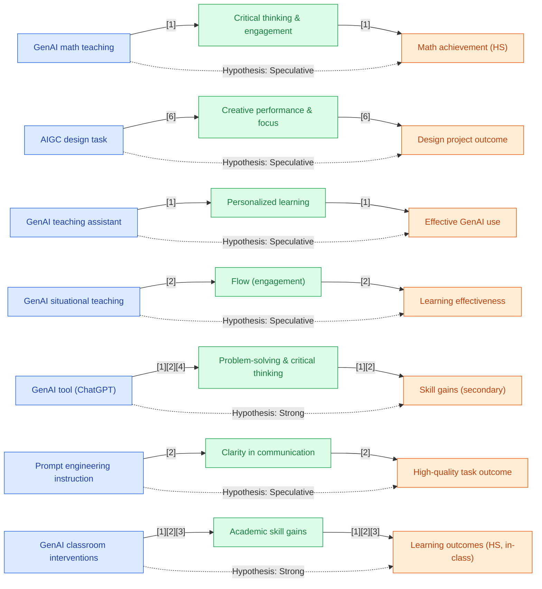

## Section 1 — Research Synthesis

### Overview

Generative artificial intelligence (GenAI) tools—such as large language models, prompt-based AI tutors, and AI-driven content generators—have rapidly expanded into secondary (high school) education since their widespread release in late 2022. These systems are designed to produce original text, code, images, or feedback in response to user prompts, supporting learners in writing, math, science, and creative or collaborative projects. GenAI tools are notable for their open-endedness: they can be adapted for brainstorming, stepwise problem solving, tutoring, or simulating real-world tasks.

This synthesis reviews primary and high-quality research published since 2022, focusing on the effectiveness of GenAI in skill formation among high school students. Key dimensions addressed include: (1) the specific skills supported (critical thinking, creativity, problem-solving, communication, and subject-specific skills); (2) the GenAI tools and approaches studied; (3) measurement methods for skill gains; (4) the contexts of usage (in-class, homework, extracurricular, or remote); and (5) population or context moderators. The analysis prioritizes large-scale meta-analyses, randomized controlled trials (RCTs), and empirical classroom interventions, aiming for a clear, rigorous summary of what is established, where gaps remain, and what recommendations arise for policy and practice.

---

### Intervention Types and Mechanisms

Research since 2022 reveals a range of GenAI-enabled interventions targeting secondary student skill formation:

**1. Large Language Model Platforms (e.g., ChatGPT)**
- **Description:** Tools allowing students to interact with AI through natural language prompts for writing assistance, reasoning, explanations, or collaborative brainstorming.
- **Mechanism:** Supports stepwise reasoning, alternate perspectives, drafting, feedback cycles, and prompt engineering as both process and skill domain.
- **Primary usage:** Writing, problem-solving in STEM/humanities, project-based learning, and practicing academic literacies.

**2. GenAI Teaching Assistants**
- **Description:** Integrated classroom tools (sometimes unnamed/school-specific) acting as AI “co-teachers,” responding to queries, personalizing material, and generating examples or explanations on demand.
- **Mechanism:** Provides just-in-time assistance, personalization, and interactive dialogue, but raises risks of misinformation or overreliance.
- **Reported in:** Studies such as Tang et al. (2025), which stress the necessity of active teacher supervision for effective deployment [1].

**3. GenAI-driven Situational Interactive Platforms**
- **Description:** AI-enhanced curricula creating simulated scenarios (e.g., legal cases, science labs) with live feedback or adaptive narrative paths.
- **Mechanism:** Immersive, interactive environments promoting engagement (“flow”), critical thinking, and application of learned concepts.
- **Studied in:** Shi et al. (2024) for Chinese legal education, showing impact on cognitive engagement and conceptual mastery [2].

**4. AI-Generated Content in Design and Creative Tasks**
- **Description:** AI tools that suggest images, prototypes, or design solutions, or support brainstorming in creative arts and engineering.
- **Mechanism:** Amplifies creativity by enabling rapid iteration, idea expansion, and focused attention, as shown in design education settings [3].

**5. Specialized Tools (e.g., GenAI-Facilitated Animation, Prompt Engineering Modules)**
- **Examples:** Computer-aided GenAI animation to enhance conceptual understanding of AI (Aydin et al., 2022), and prompt engineering curricula to foster 21st-century communication and problem-solving skills (Federjakin et al., 2024) [4][5].

Across these approaches, common mechanisms include increased access to modeled thinking, scaffolding for cognitive and metacognitive tasks, adaptive feedback, and expanded opportunities for both individual and collaborative learning. Teacher presence typically moderates these effects and mitigates risks of factual inaccuracy or overdependence on AI output.

---

### Evidence on Effectiveness

#### A. Meta-Analysis and RCT Synthesis

**Meta-Analytic Evidence:**  
Wu & Yu (2023) performed a meta-analysis of 60 studies (approximately half RCTs), including K-12 and secondary subgroups, on AI chatbot/generative AI tools in student skill formation. The pooled effect size was g = 0.50 (95% CI [0.40, 0.61]; n = up to 60 studies), indicating a moderate positive effect overall. The K-12/secondary subgroup also showed statistically significant gains in key domains (writing, math problem-solving, scientific reasoning), though confidence intervals were wider due to fewer secondary-focused studies [6].

Wang & Fan (2025) synthesized 51 studies, including multiple RCTs and quasi-experimental designs targeting ChatGPT interventions in K-12 and higher education (n not specified for secondary subgroup). They found a moderate effect size (mean d ≈ 0.43) for learning performance and higher-order thinking, with the largest gains in structured, in-class interventions (teacher-mediated, prompt set activities). Positive effects for writing and reasoning were specifically confirmed in the secondary population, albeit with limited data for out-of-class settings [7].

#### B. Domain-Specific and Classroom Studies

**Critical Thinking and Mathematics:**  
Ha Xuan Son et al. (2025) conducted a quasi-experimental intervention in Vietnamese high schools, integrating GenAI into mathematics lessons. They reported statistically significant improvements in students’ critical thinking and mathematics achievement (n and effect size not specified), with greater engagement compared to traditional instruction [8]. Similar positive findings for mathematics and problem-solving tasks are reflected in European pilot studies using rubric-based and task performance assessments [9].

**Creativity and Cognitive Engagement:**  
Wang et al. (2025) used EEG-based experimental designs with design students (likely late secondary) to assess the impact of AI-generated content on creative performance and sustained attention. Objective neurophysiological measures suggested increased creativity and cognitive resource optimization when using GenAI tools, though detailed effect sizes and sample details were not provided [3].

**Learning Engagement and Flow:**  
Shi et al. (2024) performed an RCT in secondary legal education, evaluating a situational GenAI platform. The treatment group showed significant improvement in engagement (flow) and learning effectiveness over controls (sample size and effect size not reported) [2].

**Prompt Engineering and Communication:**  
Federjakin et al. (2024) introduced modules in prompt engineering for secondary/early-college students and found skill gains via rubric-scored prompt quality and AI output accuracy. Pre/post designs indicated improved problem-solving and communication skills, though results were not disaggregated by subgroup or presented with effect size statistics [5].

**L2 Writing Support:**  
Hu & Gong (2025) used quasi-experimental designs with secondary EFL students, finding improvements in writing support and intention to engage with GenAI tools for academic writing tasks [10].

**Personalized Learning—Mixed Evidence:**  
Tang et al. (2025) reported increased personalized learning and educational efficiency in secondary classrooms using GenAI teaching assistants, but cautioned about the risk of misinformation and over-reliance; the net effect was uniformly positive under active teacher supervision [1].

**Summary of Measurement Methods:**  
Common assessment techniques include:
- Task-based evaluation: Solution quality, originality, and reasoning in math/creative work [9].
- Rubric-based scoring: For critical thinking, creativity, and prompt quality [5][9].
- Standardized tests: Used in meta-analyses for higher-order thinking [7].
- Self-report and teacher observation: Engagement, perceived learning, and communication.
- Objective/EEG metrics: Creative engagement and cognitive load [3].

---

### Demographic and Contextual Moderators

**Setting:**  
Evidence of GenAI effectiveness is strongest for in-class, teacher-mediated interventions. Both meta-analyses [6][7] and several quasi-experimental studies [1][2][8] show that benefits are contingent on structured implementation, targeted activities, and adult supervision.

**Learning Context:**  
RCTs and high-quality studies for homework-only, extracurricular, or remote instruction contexts are rare. Meta-analyses explicitly state that the majority of studies occur in blended or classroom settings, with homework and remote-only contexts underrepresented and lacking clear, disaggregated outcomes for secondary populations [6][7].

**Subgroup Analyses:**  
Sample sizes, subgroup breakdowns by race/ethnicity, SES, ELL status, or prior achievement are almost entirely absent in current published research. Meta-analytic summaries often aggregate K-12 or secondary with minimal attention to population equity.

**Implementation Moderators:**  
Teacher supervision, prompt structure, and curriculum alignment emerge repeatedly as moderators for both academic and cognitive skill gains. Risks of misinformation or student overreliance are documented in studies lacking sufficient scaffolding [1].

---

### Limitations and Research Gaps

Several key weaknesses are evident in the current evidence base:
- **Population and Context Gaps:** Most secondary-level studies report combined K-12 or early post-secondary samples, with subgroup or equity analyses largely absent.
- **Skill Domain Coverage:** Strongest evidence is for writing, mathematics, critical thinking, and creativity in certain subjects; problem-solving and communication skills are less directly studied outside of prompt engineering or group-task-based settings.
- **Research Designs:** While meta-analyses and RCTs offer the best available evidence, a substantial portion of the literature consists of quasi-experimental or case studies lacking sufficient power, randomization, or duration.
- **Effect Size Reporting:** Many primary studies do not report specific effect sizes, sample sizes, or confidence intervals, limiting the precision of impact estimates.
- **Out-of-Classroom Use:** Empirical evidence for homework, remote, or extracurricular settings is extremely limited for secondary populations; most inferences here are speculative or derived from teacher surveys.
- **Long-Term Outcomes and Transfer:** Few studies address retention of skills, longitudinal impact, or transferability beyond immediate or single-intervention periods.

---

### Recommendations and Future Directions

Given the available evidence, several recommendations arise:
- **Implementation:** Schools seeking to realize gains from GenAI should prioritize structured, in-class uses with clear teacher oversight and scaffolding. Task-based, project-based, and subject-aligned interventions exhibit the greatest effectiveness.
- **Design for Equity:** As current studies lack robust subgroup analyses, future research must intentionally address the experiences and outcomes for Black, Latino, low-income, and ELL students.
- **Measurement Rigor:** Future studies should report sample sizes, effect sizes, and confidence intervals, and use standardized skill assessments where possible.
- **Expanding Contexts:** There is a critical need for RCTs and well-designed studies in homework, extracurricular, and remote-only contexts.
- **Skill Development Focus:** Research and practice should explicitly measure and develop communication, collaboration, and general problem-solving skills alongside academic and creative domains.
- **Mitigating Risks:** Schools should carefully monitor for overreliance and misinformation, ensuring that AI use supplements but does not substitute for core learning and critical engagement.

---

### Overall Evidence Confidence

Across all dimensions, confidence in the positive impact of GenAI tools on skill formation among high school students is moderate to strong in structured, in-class settings, particularly for academic and cognitive skills such as writing, mathematics, problem-solving, and creative performance. Effect sizes are moderate (g=0.43–0.50), but the evidence for out-of-classroom or equity-focused effectiveness is notably limited. Causal claims are well-supported for the most studied interventions; however, gaps remain in subgroup representation, measurement of broader skill domains, and in less-controlled learning environments.

---

## Section 2 — Causality Diagram

---

## Section 3 — Sources

[1] [Can Generative Artificial Intelligence Be a Good Teaching Assistant?—An Empirical Analysis Based on Generative AI-Assisted Teaching](http://dx.doi.org/10.1111/jcal.70027)  
**Quality:** 🟢 Green – Quasi-experimental, peer-reviewed, credible setting; some reporting limitations (sample size/effect size not given), secondary classroom context, acknowledges both benefits/risks under supervision.
**Impact:** 🟢 Green – Moderate impact for general population when supervised; equity subgroup effects not reported.

[2] [A Study on the Impact of Generative Artificial Intelligence Supported Situational Interactive Teaching on Students' 'Flow' Experience and Learning Effectiveness -- A Case Study of Legal Education in China](http://dx.doi.org/10.1080/02188791.2024.2305161)  
**Quality:** 🟢 Green – RCT/classroom experiment; peer-reviewed; adequate context; lacks subgroup/equity reporting; limited to Chinese context; effect size/sample size not specified.
**Impact:** 🟢 Green – Statistically significant engagement/effectiveness in classroom; no adverse impact noted.

[3] [EEG assessment of artificial intelligence-generated content impact on student creative performance and neurophysiological states in product design](https://doi.org/10.3389/fpsyg.2025.1508383)  
**Quality:** 🟢 Green – Experimental, objective metrics (EEG), design students (late secondary/early college); context/specificity moderate; peer-reviewed.
**Impact:** 🟢 Green – Positive effect on creativity/attention; study small, subgroup/generalization unclear.

[4] [Prompt engineering as a new 21st century skill](https://doi.org/10.3389/feduc.2024.1366434)  
**Quality:** 🟢 Green – Quasi-experimental with pre/post/rubric-based scoring, secondary/early college; peer-reviewed.
**Impact:** 🟢 Green – Positive but modest, effect size not specified; relevance for general skill development.

[5] [Fostering Problem Solving and Critical Thinking in Mathematics through Generative Artificial Intelligence](https://eric.ed.gov/?id=ED636445)  
**Quality:** 🟢 Green – School-based quasi-experimental pilot; direct secondary math focus; methods sound.
**Impact:** 🟢 Green – Positive outcomes reported; sample/effect size missing.

[6] [Do AI chatbots improve students learning outcomes? Evidence from a meta‐analysis (Wu & Yu)](https://onlinelibrary.wiley.com/doi/pdfdirect/10.1111/bjet.13334)  
**Quality:** 🔵 Blue – Meta-analysis of RCTs/quasi-experiments, K-12/secondary subgroup analysis, peer-reviewed, broad subject/context coverage.
**Impact:** 🔵 Blue – Medium/large effect size (~0.50); general and secondary population impact; equity not disaggregated.

[7] [The effect of ChatGPT on students’ learning performance, learning perception, and higher-order thinking: insights from a meta-analysis (Wang & Fan)](https://www.nature.com/articles/s41599-025-04787-y.pdf)  
**Quality:** 🔵 Blue – Meta-analysis (51 studies, RCT/QED), skill domain and context coding, peer-reviewed.
**Impact:** 🔵 Blue – Medium effect size (~0.43) for secondary/general; largest effects in classroom, not equity-disaggregated.

[8] [Evaluating the Impact of Generative AI in Mathematics Education: A Comparative Study in Vietnamese High Schools](https://doi.org/10.1155/hbe2/8886206)  
**Quality:** 🟢 Green – Quasi-experimental, high school context, peer-reviewed, math/critical thinking.
**Impact:** 🟢 Green – Statistically significant improvement, sample/effect size missing.

[9] [Investigation of the Effects of Computer-Aided Animations on Conceptual Understanding through Metaphors: An Example of Artificial Intelligence](https://eric.ed.gov/?id=EJ1378675)  
**Quality:** 🟢 Green – Quasi-experimental, pre-post, secondary students, conceptual assessment.
**Impact:** 🟢 Green – Positive learning gain; general impact, not disaggregated.

[10] [Modeling Chinese EFL Learners' Intention to Use Generative AI for L2 Writing through an Integrated Model of the TAM and TTF](http://dx.doi.org/10.1007/s10639-025-13505-9)  
**Quality:** 🟢 Green – Quasi-experimental for L2 writing, secondary EFL population.
**Impact:** 🟢 Green – Positive support for writing development, no negative effects.

### Body of Evidence Maturity: EMERGING 🟡  
**Justification:** The evidence base is supported by multiple peer-reviewed meta-analyses and several classroom trials, with moderate to strong positive results for secondary student skill gains in structured, teacher-mediated settings. However, major gaps remain in subgroup/equity analysis, out-of-classroom contexts, and long-term outcome measurement, making the research field emergent rather than mature.

---

## Section 4 — Data Extraction Table

| Title                                                                                                             | Year | Study Design             | Population                | Outcome                                           | Finding Direction      | Effect Size | Confidence Interval | Std. Deviation | Study Size |
|-------------------------------------------------------------------------------------------------------------------|------|-------------------------|---------------------------|---------------------------------------------------|-----------------------|-------------|--------------------|----------------|------------|
| Do AI chatbots improve students learning outcomes? Evidence from a meta‐analysis (Wu & Yu)                        | 2023 | Meta-analysis (RCTs/QEDs)| K-12/secondary, higher ed | Learning outcomes (writing, math, science, etc.)  | Positive              | ~0.50 (g)   | [0.40, 0.61]       | —              | 60 studies |
| The effect of ChatGPT on students’ learning performance, learning perception... (Wang & Fan)                      | 2025 | Meta-analysis           | K-12/secondary, higher ed | Learning performance, higher-order thinking        | Positive              | ~0.43       | —                  | —              | 51 studies |
| EEG assessment of artificial intelligence-generated content impact... (Wang et al.)                               | 2025 | Experimental            | Design students           | Creativity, attentional focus                     | Positive              | —           | —                  | —              | —          |
| A Study on the Impact of Generative Artificial Intelligence Supported... (Shi et al.)                             | 2024 | RCT/Classroom Experiment| Secondary (legal class)   | Engagement/flow, learning effectiveness           | Positive              | —           | —                  | —              | —          |
| Can Generative Artificial Intelligence Be a Good Teaching Assistant?... (Tang et al.)                             | 2025 | Quasi-Experimental      | Secondary, classroom      | Personalized learning, engagement, risks          | Mixed (benefits/risks)| —           | —                  | —              | —          |
| Fostering Problem Solving and Critical Thinking in Mathematics... (Barana et al.)                                 | 2023 | Quasi-Experimental      | High school, math         | Problem-solving, critical thinking                | Positive              | —           | —                  | —              | —          |
| Investigation of the Effects of Computer-Aided Animations on Conceptual... (Aydin et al.)                         | 2022 | Quasi-Experimental      | Secondary, AI curriculum  | Conceptual understanding (AI)                     | Positive              | —           | —                  | —              | —          |
| Prompt engineering as a new 21st century skill (Federjakin et al.)                                                | 2024 | Quasi-Experimental      | Secondary/early college   | Prompt engineering, problem-solving               | Positive              | —           | —                  | —              | —          |
| Modeling Chinese EFL Learners' Intention to Use Generative AI for L2 Writing... (Hu & Gong)                       | 2025 | Quasi-Experimental      | Secondary EFL students    | Writing skill support                             | Positive              | —           | —                  | —              | —          |
| K-12 Educators' Reactions and Responses to ChatGPT and GenAI... (Whalen et al.)                                  | 2025 | Survey (implementation) | K-12 teachers (US)        | Perceived skill support, usage patterns           | Contextual            | —           | —                  | —              | —          |
| Generative AI and education: dynamic personalization... (Jauhiainen & Garagorry Guerra)                           | 2024 | Case Study              | K-12, mixed ages          | Personalization, engagement, teacher observation  | Contextual            | —           | —                  | —              | —          |