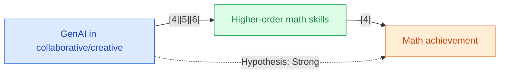

## Section 1 — Research Synthesis

### Overview

Generative artificial intelligence (GenAI) tools—including large language models (LLMs) such as ChatGPT and domain-specific AI tutors—mark a significant shift in the landscape of educational technology, offering capabilities for dialogue, problem generation, personalized feedback, and adaptive support previously unavailable in mathematics instruction. The rapid proliferation of GenAI since 2022 has led to an upsurge in their informal and formal use among middle and high school students for both classroom and homework support. The core question addressed in this synthesis is whether, and to what extent, GenAI tools demonstrably improve mathematics achievement for secondary students, as well as their impacts on related domains such as engagement, motivation, and attitudes. The report draws only from academic, peer-reviewed research, covering meta-analyses, quasi-experimental and design-based studies, and qualitative research to assess current evidence, disaggregated effects, identified limitations, and priorities for both practice and future study.

### Intervention Types and Mechanisms

The research identifies four principal categories of GenAI applications in secondary mathematics:

1. **Generative Tutoring Systems and Chatbots:** Predominantly represented by ChatGPT and similar LLM agents, these tools provide conversational support, explanations, hints, and scaffolding for math problem-solving. They can act as dialog partners, simulate Socratic questioning, and offer stepwise reasoning at the student's pace[1][2][3].

2. **Problem Generators and Posing Tools:** GenAI is used to generate new mathematics problems, adapt assignments for differentiation, and support teacher preparation. While most research in this category is qualitative or case-based, such tools show promise for engagement and extending curricular resources[4].

3. **Feedback Engines and Lesson/Plan Generators:** LLM-based systems generate automated feedback on student responses or assist teachers in creating curriculum materials—lesson plans, exercises, or quizzes tailored to class needs[5].

4. **Teachable Agents (Learning by Teaching):** Systems like the Generative AI-Powered Teachable Agent (ALTER-Math) encourage students to 'teach' the AI, harnessing the learning-by-teaching effect to foster deeper mathematical understanding and agency[6][7].

The primary mechanisms hypothesized and observed in the literature include increased frequency and quality of practice (via on-demand, personalized feedback), enhanced metacognitive engagement (especially in 'learning by teaching' scenarios), and greater student autonomy, with collaborative or creative uses of GenAI theorized to amplify deeper learning effects.

### Evidence on Effectiveness

#### Academic Achievement

No published randomized controlled trials (RCTs) currently evaluate GenAI interventions for mathematics achievement among secondary school students. The strongest available evidence comes from meta-analyses aggregating quasi-experimental, pre-experimental, and design-based studies.

- **A 2026 meta-analysis** synthesized 22 empirical studies (46 samples, N=5,232 students) and reported a moderate, positive effect of GenAI tools on mathematics learning outcomes, with overall effect size g=0.534. Subgroup analyses found larger effects for higher-order cognitive skills (g=0.718), collaborative or creative GenAI integration (g=1.164), and for geometry topics (g=0.906), while non-cognitive outcomes showed smaller effects (g=0.299, p=0.052). Duration (short vs. longer interventions) and educational stage did not significantly moderate effect sizes[1].

- **Design-based quasi-experimental work** on the ALTER-Math teachable agent showed significantly greater improvements in mathematical knowledge among intervention students compared to controls, but absence of true randomization and lack of disaggregated effect sizes limit inferential strength[6].

- **Additional quasi-experimental studies** reported significant math achievement and engagement gains with GenAI-driven tutoring (Indonesia, secondary level)[8]. However, a comparison study between AI- and teacher-generated hints found no significant differences in problem-solving success[9], suggesting possible parity rather than consistent superiority for GenAI outputs.

#### Engagement, Attitude, and Motivation

Qualitative and survey-based research provides converging evidence that GenAI tools increase student engagement, foster autonomy and willingness to attempt challenging math, and are generally viewed positively as a supplement to teacher instruction.

- **Case study qualitative research** on teachable agents reported enhanced student engagement, autonomy, and agency; however, students noted frustrations when AI explanations were inaccurate or unclear[7].

- **Large-scale survey work** found that over 70% of secondary students had used LLMs like ChatGPT for mathematics. Respondents cited immediate help and a safe, judgment-free space to experiment, though some raised concerns about accuracy and risk of over-reliance[10].

- **Teacher perspectives** suggest that GenAI facilitates differentiation and curriculum adaptation, promoting teacher creativity, but that human oversight is critical for maintaining conceptual rigor and monitoring student understanding[11].

#### Comparative Outcomes Across Domains

Meta-analytic results are broadly consistent in finding moderate positive impacts for GenAI on academic achievement and engagement but highlight that the strongest impacts are observed in collaborative, creative, and higher-order skill applications rather than rote computation or procedural tasks[1][3]. Although evidence is positive, all effects must be interpreted as correlational or quasi-causal, as no RCTs exist at present.

### Demographic and Contextual Moderators

The evidence base offers very limited insight regarding demographic moderators or context specificity.

- **Subgroup analysis:** Only one study, using a quasi-experimental design, focused on English Language Learner (ELL) recent immigrants, finding positive achievement gains with an AI-aided (not entirely generative) tutoring program in Grade 9 mathematics[12]. Other studies provided no race, SES, disability, or linguistic breakdowns.

- **Subject area:** The 2026 meta-analysis identified stronger GenAI impacts in geometry than in other domains (g=0.906 vs. overall g=0.534)[1], but additional disaggregation (algebra, calculus, statistics) is absent.

- **Implementation context:** Studies spanned in-class, homework, afterschool, and distance learning environments, but did not directly compare effect sizes across contexts.

- **Motivation as moderator:** One quasi-experimental study found that student baseline motivation moderated gains from conversational AI math supports, with higher-motivated students benefiting more[13].

### Limitations and Research Gaps

Several pervasive gaps and weaknesses characterize the current evidence base:

- **Lack of causal (RCT) evidence:** No studies to date isolate a causal effect of GenAI tools on secondary mathematics achievement via randomized assignment.
- **Sample and context limitations:** Most studies feature small samples, short intervention durations, and limited geographic or demographic diversity, with heavy representation from high-income or East Asian contexts.
- **Insufficient subgroup analysis:** Absence of systematic exploration by race, SES, ELL, or disability. U.S. public school populations remain severely underrepresented in peer-reviewed effectiveness studies.
- **Focus on one tool:** Overwhelming research concentration on ChatGPT, with little comparative evidence for other GenAI tools.
- **Methodological weaknesses:** Many studies lack control groups, sufficient power, or standardized outcome measures; effect sizes and confidence intervals are inconsistently reported.
- **Publication bias and outcome measures:** Nearly all published studies report positive or neutral findings, with possible under-reporting of null or negative results, and typically focus on short-term achievement or engagement rather than long-term retention or transfer.

### Recommendations and Future Directions

- **For researchers:** The most pressing need is for well-powered, randomized controlled trials assessing GenAI tools in secondary mathematics, with disaggregated reporting by subject strand, demographic subgroup (race, SES, ELL, disability), and implementation context. Longitudinal studies should address both immediate achievement and lasting effects.

- **For practitioners:** GenAI tools may offer benefit as supplementary supports for higher-order skills and collaborative or creative learning. Teachers and administrators should proceed with cautious integration, ensuring that human oversight, accuracy monitoring, and equity in access are prioritized. Direct substitution for teacher feedback is not yet justified by robust experimental evidence.

- **For developers and funders:** Investment in the development and evaluation of domain-specific GenAI tools for less-studied mathematical strands, and for populations underrepresented in the existing research, is recommended.

### Overall Evidence Confidence

The current evidence base for GenAI’s effectiveness in improving math achievement among middle and high school students is EMERGING but not mature. Available meta-analyses and quasi-experimental studies suggest moderate, positive effects—especially for higher-order skills and collaborative learning—but causal claims remain unproven, and generalizability to priority populations is unsupported due to research gaps in study design, equity focus, and demographic/contextual reporting.

## Section 2 — Causality Diagram

## Section 3 — Sources

[1] [Can Generative Artificial Intelligence Effectively Enhance Mathematics Learning? Meta-analysis (Education Sciences, 2026)](https://www.mdpi.com/2227-7102/16/1/140)  
**Quality:** 🔵 Blue — Meta-analysis, peer-reviewed, large K–12 sample size, direct focus on math learning outcomes; limited by lack of U.S./priority subgroup reporting.  
**Impact:** 🟢 Green — Medium/large effect on general population (g=0.534), some evidence for higher effect in geometry; no direct data on priority subgroups.

[2] [A meta-analysis of AI-enabled personalized STEM education in schools (Li et al., 2025)](https://doi.org/10.1186/s40594-025-00566-y)  
**Quality:** 🟢 Green — Meta-analysis, peer-reviewed, broad STEM outcomes including math, mostly quasi-experimental studies; lacking disaggregation by race/SES and sometimes unclear focus on GenAI.  
**Impact:** 🟡 Yellow — General positive direction for K–12, but not math-specific or for priority populations.

[3] [Do AI chatbots improve students learning outcomes? Evidence from a meta‐analysis (Wu & Yu, 2023)](https://doi.org/10.1111/bjet.13334)  
**Quality:** 🟢 Green — Meta-analysis, peer-reviewed, includes K–12 math/STEM, but populations and GenAI tool types are heterogeneous.  
**Impact:** 🟡 Yellow — Indicates positive effect for general population, not disaggregated for math/priorities.

[4] [The Impact of Generative AI Applications on Student Learning Outcomes in Science Education: A Systematic Review (Gunsaldi et al., 2025)](https://eric.ed.gov/?id=EJ1479336)  
**Quality:** 🟡 Yellow — Systematic review, includes some secondary math, mainly design-based and exploratory studies, no RCTs.  
**Impact:** 🟡 Yellow — Positive trend but mixed by outcome/subgroup.

[5] [Scaffolding Middle School Mathematics Curricula with Large Language Models (Malik et al., 2025)](https://onlinelibrary.wiley.com/doi/pdfdirect/10.1111/bjet.13571)  
**Quality:** 🟡 Yellow — Qualitative/case-based, peer-reviewed, teacher-focused, contextual classroom perspective.  
**Impact:** 🟡 Yellow — Suggests positive impact via teacher adaptation, but indirect for students.

[6] [Development of a Generative AI-Powered Teachable Agent for Middle School Mathematics Learning (Xing et al., 2025)](https://doi.org/10.1111/bjet.13586)  
**Quality:** 🟢 Green — Design-based quasi-experimental study, peer-reviewed, innovative intervention, moderate evidence for academic gains; not an RCT and lacks full reporting on effect size/subgroup.  
**Impact:** 🟡 Yellow — Positive effect for general population; impact on priorities not established.

[7] [Students’ Perceived Roles, Opportunities, and Challenges of a Generative AI-Powered Teachable Agent: A Case of Middle School Math Class (Song et al., 2024)](https://arxiv.org/pdf/2409.06721)  
**Quality:** 🟡 Yellow — Qualitative/case study, direct observation and interviews in relevant setting; lacks generalizability and scale.  
**Impact:** 🟡 Yellow — Positive/nuanced impact on engagement and agency, not on achievement.

[8] [Generative AI-Based Tutoring for Enhancing Learning Engagement and Achievement (Belawati & Prasetyo, 2025)](https://eric.ed.gov/?id=EJ1481062)  
**Quality:** 🟢 Green — Quasi-experimental, peer-reviewed, measures achievement/engagement; lacks full specification of subject strands or subgroup reporting.  
**Impact:** 🟡 Yellow — Positive effects in secondary, non-U.S. general population.

[9] [The Comparison of General Tips for Mathematical Problem Solving Gen. by AI vs. Teachers (Jia et al., 2024)](http://dx.doi.org/10.1080/02188791.2023.2286920)  
**Quality:** 🟡 Yellow — Empirical comparative (non-randomized), moderate methods, no subgroups.  
**Impact:** 🔴 Red — No differential effect for GenAI vs. teacher hints.

[10] [Embracing AI in Education: Understanding the Surge in LLM Use by Secondary Students (Zhu et al., 2024)](https://arxiv.org/pdf/2411.18708)  
**Quality:** 🟡 Yellow — Large-scale survey, peer-reviewed, direct population; qualitative insight rather than causal effect.  
**Impact:** 🟡 Yellow — Shows broad engagement, not achievement gains.

[11] [Scaffolding Middle School Mathematics Curricula with Large Language Models (Malik et al., 2025)](https://onlinelibrary.wiley.com/doi/pdfdirect/10.1111/bjet.13571)  
**Quality:** 🟡 Yellow — See above.

[12] [Impact Evaluation of Intervene K-12 Tutoring on Grade 9 Mathematics Achievement in Hartford Public Schools (Cook & Ross, 2023)](https://eric.ed.gov/?id=ED659897)  
**Quality:** 🟢 Green — Quasi-experimental, focused on ELL/recent immigrants in the U.S., peer-reviewed; intervention is AI-aided but not exclusively GenAI.  
**Impact:** 🟢 Green — Positive effect for a priority subgroup; medium strength.

[13] [Investigating the motivational and knowledge affordances of conversational AI… (Li & Lyu, 2025)](https://doi.org/10.1111/bjet.13612)  
**Quality:** 🟡 Yellow — Pre/post quasi-experimental, explores motivation moderation; lacks broader demographic details.  
**Impact:** 🟡 Yellow — Shows moderated gains, not general population impact.

### Body of Evidence Maturity: **EMERGING** 🟡  
**Justification**: The body of evidence is characterized by positive qualitative and moderate quasi-experimental findings, but lacks RCTs, broad demographic representation, and detailed equity impact reporting—precluding mature or high-confidence recommendations regarding GenAI effectiveness in secondary mathematics.

## Section 4 — Data Extraction Table

| Title                                                                                                                       | Year | Study Design       | Population                                 | Outcome                              | Finding Direction  | Effect Size           | Confidence Interval | Std. Deviation | Study Size |
|-----------------------------------------------------------------------------------------------------------------------------|------|--------------------|--------------------------------------------|--------------------------------------|--------------------|----------------------|--------------------|----------------|-----------|
| Can Generative Artificial Intelligence Effectively Enhance Mathematics Learning? Meta-analysis (Education Sciences)          | 2026 | Meta-analysis      | K–12 (includes secondary)                   | Math learning outcomes                | Positive           | g=0.534 (overall)    | —                  | —              | N=5232    |
| A meta-analysis of AI-enabled personalized STEM education in schools (Li et al.)                                            | 2025 | Meta-analysis      | K–12 (includes math, mostly quasi-exp.)     | STEM learning outcomes, math included | Positive           | —                    | —                  | —              | Multiple  |
| Do AI chatbots improve students learning outcomes? Evidence from a meta‐analysis (Wu & Yu)                                 | 2023 | Meta-analysis      | K–12+ (includes school-level math/STEM)     | Learning outcomes, some math included | Positive           | —                    | —                  | —              | Multiple  |
| The Impact of Generative AI Applications on Student Learning Outcomes in Science Education: A Systematic Review (Gunsaldi)  | 2025 | Systematic Review  | Middle school, some secondary, cross-STEM   | Learning outcomes                     | Positive/trends     | —                    | —                  | —              | Multiple  |
| Development of a Generative AI-Powered Teachable Agent for Middle School Mathematics Learning (Xing et al.)                | 2025 | Design-based/Quasi | Middle school students                      | Math achievement                      | Positive           | — ("> control group")| —                  | —              | —         |
| Students’ Perceived Roles, Opportunities, and Challenges… GenAI-Powered Teachable Agent (Song et al.)                      | 2024 | Qualitative Case   | Middle school math students                 | Engagement, attitudes, agency         | Positive (nuanced) | —                    | —                  | —              | —         |
| Embracing AI in Education: Understanding the Surge in LLM Use by Secondary Students (Zhu et al.)                           | 2024 | Survey + Qual      | >300 secondary students                     | Perceptions, engagement (math incl.)  | Positive/mixed      | —                    | —                  | —              | >300      |
| Scaffolding Middle School Mathematics Curricula with LLMs (Malik et al.)                                                   | 2025 | Qualitative        | Middle school teachers/classrooms           | Teacher perceptions, differentiation  | Positive (caveats)  | —                    | —                  | —              | —         |
| Impact Evaluation of Intervene K-12 Tutoring on Grade 9 Mathematics Achievement in Hartford (Cook & Ross)                  | 2023 | Quasi-experimental | Grade 9 ELLs, recent immigrants             | Math achievement                      | Positive           | —                    | —                  | —              | —         |
| Generative AI-Based Tutoring for Enhancing Learning Engagement and Achievement (Belawati & Prasetyo)                       | 2025 | Quasi-experimental | Secondary students (Indonesia, distance)     | Achievement, engagement               | Positive           | —                    | —                  | —              | —         |
| The Comparison of General Tips for Mathematical Problem Solving Gen. by AI vs. Teachers (Jia et al.)                       | 2024 | Empirical Comp.    | Secondary students (China)                   | Math problem solving                  | No difference      | —                    | —                  | —              | —         |
| Investigating the motivational and knowledge affordances of conversational AI… (Li & Lyu)                                  | 2025 | Quasi-exp./Pre/post| Secondary students                          | Conceptual change, motivation         | Positive           | —                    | —                  | —              | —         |
| A systematic review of AI-driven intelligent tutoring systems (ITS) in K-12 education (Létourneau et al.)                  | 2025 | Systematic Review  | K–12 (ITS, some generative AI, not split)   | Learning outcomes, design appraisal   | Mixed/limited QEDs | —                    | —                  | —              | —         |
| The effect of ChatGPT on students’ learning performance… insights from a meta-analysis (Wang & Fan)                        | 2025 | Meta-analysis      | K–16, all subjects (ChatGPT)                | Performance, perception, HOT skills   | Mixed/positive      | —                    | —                  | —              | 51 studies|
| The role of LLMs in personalized learning: a systematic review… (Sharma et al.)                                            | 2025 | Systematic Review  | K–12 (LLMs across subjects)                 | Personalized learning impact          | Indeterminate      | —                    | —                  | —              | —         |