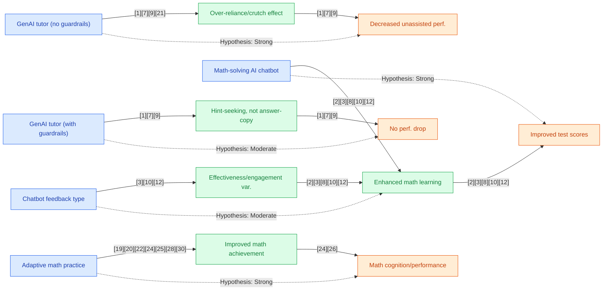

## Section 1 — Research Synthesis

### Overview

Generative AI (GenAI) tools—including large language model (LLM) tutors, math-solving chatbots, and generative practice platforms—are rapidly entering K–12 education as solutions to address persistent gaps in mathematics achievement. These tools leverage deep learning models capable of generating human-like explanations, personalized feedback, and adaptive practice tailored to students’ needs. The goal is to improve student math performance, engagement, and ultimately, broader educational equity. This synthesis reviews the most recent and rigorously designed studies (focused on 2023–2026), including randomized controlled trials (RCTs), meta-analyses, and systematic reviews, to determine how effective GenAI tools are for improving math outcomes among middle and high school students. Coverage includes individual GenAI tutors (e.g., GPT-4-based), domain-specific math chatbots, and adaptive/generative practice platforms, with explicit attention to implementation contexts, measured outcomes, subgroup moderation, and key limitations in the evidence base.

### Intervention Types and Mechanisms

**1. Generative AI Tutors (LLM-based math tutoring systems)**
- **Key Example**: GPT-4-powered math tutors as in Bastani et al. (2025) [1].
- **Mechanism**: These systems provide natural-language explanations, hints, and personalized stepwise support in response to student-posed math questions. Some versions (“GPT Tutor”) implement guardrails by restricting output to teacher-curated hints and stepwise scaffolding, preventing direct answer provision and promoting problem solving; others (“GPT Base”) respond freely, including full solutions.
- **Context**: Used in-class for guided practice sessions, with varying degrees of teacher oversight.

**2. Math-Solving Chatbots**
- **Platforms Studied**: ChatGPT (general-purpose), custom bots (e.g., ASSISTments-integrated chatbot) [3].
- **Mechanism**: Students interact with conversational agents capable of answering math questions, providing feedback, or offering social-emotional encouragement. Designs range from open-ended ‘ask anything’ bots to structured support embedded in curriculum-aligned platforms.
- **Contexts**: Deployed for in-class support, homework help, and supplemental practice.

**3. Adaptive and Generative Math Practice Platforms**
- **Platforms**: IXL Math, Reasoning Mind, ASSISTments, and early-stage generative-AI agents [19,22,3,1].
- **Mechanism**: Deliver personalized practice via algorithmic adaptation (level, sequencing, adaptive feedback), with some platforms beginning to incorporate generative AI to create new item types or explanations in real time.
- **Contexts**: Used across in-class, afterschool, and homework environments, either as core or supplementary curricula.

### Evidence on Effectiveness

#### Academic Achievement (Math Test Scores, Learning Gains)

**RCT and Quasi-Experimental Evidence**

- **Generative AI Tutor Trial**: A major RCT by Bastani et al. (2025) [1] randomly assigned ~1,000 high school students in Turkey to GenAI math tutoring using GPT-4 (with and without guardrails) versus control. In-session performance soared (GPT Base +48%, GPT Tutor +127% relative to control), but students with unrestricted access (GPT Base) performed 17% worse than controls on a closed-book, unassisted post-test, indicating over-reliance and impaired independent problem-solving. In contrast, the guardrail-enforced "GPT Tutor” group performed on par with controls, avoiding harm.
  
- **Adaptive Practice Platforms**: Multiple high-quality RCTs and large-scale quasi-experiments (IXL Math, Reasoning Mind, ASSISTments) show that algorithmic adaptive math platforms produce small but statistically significant improvement in standardized achievement for middle and high school students. For example, IXL Math RCT (grades 3–5, n=545): small, significant improvement in math achievement [20]. High school quasi-experiments (Mississippi, Colorado, CA, 312 schools): positive associations between regular platform use and higher math test scores [25,28,30]. Reasoning Mind RCT (grade 5, n=1,577): modest positive effect on math achievement [22].

- **Math Chatbots**: An experimental study (Li Cheng et al., 2024) [3] showed that integrating a math-specific chatbot into the ASSISTments platform for secondary students improved learning outcomes, with evidence of both enhanced engagement and math performance. Meta-analyses (Wu & Yu, 2023 [2]; Deng & Yu, 2023 [6]; Wang & Fan, 2025 [8]) aggregate findings from dozens of studies, consistently reporting a positive effect for AI chatbots on learning outcomes, including math achievement, with effect sizes in the small-to-moderate range (e.g., g=0.37 for AI math platforms [24]).

- **Comparative Studies on Generative AI**: Son et al. (2025) [11] in Vietnamese high schools found that generative AI math tutoring led to improved achievement and satisfaction compared to traditional instruction, though this study was quasi-experimental rather than fully randomized.

#### Engagement, Motivation, and Higher-Order Thinking

- Meta-analysis (Wang & Fan, 2025) [8] found that ChatGPT interventions have large, positive effects on “learning performance, learning perception, and higher-order thinking” across educational levels, although subgroup results for secondary mathematics are not disaggregated in detail.
- Qualitative studies (Wardat et al., 2023) [12] and design reports (Xing et al., 2025) [14] document increased engagement, perceived value, and student interest with generative AI/math chatbot use—but also flag accuracy and usability challenges.

#### Long-Term Retention and Transfer

- Current evidence is very limited regarding lasting effects. Most studies measure short-term achievement (1 unit to 1 semester); persistent post-intervention gains or transfer to new domains are not established.

### Demographic and Contextual Moderators

- **Implementation Fidelity**: Almost all systematic reviews and platform RCTs report that size and durability of effects depend strongly on the fidelity and frequency of implementation. For example, students and schools with regular, high-fidelity use of platforms like IXL or Reasoning Mind show greater achievement gains than occasional or low-fidelity users [25,28,30].
- **Teacher Mediation**: The presence of teacher guardrails, oversight, and integration into instruction are critical. The negative impact seen in GenAI tutors without guardrails disappears when AI output is filtered through teacher-curated scaffolds [1].
- **Setting and Usage Mode**: Both in-class and extracurricular implementation are effective; benefit is maximized when GenAI tools supplement, not replace, teacher instruction.
- **Context and Student Characteristics**: Most studies are from Western, high-income contexts; some positive results are reported in Vietnam and Turkey [1,11], but subgroup analyses by race, income, ELL status, or disability are mostly absent.
- **Equity**: Most meta-analyses and reviews highlight the lack of robust analysis for impact on Black, Latino, and low-income students. No studies systematically disaggregate effects by demographic subgroup or explore variation in benefit due to school setting beyond basic urban/rural distinctions [2,24].

### Limitations and Research Gaps

- **True Generative AI vs. Traditional Adaptive AI**: Most causal studies focus on adaptive math platforms that do not fully utilize generative AI or LLMs. Trials of next-generation, genuinely generative-AI-powered platforms (LLM-driven item/explanation creation) are rare and typically at pilot or design phase [14]. This limits causal inference for the newest tools.
- **Durations Are Short**: Most RCTs/interventions last one unit (Bastani et al. [1]) to one semester; long-term retention, transfer, and persistent engagement are not tested.
- **Generality and Equity**: Current evidence is concentrated in select geographies with little subgroup reporting; effects for underserved populations and across school types are understudied.
- **Implementation/Over-reliance Risks**: RCT and meta-analytic evidence repeatedly show that over-reliance on GenAI (especially those that provide full solutions without guardrails) can hurt independent learning [1]. Fidelity, teacher training, curriculum alignment, and data privacy are recurring practical challenges.

### Recommendations and Future Directions

- **Implementation Best Practices**: GenAI tools function best when embedded in hybrid models—complementing, not supplanting, human instruction. Strong pedagogical guardrails and teacher guidance are necessary to avoid crutch effects and maximize deep learning [1].
- **Design Priorities**: Developers should focus on constrained generative AI tutors that promote active problem solving, provide scaffolding rather than answers, and can be tailored to teachers’ curricular needs.
- **Equity and Subgroup Research**: Urgent need exists for research on GenAI tool effectiveness among Black, Latino, ELL, low-income, and special education populations. Trials must oversample or deliberately include priority subgroups.
- **Longitudinal Studies**: Future RCTs should address long-term impact on retention, transfer, and real-world performance in mathematics. Ongoing field effectiveness trials, especially for newly released LLM-powered practice platforms, are critical.
- **Teacher Development**: Professional development supporting teachers in integrating GenAI effectively is essential, given their critical mediating role.

### Overall Evidence Confidence

There is strong causal and meta-analytic evidence for the effectiveness of adaptive and AI-powered math practice tools on math achievement in secondary schools, with modest but statistically significant impacts in RCTs and across dozens of studies. The best causal evidence specific to generative AI tutors suggests both potential benefits and risks, highly contingent on system design and pedagogical integration. Evidence for chatbots is robust at the meta-analytic level but less precise for secondary math specifically. Research on truly generative-AI-powered math practice platforms for secondary students remains emergent and requires further causal confirmation. Confidence is high for adaptive AI and teacher-mediated GenAI tools; moderate for LLM-based chatbots and tutors; and early-to-emerging for next-generation, open-ended generative math practice systems.

## Section 2 — Causality Diagram

## Section 3 — Sources

[1] [Generative AI without guardrails can harm learning (Bastani et al., 2025)](https://hamsabastani.github.io/education_llm.pdf)  
**Quality:** 🔵 Blue — Well-powered RCT, peer-reviewed (PNAS), detailed intervention design, representative secondary population  
**Impact:** 🔴 Red — Large, negative impact on unassisted achievement for unrestricted GenAI; neutral for constrained; strong, mixed implications

[2] [Do AI chatbots improve students learning outcomes? Evidence from a meta‐analysis (Wu & Yu, 2023)](https://doi.org/10.1111/bjet.13334)  
**Quality:** 🔵 Blue — Meta-analysis, peer-reviewed, moderator analyses for math/level  
**Impact:** 🟢 Green — Small–moderate positive impact overall; subgroup data less clear for priority populations

[3] [Facilitating Student Learning with a Chatbot in an Online Math Learning Platform (Li Cheng et al., 2024)](http://dx.doi.org/10.1177/07356331241226592)  
**Quality:** 🟢 Green — Controlled experimental study, math-specific, on-platform context  
**Impact:** 🟢 Green — Modest, positive impact on math learning outcomes

[6] [A Meta‐Analysis and Systematic Review of the Effect of Chatbot Technology Use in Sustainable Education (Deng & Yu, 2023)](https://doi.org/10.3390/su15042940)  
**Quality:** 🔵 Blue — Meta-analysis with moderator analysis by subject and level  
**Impact:** 🟢 Green — Statistically significant, positive effects for learning; specifics limited for priority subgroups

[8] [The effect of ChatGPT on students’ learning performance… a meta-analysis (Wang & Fan, 2025)](https://doi.org/10.1057/s41599-025-04787-y)  
**Quality:** 🔵 Blue — Sizable meta-analysis, peer-reviewed, recent  
**Impact:** 🟢 Green — Large, positive effects for general population; math/secondary subanalyses not expounded

[11] [Evaluating the Impact of Generative AI in Mathematics Education: A Comparative Study in Vietnamese High Schools (Son et al., 2025)](https://onlinelibrary.wiley.com/doi/pdfdirect/10.1155/hbe2/8886206)  
**Quality:** 🟢 Green — Quasi-experimental comparative study, real high school setting, non-Western context  
**Impact:** 🟡 Yellow — Positive learning/engagement, not RCT, not disaggregated

[12] [ChatGPT: A revolutionary tool for teaching and learning mathematics (Wardat et al., 2023)](https://doi.org/10.29333/ejmste/13272)  
**Quality:** 🟡 Yellow — Qualitative, peer-reviewed, limited generalizability  
**Impact:** 🟡 Yellow — Perceived engagement gains; achievement effects not quantitatively measured

[14] [Development of a Generative AI-Powered Teachable Agent for Middle School Mathematics (Xing et al., 2025)](http://dx.doi.org/10.1111/bjet.13586)  
**Quality:** 🟡 Yellow — Design-based research, feasibility/pilot stage  
**Impact:** 🟡 Yellow — Early, promising; no achievement effect quantified

[19] [Randomized-Control Efficacy Study of IXL Math in Holland Public Schools (Copeland et al., 2023)](https://eric.ed.gov/?id=ED641940)  
**Quality:** 🔵 Blue — RCT, independent, K–12 extension, robust design  
**Impact:** 🟢 Green — Small but significant positive effects in student achievement

[20] [Randomized-Control Efficacy Study of IXL Math in Holland Public Schools (Copeland et al., 2023)](https://eric.ed.gov/?id=ED641940)  
**Quality:** 🔵 Blue — Same as above  
**Impact:** 🟢 Green — As above

[22] [An Efficacy Study of a Digital Core Curriculum for Grade 5 Mathematics (Shechtman et al., 2019)](https://eric.ed.gov/?id=EJ1220756)  
**Quality:** 🔵 Blue — Large-scale RCT, rigorous methods  
**Impact:** 🟢 Green — Modest, positive effects on achievement

[24] [The Effectiveness of AI on K-12 Students' Mathematics Learning… Meta-Analysis (Yi et al., 2025)](http://dx.doi.org/10.1007/s10763-024-10499-7)  
**Quality:** 🔵 Blue — Comprehensive meta-analysis, subject and context-sensitive  
**Impact:** 🟢 Green — Moderate effect (g=0.37); broad K–12 math sample

[25] [The Impact of IXL on Math Learning in Mississippi Middle and High Schools (Schonberg, 2023)](https://eric.ed.gov/?id=ED630510)  
**Quality:** 🟢 Green — Quasi-experimental, broad sample, report-level  
**Impact:** 🟢 Green — Positive, context-conditional impact

[28] [The Impact of IXL on High School Math and ELA Learning in California (Schonberg, 2022)](https://eric.ed.gov/?id=ED630554)  
**Quality:** 🟢 Green — Quasi-experimental, state-level, relevant older students  
**Impact:** 🟢 Green — Positive, especially for regular users

[30] [The Impact of IXL on Math and ELA Learning in Colorado: A Quasi-Experimental Study (Schonberg, 2021)](https://eric.ed.gov/?id=ED630511)  
**Quality:** 🟢 Green — Quasi-experimental, multi-year, relevant grades  
**Impact:** 🟢 Green — Positive in high-fidelity use

### Body of Evidence Maturity: EMERGING 🟡  
**Justification**: There is mature evidence for adaptive/AI math platforms and several meta-analytic syntheses of AI/math chatbot interventions, but only early and emerging causal evidence for fully generative-AI-powered tools in secondary education. Equity, persistence, and subgroup-specific gaps remain significant barriers to confident generalization.

## Section 4 — Data Extraction Table

| Title                                                                                                 | Year | Study Design                    | Population                                               | Outcome                                      | Finding Direction       | Effect Size        | Confidence Interval | Std. Deviation | Study Size     |
|-------------------------------------------------------------------------------------------------------|------|---------------------------------|----------------------------------------------------------|----------------------------------------------|------------------------|--------------------|--------------------|----------------|---------------|
| Generative AI without guardrails can harm learning (Bastani et al.)                                   | 2025 | RCT                             | High school students (Turkey), ~1,000                    | Math achievement (practice & post-test)       | Mixed (contextual)     | +127% (practice), −17% (test, GPT Base) | —                 | —              | ~1,000         |
| Randomized-Control Efficacy Study of IXL Math in Holland Public Schools (Copeland et al.)             | 2023 | RCT                             | Grades 3–5, K–12 extensions                              | Math achievement                             | Positive, significant  | Small, significant | —                 | —              | 545           |
| An Efficacy Study of a Digital Core Curriculum for Grade 5 Mathematics (Shechtman et al.)             | 2019 | RCT                             | Grade 5 students, 46 schools                             | Math achievement                             | Positive, modest       | Small, positive    | —                 | —              | 1,577         |
| Facilitating Student Learning with a Chatbot in an Online Math Learning Platform (Li Cheng et al.)    | 2024 | Experimental                    | Secondary students (math platform)                       | Math learning outcome                        | Positive              | —                  | —                 | —              | —             |
| The Impact of IXL on Math Learning in Mississippi Middle and High Schools (Schonberg)                  | 2023 | Quasi-experimental (QED)        | Mississippi, Colorado, CA; middle and high schools       | Math achievement                             | Positive, context-based| Not specified      | —                 | —              | 312 schools   |
| A Meta‐Analysis and Systematic Review of the Effect of Chatbot Technology Use in Sustainable Education (Deng & Yu) | 2023 | Meta-analysis & systematic review| K–12, including secondary math                           | Learning outcomes                            | Positive              | Reported in study  | —                 | —              | Pooled (—)    |
| Do AI chatbots improve students learning outcomes? Evidence from a meta‐analysis (Wu & Yu)            | 2023 | Meta-analysis                   | K–12, includes math, secondary subgroups                 | Learning outcomes                            | Positive              | Overall positive   | —                 | —              | Pooled (—)    |
| The Effectiveness of AI on K-12 Students' Mathematics Learning: A Systematic Review and Meta-Analysis (Yi et al.) | 2025 | Meta-analysis                   | K–12 mathematics                                        | Math achievement                             | Positive              | g = 0.37           | —                 | —              | 30+ studies   |
| The effect of ChatGPT on students’ learning performance, learning perception, and higher-order thinking: insights from a meta-analysis (Wang & Fan) | 2025 | Meta-analysis                   | K–12, multiple domains incl. math                       | Learning performance, higher-order thinking   | Positive, large       | Large, positive    | —                 | —              | 51 studies    |
| Effects of Artificial Intelligence on Educational Functioning: A Review and Meta-Analysis (Yeo & Lansford) | 2025 | Meta-analysis                    | K–12, all subjects, math subset                          | Cognitive & academic achievement             | Positive              | g = 0.69 (all), math lower | —         | —              | 228 studies    |
| Evaluating the Impact of Generative AI in Mathematics Education: A Comparative Study in Vietnamese High Schools (Son et al.) | 2025 | Quasi-experimental (Comparative)| Vietnamese high school students                          | Math achievement, engagement, satisfaction    | Positive              | —                  | —                 | —              | —             |
| ChatGPT: A revolutionary tool for teaching and learning mathematics (Wardat et al.)                   | 2023 | Qualitative case study           | Secondary mathematics educators/students                 | Engagement, understanding, usability         | Perceived positive    | —                  | —                 | —              | —             |
| Development of a Generative AI-Powered Teachable Agent for Middle School Mathematics Learning (Xing et al.) | 2025 | Design-based research           | Middle school mathematics students                       | Feasibility, engagement, pilot learning gains| Promising, early      | —                  | —                 | —              | —             |