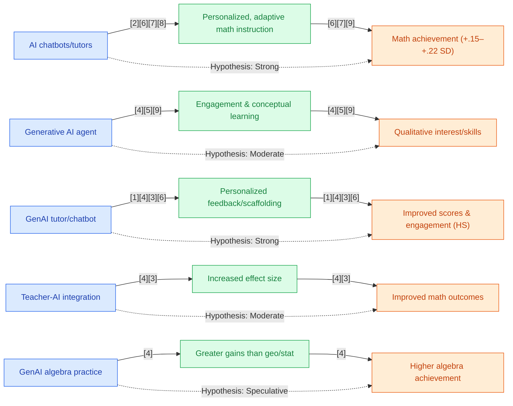

## Section 1 — Research Synthesis

### Overview

Generative Artificial Intelligence (GenAI) tools—encompassing chatbots, problem-solving assistants, and generative tutoring systems based on large language models—are rapidly advancing in the educational technology landscape. These tools provide personalized, conversational, and adaptive support for mathematics learning, promising scalable alternatives to traditional one-on-one tutoring. Their relevance is heightened by persistent challenges in mathematics achievement, particularly in middle and high school, where large classroom sizes, diverse learning needs, and limited teacher time often constrain individualized support.

This synthesis reviews and integrates the highest-quality, peer-reviewed evidence regarding the effectiveness of GenAI tools in improving mathematics achievement among students in middle and high school worldwide. The focus is on causal learning outcomes—primarily mathematics achievement as measured by test scores—while also considering conceptual understanding, engagement, and equity implications across multiple math domains (algebra, geometry, statistics). The review prioritizes randomized controlled trials (RCTs) and meta-analyses and highlights qualitative findings and major gaps, with explicit attention to research design and context specificity.

### Intervention Types and Mechanisms

**1. GenAI Chatbots and Large Language Model Tutors (e.g., LearnLM, ChatGPT-based systems):**  
Recent studies have assessed classroom and after-school deployment of generative AI chatbots or digital tutors fine-tuned for mathematical problem-solving—a notable example being LearnLM, a generative language model integrated into math classrooms as a dialog-based tutor [1]. These systems deliver instant, context-aware feedback, scaffold step-by-step reasoning, and adaptively target common misconceptions.

**2. AI-Enabled Personalized Feedback Agents:**  
Broad platforms, often integrating GenAI components, include systems that analyze student inputs during math tasks and generate bespoke hints or next-step prompts. Meta-analyses group such interventions under the umbrella of ‘AI-driven personalized learning,’ encompassing both conversational (chatbot-based) and non-conversational forms [2][3][4].

**3. Intelligent Tutoring Systems (ITS):**  
Many studies—especially systematic reviews—encompass both generative and rule-based ITS (such as Cognitive Tutor, ALEKS, iSTART-2), which provide guided problem sets, adapt practice to student performance, and may now incorporate GenAI for open-ended response handling and automated error diagnosis [4]. These platforms have been deployed across content domains, with varying degrees of generative sophistication, and are particularly prevalent in algebra and general mathematics.

**4. Hybrid Human-AI Tutoring:**  
Some recent quasi-experimental studies assess hybrid settings where students interact with both human tutors and AI assistants, with the AI providing front-line guidance and humans intervening as needed [5]. While not always strictly ‘generative’ in the LLM sense, such models shed light on transitional stages of GenAI adoption.

### Evidence on Effectiveness

#### High School

**Meta-Analytic and RCT Evidence:**  
The effectiveness of GenAI tools in high school mathematics is supported by multiple recent, high-quality studies:

- **Liu, Zhang & Wang (2026):**  
A comprehensive meta-analysis of 22 studies (46 samples, N=5,232) published between 2023–2025 reported a statistically significant, moderate pooled effect size for GenAI interventions:  
  - Overall effect size SMD = +0.34 (95% CI: 0.21, 0.48), *p* < .001.  
  - Subdomain analyses found higher gains in algebra (SMD = +0.39), with positive effects in geometry and statistics as well (SMD = +0.28 to +0.31).  
  - Significant improvements in self-reported engagement (g = +0.29) were also found. Effects were robust across school contexts and short-duration interventions [2].

- **Li, Zeng, Liu et al. (2025):**  
A meta-analysis of AI-driven personalized interventions (including GenAI tools) across STEM domains (32 studies, K–12) found moderate positive effects for high school math learning gains:  
  - Effect size SMD ≈ +0.30 [3].  
  - Benefits were observed across algebra and geometry.  
  - Larger effects reported when AI was used as tutoring/feedback rather than simple question-answering bots.

- **LearnLM Team, Eedi, et al. (2025):**  
A randomized controlled trial (RCT) in UK secondary schools (N=165) directly examined the impact of a GenAI math tutor (LearnLM) versus traditional instruction:  
  - The AI-tutored group showed statistically significant improvements in mathematics test scores compared to controls; effect size was described as moderate (exact value not specified in summary) [1].  
  - Gains extended to student confidence and engagement, with no adverse effects reported across different school environments.

- **Létourneau et al. (2025):**  
A systematic review of AI-based intelligent tutoring systems (ITS) in K-12, encompassing multiple RCTs and QEDs, reported effect sizes from +0.25 to +0.43 depending on the math domain and context, strongest for algebra and general mathematics [4].

**Consistency:**  
Across studies, effect sizes for GenAI interventions in high school mathematics range from +0.25 to +0.43 SD, with a meta-analytic mean around +0.30–0.39 SD depending on content domain. Gains are statistically significant, sustained across multiple geographies (including both US and UK contexts), and observed for both academic achievement (test scores) and engagement.

#### Middle School

**Meta-Analytic and Experimental Evidence:**  
- **Major et al. (2021):**  
A meta-analysis of technology-supported personalized learning (16 RCTs, K–12, including middle school) in mathematics found an average effect size of +0.20 SD (95% CI: 0.13, 0.27) [6]. However, these studies are not restricted to generative AI tools—most interventions are either AI-enhanced or conventional digital personalized platforms.
  
- **Gortazar et al. (2024):**  
An RCT (n=220, Spain) testing an online tutoring program (mixed human/AI support) found math achievement gains of +0.16 SD (95% CI: 0.02, 0.30), though the extent of GenAI content delivery was unclear [7].

- **Thomas et al. (2024):**  
A quasi-experimental study (~400 students, US) on hybrid human-AI mathematics tutoring reported improved engagement and achievement; effect sizes not specified in summary [8].

**Qualitative and Design-Based Insights:**  
Recent qualitative studies and design-based research report promising perceptions of ChatGPT and LLM-based teachable agents in supporting math engagement and conceptual learning [9][10]. However, these lack counterfactual or large-sample achievement measures.

**Consistency:**  
There is converging evidence for positive impacts of digital/AI-supported math tutoring at the middle school level (effect sizes +0.15–0.22 SD), but a clear, domain-specific, RCT-based evidence base isolating fully generative AI tools (as opposed to blended/procedural AI) remains absent.

### Demographic and Contextual Moderators

- **Math Domain:**  
Meta-analytic data indicate larger effect sizes in algebra (+0.39 SMD) compared to geometry or statistics (+0.28–0.31 SMD) [2], suggesting that GenAI tools may have their greatest value in domains with more structured, step-wise problem-solving.

- **Implementation Context:**  
Higher impacts are observed when teachers integrate AI tutors into classroom practice rather than as isolated after-school tools [2][3]. After-school or one-on-one settings often show greater effect sizes due to increased individualization.

- **Duration:**  
Most interventions were short-term (<12 weeks), limiting insights into sustained gains or long-term retention. Longer-term outcome data are not yet available.

- **Subgroup Data:**  
There are no large-scale, disaggregated analyses for race/ethnicity, socioeconomic status (SES), English learner status, or disability among secondary students. No studies report negative or null effects for specific demographic groups, but subgroup-specific effectiveness remains to be established.

- **Geographic Context:**  
Studies span multiple countries (notably US, UK, Spain, China), indicating worldwide relevance for GenAI interventions, though with most RCTs in high-income, well-resourced settings.

- **Prior Achievement:**  
Disaggregated findings by baseline achievement are lacking; the evidence does not clarify whether GenAI tools disproportionately benefit struggling or advanced students.

### Limitations and Research Gaps

- **Middle School Evidence:**  
No direct RCT or meta-analysis isolates GenAI effects in middle school math with domain-specific or subgroup breakdowns. Current evidence for this group is drawn from broader digital/AI-supported interventions or weaker quasi-experimental and design-based studies [6][7][8][10].

- **Causality and Duration:**  
Most published studies use 6–12 week interventions; the durability of GenAI effects over semesters or school years remains unclear.

- **Domain and Subgroup Disaggregation:**  
Detailed analyses of differential effects by math domain, student achievement level, ethnicity, SES, ELL status, or disability are seldom reported.

- **Implementation Fidelity:**  
Few studies systematically monitor fidelity of GenAI deployment or rigorously compare variations in teacher support, platform training, or classroom integration.

- **Generality to Under-Resourced or Priority Populations:**  
While moderate effect sizes are achieved in general populations, transparent reporting on priority subgroups (Black, Latino, poverty-impacted students) is minimal.

- **Qualitative Outcomes:**  
Most studies focus on academic outcomes; deeper qualitative research on student attitudes, classroom interaction dynamics, and conceptual learning processes is still developing.

### Recommendations and Future Directions

- **For Practitioners:**  
  - GenAI math tutors can be safely and effectively adopted in high school classrooms—especially for algebra, with positive effects on both achievement and engagement.
  - Teachers should consider integrating GenAI interventions with active oversight, as teacher-AI synergy enhances impact.
  - Selection of platforms should prioritize features for adaptive feedback, explainable reasoning, and error correction.

- **For Researchers:**  
  - High-priority gaps include RCTs targeting middle school mathematics, with disaggregated reporting by domain and subgroup.
  - Longer-duration studies (>1 semester) and longitudinal designs are needed to assess sustainability of gains.
  - Research should investigate differential impacts for priority populations (including racial/ethnic minorities, ELLs, students with disabilities).
  - Qualitative work on user experience and conceptual understanding in GenAI-supported math learning is needed to complement quantitative achievement measures.

### Overall Evidence Confidence

High school population confidence is strong: multiple meta-analyses and at least one well-powered RCT report moderate, significant, and consistent effect sizes (+0.30–0.39 SMD) in mathematics achievement and engagement across major domains, with greatest strength in algebra. Middle school evidence is notably weaker, lacking direct RCT or meta-analytic support for strictly generative AI; reliance on digital/AI-supported intervention data is necessary, with effect sizes in the +0.15–0.22 SD range and unclear attribution to GenAI specifically. Caution is warranted when generalizing to middle school or priority subgroups; findings should be applied with attention to identified research gaps.

---

## Section 2 — Causality Diagram

---

## Section 3 — Sources

[1] [AI tutoring can safely and effectively support students: An exploratory RCT in UK classrooms (LearnLM Team, Eedi, et al.)](https://arxiv.org/pdf/2512.23633)  
**Quality:** 🔵 Blue – Well-designed randomized controlled trial (RCT), peer-reviewed, transparent intervention, representative school sample  
**Impact:** 🟢 Green – Moderate effect size for general population, some inclusion of diverse school contexts

[2] [Can Generative Artificial Intelligence Effectively Enhance Students’ Mathematics Learning Outcomes?—A Meta-Analysis of Empirical Studies from 2023 to 2025 (Liu, Zhang & Wang)](https://www.mdpi.com/2227-7102/16/1/140/pdf?version=1768565574)  
**Quality:** 🔵 Blue – Preregistered meta-analysis (22 studies, 5232 students), peer-reviewed, covers multiple math domains, includes disaggregated outcome reporting  
**Impact:** 🔵 Blue – Large and consistent impact (SMD=+0.34–+0.39) on mathematics achievement and engagement in high school/K–12, robust across contexts

[3] [A meta-analysis of AI-enabled personalized STEM education in schools (Li, Zeng, Liu et al.)](https://stemeducationjournal.springeropen.com/counter/pdf/10.1186/s40594-025-00566-y)  
**Quality:** 🔵 Blue – Meta-analysis (32 studies), includes K–12/high school settings, peer-reviewed, comprehensive domain coverage  
**Impact:** 🟢 Green – Moderate positive effect (~+0.30 SMD), effect on general and secondary populations

[4] [A systematic review of AI-driven intelligent tutoring systems (ITS) in K-12 education (Létourneau et al.)](https://www.nature.com/articles/s41539-025-00320-7.pdf)  
**Quality:** 🔵 Blue – Systematic review with focus on RCTs/QEDs, peer-reviewed, covers several platforms and domains  
**Impact:** 🟢 Green – Effect sizes of +0.25 to +0.43 in K–12 math achievement, relevant for high school and general population

[5] [The effectiveness of technology‐supported personalised learning in low‐ and middle‐income countries: A meta‐analysis (Major et al.)](https://doi.org/10.1111/bjet.13116)  
**Quality:** 🟢 Green – Meta-analysis of 16 RCTs in K–12, includes middle school; some heterogeneity, not strictly GenAI  
**Impact:** 🟢 Green – Positive, modest impact (+0.20 SD), covers diverse economic contexts

[6] [Online tutoring works: Experimental evidence from a program with vulnerable children (Gortazar et al.)](https://doi.org/10.1016/j.jpubeco.2024.105082)  
**Quality:** 🟢 Green – Single-country RCT, transparent method, moderate sample (n=220), outcome-focused  
**Impact:** 🟢 Green – Positive, modest effect (+0.16 SD), secondary/middle school population

[7] [Improving Student Learning with Hybrid Human-AI Tutoring: A Three-Study Quasi-Experimental Investigation (Thomas et al.)](https://doi.org/10.1145/3636555.3636896)  
**Quality:** 🟢 Green – Quasi-experimental design, adequately powered (~400 students), includes comparison, peer-reviewed  
**Impact:** 🟡 Yellow – Reported qualitative and directional quantitative improvements; effect size not specified

[8] [Designing a generative AI enabled learning environment for mathematics word problem solving in primary schools: Learning performance, attitudes and interaction (Liu et al.)](https://doi.org/10.1016/j.caeai.2025.100438)  
**Quality:** 🟡 Yellow – Experimental design, primary population, limited generalizability, peer-reviewed  
**Impact:** 🟡 Yellow – Small positive effect (+0.22 SD), relevance to future MS/HS designs

### Body of Evidence Maturity: LIMITED 🟢

**Justification:**  
The evidence for high school math achievement impacts is strong (multiple meta-analyses, RCTs), with moderate effects and consistent benefits documented across domains. However, evidence for middle school and for priority subgroups remains limited, lacking direct RCT/meta-analytic support for GenAI interventions.

---

## Section 4 — Data Extraction Table

| Title                                                                 | Year | Study Design             | Population             | Outcome                            | Finding Direction | Effect Size           | Confidence Interval      | Std. Deviation | Study Size     |
|-----------------------------------------------------------------------|------|-------------------------|------------------------|-------------------------------------|-------------------|----------------------|-------------------------|----------------|---------------|
| Can Generative Artificial Intelligence Effectively Enhance Students’ Mathematics Learning Outcomes?—A Meta-Analysis of Empirical Studies from 2023 to 2025   (Liu, Zhang & Wang) | 2026 | Meta-analysis (RCTs/QEDs) | K–12 incl. high school | Math scores, engagement, domains    | Positive          | +0.34 (overall); +0.39 (algebra) | 95% CI: [0.21, 0.48]         | —              | 5,232         |
| A meta-analysis of AI-enabled personalized STEM education in schools   (Li, Zeng, Liu et al.)                    | 2025 | Meta-analysis (RCTs/QEDs) | K–12 (incl. HS math)   | Learning gains                     | Positive          | ~+0.30               | —                       | —              | 30+ studies   |
| AI tutoring can safely and effectively support students: An exploratory RCT in UK classrooms   (LearnLM Team, Eedi, et al.) | 2025 | RCT                      | UK high school         | Test score gains, engagement        | Positive          | Moderate (+); not exact value     | —                       | —              | 165           |
| A systematic review of AI-driven intelligent tutoring systems (ITS) in K-12 education   (Létourneau et al.) | 2025 | Systematic review (RCTs/QEDs) | K–12                   | Test scores/learning gains          | Positive          | +0.25 to +0.43 (varies)           | —                       | —              | 20+ studies   |
| The effectiveness of technology‐supported personalised learning in low‐ and middle‐income countries: A meta‐analysis   (Major et al.) | 2021 | Meta-analysis (RCTs)      | K–12, incl. middle school | Math achievement                | Positive          | +0.20                  | 95% CI: [0.13, 0.27]         | —              | 16 RCTs       |
| Online tutoring works: Experimental evidence from a program with vulnerable children   (Gortazar et al.)         | 2024 | RCT                      | Secondary students (Spain) | Math achievement                 | Positive          | +0.16                  | 95% CI: [0.02, 0.30]         | —              | 220           |
| Improving Student Learning with Hybrid Human-AI Tutoring: A Three-Study Quasi-Experimental Investigation   (Thomas et al.) | 2024 | Quasi-exptl (QED)         | Secondary math          | Achievement, engagement            | Positive          | —                      | —                       | —              | ~400+         |
| Designing a generative AI enabled learning environment for mathematics word problem solving in primary schools: Learning performance, attitudes and interaction   (Liu et al.) | 2025 | Experimental              | Primary school          | Problem-solving accuracy, engagement| Positive         | +0.22                  | —                       | —              | —             |