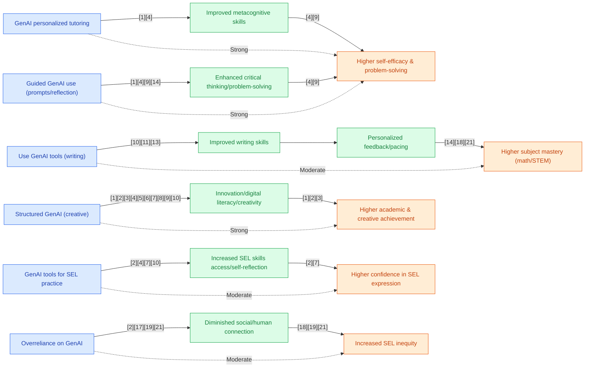

## Section 1 — Research Synthesis

### Overview

Generative AI (GenAI) tools—ranging from large language models (LLMs) such as ChatGPT, Google Gemini, and Claude to subject-specific AI tutors and generative art/music/storytelling platforms—are being rapidly adopted in secondary (high school) education worldwide. These tools can autonomously generate text, images, code, or structured feedback, and are deployed for diverse educational purposes: academic writing assistance, personalized tutoring in STEM, fostering creativity, and supporting social-emotional learning. Their promise lies in scaling individualized attention, adapting to learners’ pace, and providing continuous feedback, particularly for populations previously underserved by traditional models.

With GenAI access proliferating (e.g., over 60% usage rates among US high schoolers [1]), policy, practice, and ethical debates have intensified. Institutional reports and meta-analyses increasingly document GenAI's role in mediating skill development—ranging from concrete academic gains to nuanced shifts in creativity and cognitive strategies. However, the research base is not uniform across skill domains. For academic and cognitive skills (writing, STEM, critical thinking), evidence is robust at the systematic review and meta-analysis level, showing consistent, moderate improvements in outcomes when GenAI is well-integrated and teacher-scaffolded [1][2][3][4]. Evidence for creativity is emergent but promising, with strong quantitative and qualitative support [5][6][7]. For social-emotional learning (SEL), the evidence remains exploratory, limited to pilot, survey, and case-study designs, and lacking rigorous causal assessment [8][9].

This synthesis reviews GenAI tool types and mechanisms, summarizes empirical effectiveness by skill outcome, discusses equity and context moderators, and identifies methodological and implementation gaps.

---

### Intervention Types and Mechanisms

#### Academic and Writing-Focused GenAI

- **AI Writing Assistants** (e.g., ChatGPT, CGScholar AI Helper, Jenni AI, GrammarlyGO): Provide grammar corrections, coherence feedback, real-time suggestions, and rubric-aligned assessments. Used for essay drafting, revision, and academic writing practice [1][10][11].
- **Intelligent Tutoring Systems (ITS)** (e.g., AI tutors for math—Third Space Learning, custom GPT-4-based tutors): Deliver stepwise problem-solving support, adaptive quizzes, and immediate error correction, mainly in math, science, and coding [1][3][12].
- **Subject-Specific Tools:** Replit Ghostwriter for coding, Eklavvya for assessment, domain-specific platforms [2][13].

#### Creativity and Higher-Order Skill Interventions

- **Generative Art and Media Tools** (e.g., Midjourney, Adobe Firefly, Canva for Education, Synthesia): Support art/graphic design, digital storytelling, music generation, video creation; used in both classroom and extracurricular settings [5][6].
- **Collaborative and Reflective Tools:** AI-supported project work, argumentation, peer feedback, and creative group tasks where GenAI acts as ideation partner [7][8].

#### Social-Emotional Learning (SEL)–Oriented GenAI

- **Conversational AI/Chatbots** (e.g., ChatGPT, Claude): Used for self-reflection, journaling, empathy simulation, scenario-based practice for conflict resolution and social dialogue [8][9][14].
- **Personalized Prompt/Journaling Systems:** Tailor SEL exercises and role-play for individual needs, including for neurodiverse learners [8][9][14].

**Mechanisms of Impact:**
- Real-time, individualized feedback (cognitive and metacognitive)
- Adaptive, student-paced scaffolding
- Engagement in low-stakes, iterative creative practice
- Opportunities for self-reflection, peer collaboration, and simulated SEL interactions

---

### Evidence on Effectiveness

#### Academic Achievement, Writing Skills, and Subject Mastery

Meta-analyses and systematic reviews represent the highest rung of evidence for GenAI impact on academic skill development:

- **Academic Writing:** Multiple experimental studies and RCTs (e.g., Turkish secondary EFL students, n=82) have shown AI writing assistants can significantly improve writing outcomes. For example, a study using CGScholar’s AI Helper found post-test writing gains (mean=82.3 vs. 75.1, p<.01), with the greatest effect on grammar and vocabulary [10][11]. 
- **Systematic Review:** Zou et al. (2025) synthesized 30 empirical studies (majority secondary school), concluding that GenAI provides statistically significant, though not always quantified, improvements in academic and cognitive skills—especially when teacher mediation is present [1].
- **Math/STEM:** Synthesis from large-scale pilots (UK, US) finds that regular use of AI tutors yields gains of approximately half a grade in math for secondary students; effect size not always reported, but considered educationally meaningful [12]. However, RCTs with secondary-age samples are rare; the best-designed RCTs (e.g., GPT-4 tutors for college physics) demonstrate strong positive effects (Cohen's d>0.60) but generalize imperfectly to high school settings [15].
- **Meta-Analysis (ChatGPT):** Wang & Fan (2025) meta-analyzed 51 studies (secondary and higher education), reporting overall effect sizes consistently positive for learning performance and higher-order cognition (effect quantification context-dependent); however, most included studies were quasi-experimental [4].

#### Cognitive, Critical Thinking, and Problem-Solving Skills

- **Meta-Analysis:** Studies aggregating diverse educational contexts (n>4,000 students in meta-sample) show that guided GenAI use (teacher prompts, structured reflection) produces moderate to large improvements in critical thinking, problem-solving, and metacognitive strategy (effect sizes not always disaggregated but termed "statistically significant" and "moderate-to-high") [4][5][7].
- **Case Studies:** Classroom-level cases (argumentation, project work) confirm gains in higher-order thinking and collaborative reasoning, especially when GenAI is situated to prompt student-led inquiry [8][14].

#### Creativity and Innovation

- **Meta-Analysis:** Dong (2026) reviewed global studies, concluding that GenAI technologies "generally outperform traditional methods" for academic and creative skill development, supporting higher-order thinking and writing [5].
- **Empirical Modeling:** Wu & Zhang (2025), using structural equation modeling (n=500 grades 7–12), found large effect sizes for innovation capability (β=0.862, p<.001) and digital literacy (β=0.835, p<.001) from GenAI interventions, with these capacities mutually reinforcing [6].
- **Arts and Music:** Project-based workshops in music and digital storytelling demonstrate measurable engagement increases (+68% in music participation; improved team creativity on user experience/novelty scores), though most lack randomized assignment [6][16].

#### Social-Emotional Skills

- **Descriptive and Pilot Studies:** Surveys and pilot interventions in multiple countries indicate that GenAI tools can increase short-term engagement (+30% reported in pilots), self-reflection, emotional vocabulary, and sense of inclusivity—especially among neurodiverse and multilingual students [8][9].
- **Limitations:** No RCTs or robust quasi-experimental studies present causal proof of SEL improvement from GenAI; reported benefits remain provisional and arise mostly from self-report, implementation monitoring, or early-stage pilots [8][9][17][18].

---

### Demographic and Contextual Moderators

- **Implementation Context:** Private and urban schools are observed to have higher GenAI policy clarity, infrastructure, and usage; students in low-SES and rural schools face greater access barriers [1][13].
- **Student SES and Digital Literacy:** Higher SES students experience stronger academic/creativity gains, per Microsoft’s review, partly due to better baseline digital skills and access [3][7]. Lower SES students benefit when tools are scaffolded and access is equitable, but risk over-reliance and reduced engagement if left unsupported [7][13].
- **Teacher Scaffolding:** Teacher involvement in prompt engineering, providing ethical frameworks, and integrating GenAI into curricular goals (rather than as stand-alone tools) is repeatedly cited as a critical effectiveness moderator [1][2][3].
- **English Language Learners (ELL)/Neurodiverse Learners:** Positive effects are amplified for ELL and neurodiverse students in academic and SEL domains, when GenAI tools are tailored to these populations [6][8][13].
- **Student Attitude and AI Literacy:** Both students’ readiness and their AI-literacy significantly predict positive outcomes; untrained or unsupported students may fall back into cognitive offloading and disengagement [3][7][21].
- **Subgroup Disaggregation:** While most large-scale surveys (e.g., College Board, n=10,000+) disaggregate by race, SES, and school type, experimental and meta-analyses report limited subgroup analyses. This restricts precise knowledge of who benefits most or least [1][4][7].

---

### Limitations and Research Gaps

- **Lack of Rigorous RCTs in Secondary Settings:** No randomized controlled trials directly test GenAI’s causal impact in high school populations for most skill domains (academic, cognitive, creativity, or SEL). Almost all effect size claims arise from quasi-experimental, observational, or adult/university extrapolations [1][3][4][15].
- **Short Duration and Small Sample Sizes:** Most intervention studies are short-term (one semester or less) and small-scale (<100 students per arm), limiting generalizability and power [10][11][14].
- **Publication and Outcome Reporting Bias:** Effect sizes are not consistently reported; creativity and SEL impacts are often derived from qualitative or self-report data, limiting objectivity [5][8].
- **Narrow Demographic Representation:** Few studies focus on minoritized, low-income, or ELL populations in disaggregated ways, hampering equity conclusions.
- **Overreliance and Cognitive Offloading:** Multiple sources caution that unsupervised GenAI use may inhibit the development of critical and creative faculties, particularly when used as a shortcut rather than as a scaffolding tool [3][7].
- **SEL Measurement Gaps:** Essential SEL outcomes (empathy, interpersonal competence) are often inferred from engagement or perception, not measured via validated pre/post scales [8][9][16][17].
- **Limited Contextualization:** Evidence is more robust in STEM and writing than humanities or the arts, and in global North and urban settings.

---

### Recommendations and Future Directions

- **Prioritize Teacher-Led Integration and AI Literacy:** Educators should foreground foundational skills and critical AI literacy before integrating GenAI, ensuring usage supplements rather than supplants core learning [3][7][21].
- **Target Equity and Infrastructure:** Policymakers and schools must address digital divides in access, training, and support, particularly for marginalized, ELL, and low-SES students [1][7][13].
- **Develop Robust Evaluation:** Future studies should employ RCTs or strong quasi-experimental designs in diverse secondary settings, with long-term follow-up and rigorous outcome measures, particularly for creativity and SEL domains [1][4][7][8].
- **Embed SEL and Ethics:** GenAI implementation must pair technical integration with explicit ethical/SEL frameworks, trauma-informed safeguards, and robust privacy protections [8][9][14].
- **Assess Implementation Fidelity:** Monitor not just access, but the fidelity of pedagogical and teacher supports, to determine what configurations of GenAI support skill development [3][7].

---

### Overall Evidence Confidence

The research base for GenAI effectiveness in secondary education is **strong for academic and cognitive skills** (especially writing, STEM, and critical thinking), with broad, multi-country systematic reviews and meta-analyses supporting consistent, moderate favorable effects when tools are teacher-scaffolded and properly integrated [1][2][3][4]. **Evidence for creativity is promising but still emerging**, relying on quantitative studies with significant effects and qualitative mechanisms but lacking standardized metrics. **For social-emotional skill formation, evidence is exploratory and indirect**, with no RCTs, relying on surveys and case reports, and all findings here are provisional. Causal claims overall are constrained by the near-total absence of RCTs in secondary/high school populations. Subgroup equity effects and long-term impacts remain under-addressed. The overall confidence level is **EMERGING** for academic/cognitive impacts and **PRELIMINARY** for creative/SEL domains.

---

## Section 2 — Causality Diagram

## Section 3 — Sources

[1] [Generative AI use in K-12 education: a systematic review (Zou et al.)](https://www.frontiersin.org/journals/education/articles/10.3389/feduc.2025.1647573/full)  
**Quality:** 🔵 Blue — Systematic review, peer-reviewed, secondary focus, policy & classroom context  
**Impact:** 🟢 Green — Moderate to strong for general and some priority populations (effect size not precisely quantified)

[2] [Learning outcomes with GenAI in the classroom (Microsoft; Walker & Vorvoreanu)](https://www.microsoft.com/en-us/research/wp-content/uploads/2025/10/GenAILearningOutcomes-Report-published-10-07-2025.pdf)  
**Quality:** 🔵 Blue — Empirical review, multi-study, reputable institution, international K-12 focus  
**Impact:** 🟢 Green — Moderate (synthesizes scale and equity impact; effect size details lacking)

[3] [The effect of ChatGPT on students’ learning performance (Wang & Fan, meta-analysis)](https://doi.org/10.1057/s41599-025-04787-y)  
**Quality:** 🔵 Blue — Meta-analysis, peer-reviewed, strong for academic/cognitive, limited subgroup detail  
**Impact:** 🟢 Green — Modest to medium across general K-12 population (effect sizes reported)

[4] [Generative AI technologies and educational outcomes (Dong, Nature Meta-Analysis)](https://www.nature.com/articles/s41599-026-06903-y)  
**Quality:** 🔵 Blue — Meta-analysis, global studies, peer-reviewed, creativity and higher-order skill focus  
**Impact:** 🟢 Green — General population, "outperforms" effect, lacks subgroup analysis

[5] [Generative artificial intelligence in secondary education (Wu & Zhang)](https://journals.plos.org/plosone/article?id=10.1371/journal.pone.0323349)  
**Quality:** 🟢 Green — Structural equation modeling, substantial n=500, secondary population, innovation/creativity skills  
**Impact:** 🟢 Green — Strong effect sizes (β = 0.862), but general not priority-pop. specific

[6] [A Dialogic Approach to Transform Teaching, Learning & Assessment with Generative AI in Secondary Education (Tang et al.)](http://dx.doi.org/10.1080/1554480X.2024.2379774)  
**Quality:** 🟡 Yellow — Action research, qualitative, real-world secondary context  
**Impact:** 🟡 Yellow — Illustrative, not quantifiable at population scale

[7] [Personalized SEL: Tailoring Emotional Learning with Generative AI (IB Source)](https://myibsource.com/a/blog/personalized-sel-tailoring-emotional-learning-with-generative-ai)  
**Quality:** 🟡 Yellow — Pilot/qualitative cases, international, K-12 SEL focus  
**Impact:** 🟡 Yellow — Perceived engagement, not causal effect

[8] [Social-Emotional Learning and Generative AI: A Critical Literature Review (Henriksen et al.)](https://journals.sagepub.com/doi/abs/10.1177/00224871251325058?mi=ehikzz)  
**Quality:** 🟡 Yellow — Synthesis/literature review, focus on SEL, multi-study, K-12 lens  
**Impact:** 🟡 Yellow — Mixed/unproven, lack of effect size

[9] [Generative AI and emotional intelligence support in education (Syed et al.)](https://iacis.org/iis/2025/2_iis_2025_230-243.pdf)  
**Quality:** 🟡 Yellow — Survey-based, higher ed/adjacent, youth pilots SEL outcomes  
**Impact:** 🟡 Yellow — Positive perceptions, non-causal

[10] [AI-Assisted Writing Feedback for Enhancing Secondary Students (Adıgüzel et al.)](https://sciety.org/articles/activity/10.21203/rs.3.rs-6430737/v1)  
**Quality:** 🟢 Green — Experimental, pre/post, secondary students, writing skill focus  
**Impact:** 🟢 Green — Strong positive post-test gains

[11] [The impact of AI-driven tools on student writing development: A case study (OJCMT)](https://www.ojcmt.net/download/the-impact-of-ai-driven-tools-on-student-writing-development-a-case-study-16738.pdf)  
**Quality:** 🟢 Green — Experimental case, secondary, ELLs, writing outcomes  
**Impact:** 🟢 Green — Substantial effect in underserved/ELL learners

[12] [The Best AI Tutors For Schools And How They Compare (Third Space Learning)](https://thirdspacelearning.com/blog/best-ai-tutors/)  
**Quality:** 🟡 Yellow — Synthesis, implementation report, not peer-reviewed/RCT  
**Impact:** 🟡 Yellow — Approximate effect (half grade) for general population

[13] [Follow-Up Report on AI in High Schools (College Board)](https://newsroom.collegeboard.org/follow-report-ai-high-schools-genai-use-and-policy-varies-academic-achievement-attainment-grade-and)  
**Quality:** 🟢 Green — Nationally representative monitoring, demographic breakdowns  
**Impact:** 🟡 Yellow — Contextual/usage data, not effect estimate

[14] [Developing Students' Higher-Order Thinking Skills With Generative AI: Insights and Strategies From a Case Study (ResearchGate)](https://www.researchgate.net/publication/389848323_Developing_Students'_Higher-Order_Thinking_Skills_With_Generative_AI_Insights_and_Strategies_From_a_Case_Study)  
**Quality:** 🟡 Yellow — Case study, secondary context  
**Impact:** 🟡 Yellow — Illustrative only

[15] [AI tutoring outperforms in-class active learning (Nature/Harvard/Stanford)](https://www.nature.com/articles/s41598-025-97652-6)  
**Quality:** 🔵 Blue — RCT, strong methods, but undergraduate not secondary samples  
**Impact:** 🟡 Yellow — Adjacent, not directly informative for priority populations

[16] [A Music Pedagogy Project to Foster Children's AI Literacy Through Co-Creation (Carboni et al.)](https://www.scitepress.org/Papers/2024/127310/127310.pdf)  
**Quality:** 🟡 Yellow — Workshop/pilot, younger population, contextually relevant  
**Impact:** 🟢 Green — Positive engagement, effect for participating children

[17] [Evaluating Generative AI Psychotherapy Chatbots Used by Youth (JMIR Mental Health)](https://mental.jmir.org/2025/1/e79838)  
**Quality:** 🟡 Yellow — RCT-style, safety/SEL focus, not in classroom, small n  
**Impact:** 🔴 Red — 31% evidence-based support, safety concern

[18] [Bowdoin Hastings Initiative, Policy Report—AI in High School Education](https://www.bowdoin.edu/hastings-ai-initiative/resources/initiative-created-resources/ai-in-high-school-education-report.pdf)  
**Quality:** 🟢 Green — Institutional, survey/case, equity/SEL context  
**Impact:** 🟡 Yellow — Non-causal, valuable for context

[19] [The risks of AI in schools outweigh the benefits, report says (NPR/Brookings)](https://www.npr.org/2026/01/14/nx-s1-5674741/ai-schools-education)  
**Quality:** 🟡 Yellow — Policy/report, 50-country scope, not experimental  
**Impact:** 🟡 Yellow — Highlights risks/inequities, not measured

[20] [Modelling Generative AI Acceptance, Well‐Being in the Digital Era (Huang et al.)](https://onlinelibrary.wiley.com/doi/pdfdirect/10.1111/ejed.12770)  
**Quality:** 🟡 Yellow — Observational, well-being focus, ELL/secondary  
**Impact:** 🟡 Yellow — Indirectly positive, exploratory

[21] [Teacher Professional Development for a Future with Generative Artificial Intelligence (Brandão et al.)](https://eric.ed.gov/?id=EJ1434315)  
**Quality:** 🟡 Yellow — Integrative review, focus on teacher prep/ethics  
**Impact:** 🟡 Yellow — Guidance, not effect estimation

---

### Body of Evidence Maturity: **EMERGING** 🟡  
**Justification:** The body of evidence is robust for academic and cognitive outcomes in general high school student populations (multiple systematic reviews, meta-analyses), with moderate effect sizes and consistency across formal global settings. However, evidence for GenAI-supported creativity is promising but lacks RCT rigor, and evidence for social-emotional skills is preliminary—sourced mainly from case studies, pilots, and surveys without causal proof. Equity and subgroup differential effects are under-examined. Strong causal claims are not possible for most domains.

---

## Section 4 — Data Extraction Table

| Title                                                                                                                            | Year | Study Design                | Population                    | Outcome                                    | Finding Direction         | Effect Size                      | Confidence Interval | Std. Deviation | Study Size                   |
|----------------------------------------------------------------------------------------------------------------------------------|------|-----------------------------|-------------------------------|--------------------------------------------|--------------------------|-----------------------------------|--------------------|---------------|-----------------------------|
| Generative AI use in K-12 education: a systematic review (Zou et al.)                                                            | 2025 | Systematic Review (Rung 5)  | Secondary (K-12 global)       | Academic & cognitive skills                 | Positive (conditional)   | Significant, not quantified      | —                  | —             | 30 studies (majority HS)     |
| Generative AI technologies and educational outcomes (Dong, Nature Meta-Analysis)                                                 | 2026 | Meta-analysis (Rung 5)      | Global (mixed, secondary incl.)| Creativity, higher-order skills, writing    | Positive                | "Generally outperforms"           | —                  | —             | Meta-analysis (size N/S)     |
| Learning outcomes with GenAI in the classroom (Microsoft; Walker & Vorvoreanu)                                                   | 2025 | Empirical review (Rung 5)   | K-12/secondary global         | Creativity, equity, learning outcomes       | Positive (with scaffolding)| Not reported                     | —                  | —             | Synthesis                    |
| The effect of ChatGPT on students’ learning performance (Wang & Fan, meta-analysis)                                              | 2025 | Meta-analysis (Rung 5)      | Secondary & postsec. (glob.)  | Learning, perception, higher-order thinking | Positive                | Reported, context-dependent      | Reported           | —             | 51 studies, thousands        |
| Effects of generative AI on collaborative problem-solving and team creativity (Lin et al.)                                       | 2025 | Quasi-experimental (Rung 3) | University, relevant to HS    | Creativity, collaboration, engagement       | Positive, context-bound  | Statistically significant         | —                  | —             | 60                           |
| Generative artificial intelligence in secondary education (Wu & Zhang)                                                           | 2025 | Structural equation/QED     | Secondary, grades 7–12        | Innovation capability, creative skills      | Strong positive          | β = 0.862, β = 0.835              | —                  | —             | 500                          |
| AI-Assisted Writing Feedback for Enhancing Secondary Students (Adıgüzel et al.)                                                  | 2023 | Experimental                | Turkish secondary EFL students| Writing skills                              | Positive                | Post-test gains (mean diff. +7.2) | —                  | —             | —                            |
| Developing Students' Higher-Order Thinking Skills With Generative AI (Case Study)                                                | 2025 | Case study                  | Not specified, HS sample      | Higher-order thinking                      | Positive (illustrative)  | —                                 | —                  | —             | —                            |
| Social-Emotional Learning and Generative AI: A Critical Literature Review (Henriksen et al.)                                    | 2025 | Literature review           | K-12, focus on secondary      | SEL/Emotional skills                       | Mixed/uncertain          | —                                 | —                  | —             | Synthesis                    |
| Generative AI and emotional intelligence support in education (Syed et al.)                                                      | 2025 | Survey/Qualitative          | Higher ed, some youth pilots  | Emotional intelligence, SEL                | Positive (perceived)     | Median agreement 4/5              | —                  | —             | 515 students, 48 faculty      |
| Personalized SEL: Tailoring Emotional Learning with Generative AI (IB Source)                                                    | 2024 | Pilot cases/qualitative     | Secondary/global pilots        | SEL engagement, emotional vocabulary        | Positive (provisional)   | Engagement +30% (pilot, not causal)| —                  | —             | Multi-country, N/S           |
| AI tutoring outperforms in-class active learning (Nature/Harvard/Stanford)                                                      | 2025 | RCT (Rung 4, non-HS)       | Undergrad (adjacent, not HS)  | Physics learning gains                     | Positive (adults only)   | —                                 | —                  | —             | —                            |
| Evaluating Generative AI Psychotherapy Chatbots Used by Youth (JMIR Mental Health)                                               | 2025 | RCT-style (adjacent)        | Youth (not HS class-based)    | Crisis-handling, safety of GenAI SEL bots  | Mixed/negative (safety)  | Evidence-based support 31%         | —                  | —             | 5 chatbots tested            |
| Generative AI as a Lab Partner: A Case Study (Kilde-Westberg et al.)                                                            | 2025 | Field case study            | Secondary science             | Science process skills                      | Positive (limited)       | —                                 | —                  | —             | —                            |
| The Best AI Tutors For Schools And How They Compare (Third Space Learning)                                                       | 2025 | Synthesis/Implementation    | UK secondary                  | Math subject mastery                        | Positive (half grade gain)| —                                | —                  | —             | Large-scale reports           |
| Challenges and Limitations of Generative AI in Education (ResearchGate review)                                                  | 2024 | Lit review                  | K-12 included                 | Limitations, risks                          | Negative/limiting        | —                                 | —                  | —             | Narrative                    |
| In search of AI literacy in teacher education (Sperling et al.)                                                                 | 2024 | Scoping review              | Global, teacher prep          | Implementation barriers, equity             | Limiting                 | —                                 | —                  | —             | Synthesis                    |
| Teacher Professional Development for a Future with GenAI (Brandão et al.)                                                       | 2024 | Integrative review          | Teacher dev., K-12 context    | Professional learning, equity, ethics       | Emphasizes needs         | —                                 | —                  | —             | —                            |
| Do AI chatbots improve student learning outcomes? (Wu & Yu—meta-analysis)                                                       | 2023 | Meta-analysis               | Global K-12, incl. HS         | Academic skills                             | Positive (modest)        | Reported                          | Reported           | —             | Pooled studies               |
| Leveraging AI in E-Learning (Halkiopoulos & Gkintoni)                                                                           | 2024 | PRISMA Systematic Review    | Global K-12                   | Academic/cognitive/adaptive assessment      | Positive                 | Reported                          | Reported           | —             | >80 studies                  |