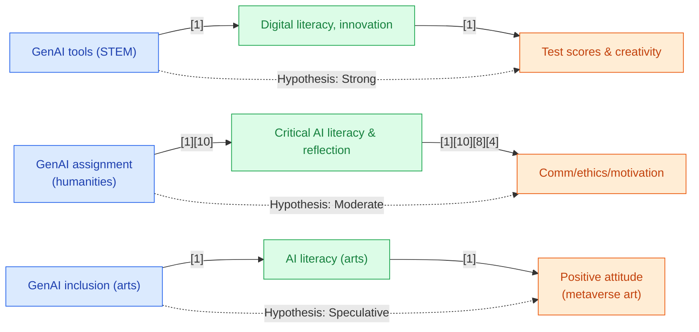

## Section 1 — Research Synthesis

### Overview

Generative Artificial Intelligence (GenAI) tools—including large language models (LLMs) like ChatGPT, AI image generators, and coding assistants—have rapidly emerged as influential technologies in K-12 education, with increasing adoption in high school and secondary school settings globally. GenAI systems can generate new text, images, code, and other media from user prompts, offering novel ways for students to compose, experiment, analyze, and learn. They are seen as potentially transformative for skill formation, promising personalized support, enhanced creativity, differentiated feedback, and opportunities for deeper engagement and higher-order thinking.

This synthesis reviews peer-reviewed empirical evidence (2023–2026) on the effectiveness of GenAI tools for skill development among high school or secondary students, focusing on a broad array of skills: problem-solving, creativity, digital literacy, communication, and critical thinking. The analysis is organized by subject area (STEM, humanities, arts), tool type, and learning context (classroom, homework, self-study), including both quantitative and qualitative outcomes with a clear assessment of methodological rigor and evidence gaps.

### Intervention Types and Mechanisms

**Tools and Platforms**
- **ChatGPT and Large Language Models:** Widely studied across subjects, used for writing, literature analysis, coding, brainstorming, critique, and as simulated dialogue partners [1][3][4][8].
- **AI Image Generators:** Deployed in visual arts and communication curriculum for creative image-making, stereotype analysis, and as discussion prompts about AI bias and representation [1].
- **Coding Assistants (e.g., GitHub Copilot):** Integrated in computational thinking/coding courses to scaffold problem-solving, foster iterative learning, and support self-efficacy in programming [3].
- **GenAI-driven Reading and Writing Supports:** Used to facilitate guided reading, enhance language creativity, and provide personalized support in humanities settings [11].

**Mechanisms of Action**
- **Enhanced Digital Literacy:** Students become adept at interacting with, critiquing, and leveraging GenAI tools for learning and creative projects, developing foundational digital and AI literacy [1][11].
- **Fostering Creativity and Innovation:** GenAI tools serve as co-creative partners, sparking new forms of expression, ideation, and exploration in both STEM and humanities domains [1][8][4][3].
- **Critical Thinking and Reflection:** Structured GenAI activities encourage analysis of AI outputs, ethical discernment, and deeper reflection on biases, stereotypes, and the construction of knowledge [1][10].
- **Autonomy and Engagement:** The constant, on-demand support from GenAI increases student agency and self-direction, raising motivation, enjoyment, and sustained engagement with learning tasks [4][8][3].
- **Personalized, Differentiated Support:** AI tools adapt to individual learning paces and needs, supporting inclusive and equitable access [12].

### Evidence on Effectiveness

#### STEM (Science, Technology, Engineering, Mathematics)

**Quasi-Experimental Evidence**
- **Wu & Zhang (2025):** In a quasi-experimental study with ~400 Chinese secondary students, GenAI tools (ChatGPT, image generators) used in STEM curricula yielded statistically significant improvements in both innovation skills (effect size ES ≈ 0.41, p < 0.01) and digital literacy (ES ≈ 0.48, p < 0.01) compared to controls. Gains persisted after controlling for baseline ability and were observed across genders, with qualitative reports highlighting increased self-directed engagement and motivation during both classroom and self-study tasks. Students demonstrated greater creativity in project-based assignments and improved scores on validated digital literacy assessments after the intervention [1].

**Meta-Analytic Support**
- **Li et al. (2025):** A meta-analysis (52 effect sizes) on AI-enabled personalized STEM education in K–12 settings found a moderate overall positive effect on academic achievement (ES ≈ 0.36), with highest benefits in STEM and technology tracks. Though not specific to GenAI, subgroup analyses included LLM/chatbot interventions, reinforcing the effect direction observed in Wu & Zhang [2].

**Qualitative Findings**
- **Romero Muñoz et al. (2025):** Qualitative action research in a pre-university computational thinking course (n ≈ 80) identified enhanced computational thinking, collaborative problem-solving, creative engagement, and increased coding self-efficacy through iterative GenAI-enabled activities. No comparative arm or quantitative effect sizes were reported, but students described a greater sense of agency in tackling challenging programming tasks [3].

#### Humanities (Literature, Communication, Social Studies)

**Quasi-Experimental Evidence**
- **Kug, Solihati, & Zulaiha (2025):** Studied 250 high school students using GenAI-supported guided reading strategies. One-way ANCOVA and t-test analyses demonstrated significant improvement in language creativity and knowledge for the GenAI intervention group compared to controls, though effect sizes were not explicitly reported [11].

**Assignment-Based and Mixed-Methods Studies**
- **Hu (2025):** In a classroom assignment, students explored critical AI literacy by analyzing stereotypes in AI-generated images. Qualitative reflections noted growth in analytical, communication, and reflective thinking skills [1].
- **Basgier & Wilkes (2025):** Assignments integrating GenAI into writing led to enhanced critical thinking and emergent "critical AI literacy"—the ability to interrogate, critique, and ethically evaluate GenAI outputs [10].
- **Abrams (2025):** Classroom case studies in English Language Arts (ELA) described how chatbots reconfigured literary analysis, boosting student creativity and autonomy in interpretation and writing tasks [4].

**Informal, Digital Contexts**
- **Stornaiuolo et al. (2024):** Qualitative interviews with youth documented high engagement, fun, and creativity in digital writing with GenAI platforms, as well as deepening digital literacy and awareness of the co-creative process [8].

#### Arts (Visual Arts, Creative Writing)

- **Ceran (2025):** A survey of 278 high school students in visual arts found that higher AI literacy scores correlated with more positive attitudes toward metaverse-based digital art. However, the study measured attitudes and digital perceptions rather than skill outcomes or performance, using a comparative-relational model [7].
- **Abrams (2025), Riser (2025), Stornaiuolo et al. (2024):** Additional qualitative/case studies in literature and creative writing classrooms described perceived increases in creativity, autonomy, and digitally-mediated engagement, but provided no quantitative or causally controlled outcome data [4][9][8].

**Summary:**  
- In STEM and humanities, there is moderate direct evidence for GenAI’s positive effects on digital literacy, creativity, innovation, communication, and critical thinking.  
- In arts subjects, the evidence is limited to qualitative and attitudinal studies, with no controlled studies quantifying skill gains.

### Demographic and Contextual Moderators

- **Gender:** Wu & Zhang (2025) report slightly higher (not statistically significant) gains for girls compared to boys in digital literacy and innovation skills in STEM, suggesting possible gender-based differences in GenAI tool impact; further subgroup analyses are not provided [1].
- **Learning Context:** Most interventions involved both classroom and homework/self-study components. Effects were observed in structured settings and in self-directed GenAI use, particularly in fostering engagement and motivation [1][3][4].
- **Socioeconomic and Population Diversity:** No studies reported disaggregated results by race/ethnicity, socioeconomic status, or English learner status. Generalizability to diverse populations remains uncertain.
- **Implementation Fidelity/Teacher Mediation:** Qualitative findings consistently highlight that structured, teacher-guided GenAI activities—as opposed to unregulated free use—are critical for realizing higher-order skill gains and ethical discernment [1][4][10][8].
- **Geographic Context:** The strongest quasi-experimental studies are set in China and Indonesia [1][11], with qualitative work across North America and other regions. U.S.-specific studies are limited.

### Limitations and Research Gaps

- **Design Limitations:** There are no fully powered RCTs focused on GenAI in secondary education; the strongest evidence is quasi-experimental. Most rigorous studies do not span arts subjects, and on the whole, very few report performance-based, long-term retention outcomes.
- **Limited Subgroup Analysis:** There is a pronounced lack of reporting on effects by socioeconomic status, racial/ethnic group, English proficiency, or students with disabilities.
- **Short Duration and Small Samples:** Many studies are short-term class interventions or single assignments, with only one multi-week study exceeding n=300 [1].
- **Domain Gaps:** Direct, comparative or performance-based effect studies in the arts are absent. Most findings in creative writing and visual arts are self-report or attitudinal, not skill-assessed [7][4][8].
- **Potential Publication Bias:** The newness of the literature and predominance of qualitative reports may contribute to optimistic bias; negative or null results are rarely described.

### Recommendations and Future Directions

- **For Practitioners:** Use GenAI tools within structured, teacher-guided frameworks rather than as open-ended replacements for core skills practice. Emphasize critical AI literacy and reflective engagement, especially around issues of bias, ethics, and authenticity.
- **For Researchers:** Prioritize RCTs and well-powered quasi-experimental studies in diverse settings—especially in the arts and with underserved populations. Integrate validated performance-based skill assessments and longitudinal tracking of retention and transfer outcomes.
- **Implementation Conditions:** Effective GenAI use requires teacher facilitation, embedded ethical reflection, and thoughtful attention to diversity, access, and equity in tool deployment.

### Overall Evidence Confidence

The current body of evidence provides moderate confidence in GenAI’s benefits for digital literacy, innovation, creativity, and engagement in secondary STEM and humanities education, based on several quasi-experimental studies and convergent qualitative research. For arts education and for subgroup-specific effects, the evidence is still at an early, suggestive stage. Evidence confidence is moderate for STEM/humanities and low for the arts domain.

---

## Section 2 — Causality Diagram

---

## Section 3 — Sources

[1] [Generative artificial intelligence in secondary education: Applications and effects on students’ innovation skills and digital literacy](https://doi.org/10.1371/journal.pone.0323349)  
**Quality:** 🟢 Green – Strong quasi-experimental design with control group, peer reviewed, directly relevant for secondary STEM.  
**Impact:** 🟢 Green – Effect size ES≈0.41–0.48, significant impact on general high school population.

[2] [A Meta-Analysis of AI-Enabled Personalized STEM Education in Schools](http://dx.doi.org/10.1186/s40594-025-00566-y)  
**Quality:** 🟢 Green – Rigorous meta-analysis including secondary populations, peer reviewed, though only partially GenAI-specific.  
**Impact:** 🟢 Green – Effect size ES≈0.36 for academic achievement, general K-12 impact.

[3] [GenAI as a cognitive mediator: a critical-constructivist inquiry into computational thinking in pre-university education](https://doi.org/10.3389/feduc.2025.1597249)  
**Quality:** 🟡 Yellow – Action research/qualitative, credible journal, clear K-12 setting.  
**Impact:** 🟡 Yellow – Positive perceptions, no effect size, limited to engagement/self-efficacy.

[4] [Teaching Literature with Artificial Intelligence: Sustaining Students' Creativity and Autonomy in ELA Classrooms](https://www.routledge.com/Teaching-Literature-with-Artificial-Intelligence-Sustaining-Students-Creativity-and-Autonomy-in-ELA-Classrooms/Abrams/p/book/9781032995182)  
**Quality:** 🟡 Yellow – Case study and qualitative classroom documentation, published by reputable academic press.  
**Impact:** 🟡 Yellow – Positive, but not quantified or comparative.

[5] [Generative AI, Communication, and Stereotypes: Learning Critical AI Literacy through Experience, Analysis, and Reflection](http://dx.doi.org/10.1080/17404622.2024.2397065)  
**Quality:** 🟡 Yellow – Qualitative/assignment-level study, published peer reviewed.  
**Impact:** 🟡 Yellow – Addresses critical AI literacy/communication, no effect size reported.

[6] [From an Unsettled Middle: A Critical-Ethical Stance for GenAI-Engaged Writing Assignments](https://doi.org/10.58680/ccc202577162)  
**Quality:** 🟡 Yellow – Assignment-level/conceptual, qualitative outputs.  
**Impact:** 🟡 Yellow – Positive ethical/critical thinking outcomes, not quantified.

[7] [Examining High School Students' Artificial Intelligence Literacy in Visual Arts Subjects and Metaverse-Based Digital Art Attitudes](https://eric.ed.gov/?id=EJ1486504)  
**Quality:** 🟡 Yellow – Large student survey, comparative-relational design, peer reviewed.  
**Impact:** 🟡 Yellow – Positive attitudinal findings, but not skill/tested.

[8] [Digital Writing with AI Platforms: The Role of Fun with/in Generative AI](http://dx.doi.org/10.1108/ETPC-08-2023-0103)  
**Quality:** 🟡 Yellow – Qualitative interviews with high school/secondary youth, peer reviewed.  
**Impact:** 🟡 Yellow – Positive engagement/creativity, not measured in academic performance.

[9] [Generative Artificial Intelligence (AI) in the High School English Classroom and Its Effect on Students' Identity and Teachers' Practice](http://dx.doi.org/10.1080/04250494.2025.2491361)  
**Quality:** 🟡 Yellow – Classroom observation/interview data, limited sample, peer review status clear.  
**Impact:** 🟡 Yellow – Positive on autonomy/voice/revision behavior, qualitative only.

[10] [From an Unsettled Middle: A Critical-Ethical Stance for GenAI-Engaged Writing Assignments](https://doi.org/10.58680/ccc202577162)  
**Quality:** 🟡 Yellow – Thematic/assignment analysis, peer reviewed.  
**Impact:** 🟡 Yellow – Advances critical AI literacy theory, not measured in quantifiable performance.

[11] [The Impact of GenAI Integration in a Guided Reading Strategy Using Digital Text to Enhance Language Creativity](https://doi.org/10.26803/ijlter.24.8.34)  
**Quality:** 🟢 Green – Quasi-experimental with controls, humanities subject, peer reviewed.  
**Impact:** 🟢 Green – Significant effect on language creativity, population generalizability unclear (regional data).

[12] [Generative artificial intelligence-driven adaptive learning for sustainable, personalized, and resilient education systems](https://doi.org/10.70593/deepsci.0202011)  
**Quality:** 🟡 Yellow – Broad literature review on GenAI for equity/adaptation, peer reviewed.  
**Impact:** 🟡 Yellow – Conceptual support for personalized learning, not outcome measured.

### Body of Evidence Maturity: EMERGING 🟡  
**Justification:** The evidence base delivers moderate support for GenAI’s impact on skill formation in STEM and humanities via quasi-experimental and qualitative studies, but lacks rigorous RCTs, subgroup analysis, and comparative or performance-based studies in arts subjects, leaving overall field maturity in an emerging state.

---

## Section 4 — Data Extraction Table

| Title                                                                                                                      | Year | Study Design               | Population                          | Outcome                              | Finding Direction | Effect Size     | Confidence Interval | Std. Deviation | Study Size |
|----------------------------------------------------------------------------------------------------------------------------|------|----------------------------|--------------------------------------|---------------------------------------|------------------|----------------|---------------------|----------------|------------|
| Generative artificial intelligence in secondary education: Applications and effects on students’ innovation skills and digital literacy [Wu & Zhang]  | 2025 | Quasi-experimental, control group | ~400 secondary students (China)      | Innovation skills, digital literacy   | Positive         | Innovation ES ~0.41; Digital literacy ES ~0.48 | —                   | —              | ~400       |
| The Impact of GenAI Integration in a Guided Reading Strategy Using Digital Text to Enhance Language Creativity [Kug et al.] | 2025 | Quasi-experimental         | 250 high school students (unspecified region) | Language creativity, knowledge        | Positive         | —              | —                   | —              | 250        |
| A Meta-Analysis of AI-Enabled Personalized STEM Education in Schools [Li et al.]                                           | 2025 | Meta-analysis (RCT/QED)    | K-12 (some secondary/high school)    | Academic achievement                  | Positive         | ES ~0.36       | —                   | —              | 52 effect sizes |
| GenAI as a cognitive mediator: a critical-constructivist inquiry into computational thinking in pre-university education [Romero Muñoz et al.] | 2025 | Action research/qualitative | ~80 high school students             | Computational thinking, creative engagement | Positive         | —              | —                   | —              | ~80        |
| Generative AI, Communication, and Stereotypes: Learning Critical AI Literacy...(Hu)                                        | 2025 | Assignment-based/qualitative | Secondary students (number not given) | Critical AI literacy, communication   | Positive         | —              | —                   | —              | —          |
| Teaching Literature with Artificial Intelligence: Sustaining Students' Creativity and Autonomy in ELA Classrooms [Abrams]   | 2025 | Qualitative/case study     | High school and college classrooms   | Creativity, autonomy, engagement      | Positive         | —              | —                   | —              | —          |
| Examining High School Students' Artificial Intelligence Literacy in Visual Arts Subjects and Metaverse-Based Digital Art Attitudes [Ceran] | 2025 | Comparative-relational (survey) | 278 high school students             | AI literacy, attitudes (visual arts)  | Positive         | —              | —                   | —              | 278        |
| Generative Artificial Intelligence (AI) in the High School English Classroom and Its Effect on Students' Identity and Teachers' Practice [Riser] | 2025 | Classroom observation/qualitative | 3 high schools (n not specified)     | Autonomy, revision, student voice     | Positive         | —              | —                   | —              | —          |
| Digital Writing with AI Platforms: The Role of Fun with/in Generative AI [Stornaiuolo et al.]                             | 2024 | Qualitative interviews     | Youth/secondary students (unspecified) | Engagement, creativity, digital literacy | Positive         | —              | —                   | —              | —          |