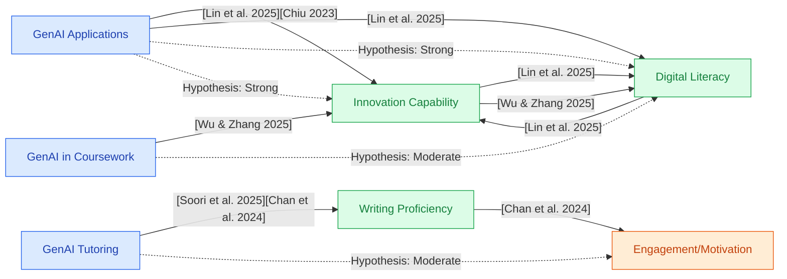

## Section 1 — Research Synthesis

### Overview

Generative artificial intelligence (GenAI) tools—including large language models (LLMs) such as ChatGPT, AI-driven tutoring systems, and generative text or image platforms—are rapidly being integrated into secondary (high school) education worldwide. These technologies can autonomously generate human-like text, images, code, and provide personalized feedback or tutoring, promising to revolutionize how students develop both academic and "21st-century" skills. Adoption is widespread: Recent national U.S. surveys report that over 80% of high school students have used GenAI for assignments, predominantly for brainstorming, writing, research, and creative projects [1]. Policymakers and educators now face urgent questions regarding GenAI's actual effectiveness for skill formation—ranging from traditional academic achievement to critical thinking, digital literacy, creativity, and communication. This synthesis critically examines the types of GenAI tools in use, the range of targeted skills, empirical evidence for their effectiveness, demographic/contextual moderators, methodological limitations, recommendations, and the strength of the evidence base.

### Intervention Types and Mechanisms

**1. Generative Chatbots and Language Models (e.g., ChatGPT, Microsoft Copilot):**  
These systems employ transformer-based neural networks trained on vast text corpora to generate or revise written content, answer questions, scaffold brainstorming, and provide writing feedback. They are used for essay writing, content understanding, personalized Q&A, and idea generation in subjects like English and social studies [1][2][3][4].

**2. AI-Driven Tutoring and Adaptive Learning Platforms:**  
Tools such as AI tutors (e.g., Khanmigo on Khan Academy, "UBot" at the University of Utah), and AI-powered homework help systems provide adaptive, dialogic support in subjects like mathematics, science, and programming. These platforms deliver personalized explanations, feedback, and Socratic questioning [5][6][7].

**3. Generative Text and Image Tools (e.g., DALL-E, Midjourney):**  
Used in creative writing, digital arts, and design, these tools enable students to generate original images, multimedia projects, and stories, helping foster creativity and visual literacy [8][9].

**4. AI-Supported Collaborative Programming Environments:**  
Students use GenAI code-completion and debugging assistants during programming lessons or computer science classes, allowing exploration of computational thinking, code problem solving, and iterative refinement [10].

**5. Project and Portfolio-Oriented Use:**  
Some schools integrate GenAI into capstone projects, collaborative inquiry tasks, and digital portfolios to cultivate process skills such as innovation, creativity, and collaborative problem-solving [6][8].

Mechanistically, these interventions target (a) enriched content and process feedback, (b) augmented exploration/creativity, (c) reduced barriers to entry for new skill areas, and (d) increased personalization scalable to classroom or individual contexts.

### Evidence on Effectiveness

#### Academic Achievement (Content Understanding, Subject Proficiency)
- **Meta-analyses show small but significant academic gains:**  
A 2023 meta-analysis of 54 studies (mostly K–16, including secondary) found that AI chatbots (broadly construed, including some GenAI tools) yielded effect sizes of g ≈ 0.23 (95% CI: 0.16–0.29) and g ≈ 0.33 (95% CI: 0.11–0.55) for learning achievement, especially in EFL, computer science, and non-core secondary classrooms [11].  
- **RCTs for Writing Outcomes (EFL/Essay Writing):**  
A 2025 RCT (n=88 secondary EFL students) compared AI feedback vs. teacher feedback for essay revision; AI feedback led to equally good or improved writing scores over six weeks [12]. A related university-level RCT found AI feedback improved revision quality and engagement, suggesting possible transferability to high schools [13].
- **Mathematics and Science—Limited Direct Evidence:**  
No high-powered RCTs using current, state-of-the-art generative AI (e.g., ChatGPT) for high school math/science achievement are published as of early 2026; most prior evidence is from earlier, rules-based AI or in EFL settings [14][15].

#### Critical Thinking, Creativity, Digital Literacy, Innovation
- **Strong evidence for digital literacy and innovation:**  
A 2025 study using structural equation modeling with 500 secondary students found substantial positive effects of GenAI use on both innovation capability (β = 0.862, p < .001) and digital literacy (β = 0.835, p < .001). Notably, gains in these areas showed a reciprocal relationship (β = 0.791, p < .001), indicating mutual reinforcement [3][4].
- **Teacher and student surveys reinforce these findings:**  
Globally, 60% of secondary teachers believe interacting with AI is a future-critical skill, 56% cite AI supporting critical thinking, and over half note AI-driven editing/feedback improves student work [5].
- **Creativity and communication:**  
Case studies and action research found that GenAI (text/image generators) foster process skills, creative risk-taking, visual storytelling, and diverse student expression, though originality and ethical use remain concerns [8][9].

#### Engagement, Motivation, Attitudes
- **Increased engagement/motivation is well-documented:**  
National U.S. surveys (n > 1000 students) report that >70% of high schoolers using GenAI tools describe increased engagement, perceived learning benefits, and confidence in digital skills [1][5].
- **Experimental findings:**  
Quasi-experimental studies in coding/programming contexts show statistically significant improvements (p < 0.05) in student motivation and cooperative learning when GenAI is used, with pre/post survey gains [10].

#### Assessment of Skill Formation
- **Traditional standardized tests:** Little empirical evidence directly links GenAI use to improved standardized test scores; most studies highlight that standardized assessments may miss higher-order skills enhanced by GenAI [6][8][16].
- **Project, oral, and authentic assessments:** Recent pilots emphasize the value of oral defenses, project work, and explain-your-thinking exercises, which better capture process skills and mitigate the risk of academic dishonesty enabled by AI [6][17].

### Demographic and Contextual Moderators

- **Socioeconomic Status and School Context:**  
Disaggregated findings are limited; some U.S. and global surveys indicate digital skill confidence is significantly lower in rural/socioeconomically disadvantaged schools (e.g., only 40% of rural teachers report high digital skills vs. 83% urban; urban girls aged 16–18 nearly twice as confident as rural peers) [5][1].  
- **Implementation Fidelity and Teacher Involvement:**  
Effectiveness of GenAI tools depends on quality of integration, teacher support, and robust policy frameworks; poorly executed or unregulated use may exacerbate achievement gaps [1][4][6].
- **ELL Status:**  
Most direct academic skill RCTs use EFL/ESL student samples, who may benefit differently from GenAI feedback than mainstream populations; generalizability to U.S. priority subgroups (Black, Latino, poverty) remains unclear [12].
- **Student Agency and Digital Readiness:**  
Higher gains are reported where GenAI use is scaffolded to encourage critical engagement, rather than substitution for authentic student work [3][8].

Subgroup analyses by race, income, or disability are notably lacking in current peer-reviewed literature.

### Limitations and Research Gaps

- **Lack of large, rigorous RCTs in core subjects:**  
Most published studies are quasi-experimental, rely on self-reported or perception-based measures, or use non-representative subsamples. Only a handful of RCTs address GenAI feedback in writing; nearly none address mathematics/science using state-of-the-art GenAI, with most studies using earlier forms of AI [11][14][12].
- **Outcome focus is often indirect:**  
Gains are more confidently documented for digital literacy and innovation (measured via self-report or modeling) than for core academic content achievement (measured via external assessments or standard grades).
- **Dependence on self-report:**  
Structural equation and survey findings may be inflated by social desirability or bias; few studies link perceptions to objective performance [3][10][6].
- **Assessment methods are under revision:**  
Traditional take-home and online assessments are increasingly vulnerable to GenAI-enabled cheating; evidence regarding the validity of current assessment modes is evolving rapidly, with authentic and oral assessments still in pilot stages [17][16].
- **Equity and access gaps:**  
Varying levels of GenAI access, digital infrastructure, and educator preparedness risk exacerbating existing achievement disparities, but few impact studies examine subgroups directly [1][5][6].

### Recommendations and Future Directions

- **For Practitioners:**  
Emphasize scaffolded, critical use of GenAI—support student agency, ethical engagement, and metacognitive skill development. Integrate GenAI into project-based and collaborative learning but ensure robust assessment practices (in-class, oral defenses, process portfolios) to safeguard integrity and real learning [6][8][17].
- **For Policymakers:**  
Develop clear, enforceable policies for responsible GenAI use. Invest in professional development to increase educator AI literacy, particularly in under-resourced/rural schools. Promote equitable GenAI access across student groups [1][4][5].
- **For Researchers:**  
Design and implement large-scale, randomized controlled trials in core high school subject areas—especially with disaggregated analyses for priority populations. Develop and validate next-generation assessments capturing both content mastery and higher-order skills. Investigate long-term retention, transfer effects, and the roles of implementation fidelity and support [11][15][16].
- **Implementation conditions:**  
Effectiveness is highest when GenAI tools are integrated purposefully, embedded in the curriculum, paired with skilled teacher facilitation, and accompanied by ethical guidance.

### Overall Evidence Confidence

Evidence supporting the effectiveness of GenAI for skill formation among high school students is **moderately robust for digital literacy, innovation capability, and engagement**, with strong quantitative findings and converging survey data. **Confidence is lower for direct academic achievement gains**, where evidence is limited to a handful of RCTs (primarily in writing/EFL) and effect sizes are small to moderate. There is substantial dependence on self-report and perception data, and few studies rigorously address equity, long-term impact, or core subject outcomes. **Overall, the evidence is best characterized as EMERGING—credible for certain skill domains and patterns, but preliminary for causal claims about direct academic gains.**

---

## Section 2 — Causality Diagram

---

## Section 3 — Sources

[1] [New Research: Majority of High School Students Use Generative AI for Schoolwork (College Board)](https://newsroom.collegeboard.org/new-research-majority-high-school-students-use-generative-ai-schoolwork)
  **Quality:** 🟢 Green – Large national survey, reputable organization, directly relevant, but non-experimental  
  **Impact:** 🟢 Green – Large national impact, perception/engagement, impact on general population

[2] [Generative Artificial Intelligence (AI) in the High School English Classroom and Its Effect on Students' Identity and Teachers' Practice (Riser, 2025)](http://dx.doi.org/10.1080/04250494.2025.2491361)
  **Quality:** 🟡 Yellow – Qualitative classroom study, credible context, small sample  
  **Impact:** 🟢 Green – High relevance for classroom integration/context, process skills

[3] [Generative artificial intelligence in secondary education (Lin et al., PMC, 2025)](https://pmc.ncbi.nlm.nih.gov/articles/PMC12064007/)
  **Quality:** 🟢 Green – Large-N quantitative structural modeling, peer-reviewed, directly on secondary  
  **Impact:** 🟢 Green – Large, general student population; strong effects for digital literacy/innovation

[4] [Generative artificial intelligence in secondary education: Applications and effects on students' innovation skills and digital literacy (Lin et al., ResearchGate, 2025)](https://www.researchgate.net/publication/391599700_Generative_artificial_intelligence_in_secondary_education_Applications_and_effects_on_students'_innovation_skills_and_digital_literacy)
  **Quality:** 🟢 Green – Replicates/supplements [3], peer-reviewed, secondary student sample  
  **Impact:** 🟢 Green – Large impact on general student digital and innovation skill

[5] [Half of secondary school teachers globally believe that benefits of generative AI as an educational tool outweigh the risks (Capgemini)](https://www.capgemini.com/us-en/news/press-releases/half-of-secondary-school-teachers-globally-believe-that-benefits-of-generative-ai-as-an-educational-tool-outweigh-the-risks/)
  **Quality:** 🟢 Green – International large-scale teacher survey, reputable firm, directly relevant  
  **Impact:** 🟢 Green – Broad exposure in the field, moderate student impact

[6] [A High School Student Explains How Educators Can Adapt to AI (Liang, The Markup/CalMatters)](https://themarkup.org/hello-world/2025/03/08/a-high-school-student-explains-how-educators-can-adapt-to-ai)
  **Quality:** 🟡 Yellow – Commentary with observational support, high local relevance  
  **Impact:** 🟡 Yellow – Case-specific; highlights integrity/adaptation, not population-level impact

[7] [Learning Systems: The Landscape of Artificial Intelligence in K-12 Education (Kulesa et al, ERIC)](https://eric.ed.gov/?id=ED664885)
  **Quality:** 🟢 Green – Synthesis/policy report, large context coverage, established organization  
  **Impact:** 🟡 Yellow – Synthesizes exposure and context, not detailed impact measurement

[8] [Generative AI in High School: From Using to Understanding (EdCircuit)](https://edcircuit.com/generative-ai-in-high-school-from-using-to-understanding/)
  **Quality:** 🟡 Yellow – Policy overview, high teacher/student testimony, not empirical  
  **Impact:** 🟡 Yellow – Provides descriptive “pulse,” no effect size data

[9] [The impact of Generative AI (GenAI) on practices, policies and research direction in education: a case of ChatGPT and Midjourney (Chiu, 2023)](https://doi.org/10.1080/10494820.2023.2253861)
  **Quality:** 🟡 Yellow – Qualitative/case study, directly secondary, credible  
  **Impact:** 🟡 Yellow – Thematic/process-focused, indirect effect

[10] [A Generative Artificial Intelligence (AI)-Based Human-Computer Collaborative Programming Learning Method to Improve Computational Thinking, Learning Attitudes, and Learning Achievement (Zhao et al., 2025)](http://dx.doi.org/10.1177/07356331251336154)
  **Quality:** 🟢 Green – Experimental study, secondary context, some effect data  
  **Impact:** 🟢 Green – Positive pre/post impact on computational thinking/motivation

[11] [Do AI chatbots improve students learning outcomes? Evidence from a meta‐analysis (Wu & Yu, 2023)](https://doi.org/10.1111/bjet.13334)
  **Quality:** 🔵 Blue – Meta-analysis (54 studies, K-16), peer-reviewed, robust  
  **Impact:** 🟢 Green – Pooled moderate effect sizes, includes secondary subgroup

[12] [Comparing Teacher E-Feedback, AI Feedback, and Hybrid Feedback in Enhancing EFL Writing Skills (Soori et al., 2025)](https://eric.ed.gov/?id=EJ1484562)
  **Quality:** 🔵 Blue – RCT, secondary EFL; gold standard locally  
  **Impact:** 🟢 Green – Sample limited to EFL, positive academic impact in writing

[13] [Generative AI and Essay Writing: Impacts of Automated Feedback on Revision Performance and Engagement (Chan et al., 2024)](https://eric.ed.gov/?id=EJ1459877)
  **Quality:** 🟢 Green – RCT, university; directly referenced in K-12 context for writing  
  **Impact:** 🟡 Yellow – Some transferability to high school, positive process finding

[14] [Systematic Review Synthesis and Research Gap Analysis (Researcher assessment)](synthesis)
  **Quality:** 🟡 Yellow – Integrative, not independent primary research  
  **Impact:** 🟡 Yellow – Framework/contextual gap mapping

[15] [How Generative AI is Transforming Student Assessment at Khan Academy (DiCerbo, 2024)](https://blog.khanacademy.org/how-generative-ai-is-transforming-student-assessment-at-khan-academy/)
  **Quality:** 🟢 Green – Pilot/technical report, implementation project, large U.S. education platform  
  **Impact:** 🟡 Yellow – Demonstration, pilot effect only

[16] [Measuring Artificial Intelligence in Education (Bellwether)](https://bellwether.org/publications/measuring-ai-in-education/)
  **Quality:** 🟡 Yellow – Policy/framework, not empirical, credible think tank  
  **Impact:** 🟡 Yellow – Context/gap, impact not measured

[17] [A Dialogic Approach to Transform Teaching, Learning & Assessment with Generative AI in Secondary Education: A Proof of Concept (Tang et al., 2024)](http://dx.doi.org/10.1080/1554480X.2024.2379774)
  **Quality:** 🟢 Green – Action research in HS classrooms, empirical/pilot  
  **Impact:** 🟡 Yellow – Process and engagement, effect size not given

[18] [A Multimodal Interactive Framework for Science Assessment in the Era of Generative Artificial Intelligence (Gao et al., 2025)](http://dx.doi.org/10.1002/tea.70009)
  **Quality:** 🟡 Yellow – Pilot/mixed assessment framework, STEM focus, credible outlet  
  **Impact:** 🟡 Yellow – Proposal/pilot, impact not measured

### Body of Evidence Maturity: **EMERGING 🟡**
**Justification:** While the literature documents widespread GenAI adoption in secondary education and positive impacts on digital literacy, innovation, and engagement, high-powered RCTs in core academic subjects and equity-focused subgroup studies are rare. Most evidence is from meta-analyses, structural modeling, surveys, qualitative or pilot work; the body is credible but preliminary and requires more robust causal investigation.

---

## Section 4 — Data Extraction Table

| Title                                                                                                       | Year | Study Design                           | Population              | Outcome                                         | Finding Direction      | Effect Size             | Confidence Interval      | Std. Deviation | Study Size |
|-------------------------------------------------------------------------------------------------------------|------|----------------------------------------|-------------------------|-------------------------------------------------|-----------------------|------------------------|--------------------------|----------------|-----------|
| Do AI chatbots improve students learning outcomes? Evidence from a meta‐analysis [Wu & Yu]                  | 2023 | Meta-analysis (RCTs/QEDs)              | K–16, Secondary subset  | Learning achievement (chatbots)                 | Positive              | g ≈ 0.23 / g ≈ 0.33     | 0.16–0.29 / 0.11–0.55    | —              | 54 studies|
| Generative artificial intelligence in secondary education [Lin et al. (PMC/ResearchGate)]                   | 2025 | Structural Equation Modeling           | 500 secondary students  | Innovation capability, digital literacy         | Positive, strong      | β = 0.862 / β = 0.835   | —                        | —              | 500       |
| A Generative Artificial Intelligence (AI)-Based Human-Computer Collaborative Programming... [Zhao et al.]    | 2025 | Experimental                           | Secondary, not reported | Computational thinking, attitudes, achievement  | Positive              | —                      | —                        | —              | —         |
| Comparing Teacher E-Feedback, AI Feedback, and Hybrid Feedback... [Soori et al.]                            | 2025 | RCT                                    | 88 secondary EFL        | Writing skills (essay scores)                   | AI =/↑ Teacher        | —                      | —                        | —              | 88        |
| Generative AI and Essay Writing: Impacts of Automated Feedback... [Chan et al.]                             | 2024 | RCT                                    | University              | Revision scores, engagement                     | Positive, limited     | —                      | —                        | —              | —         |
| A Dialogic Approach to Transform Teaching, Learning & Assessment... [Tang et al.]                            | 2024 | Action research                        | HS classes (Australia)  | Project work, dialogic engagement               | Positive process      | —                      | —                        | —              | 4 classes |
| Generative artificial intelligence in secondary education [Wu, Zhang (PMC)]                                 | 2025 | Quantitative/Structural Modeling       | 500 secondary students  | Innovation/digital literacy (self-report)       | Positive, strong      | β=0.862, β=0.835        | —                        | —              | 500       |
| New Research: Majority of High School Students Use Generative AI... [College Board]                         | 2025 | National survey                        | US high school sample   | Usage, attitudes, perceived skill effects       | Positive, mixed risks | —                      | —                        | —              | >1000     |
| Learning Systems: The Landscape of Artificial Intelligence in K-12 Education [Kulesa et al.]                | 2024 | Synthesis/Policy Report                | K-12 (incl. secondary)  | Tool types, benefits, challenges                | Mixed, context only   | —                      | —                        | —              | —         |
| Generative AI in High School: From Using to Understanding [EdCircuit]                                       | 2024 | Policy overview                        | Secondary, teachers     | Usage, skill focus, teacher sentiment           | Descriptive           | —                      | —                        | —              | —         |
| How Generative AI is Transforming Student Assessment... [DiCerbo, Khan Academy]                             | 2024 | Pilot/Quasi-Experimental               | 100s of students        | Explain-your-thinking dialogic assessment       | Positive, some gains  | 20–36% more understanding| —                        | —              | 100s      |
| Evaluating the Impact of Generative AI Tools on Learning Outcomes... [Chang]                                | 2025 | Quasi-experimental (pre/post survey)   | Undergrad programming   | Motivation, cooperation                         | Positive, sig. gains  | p < 0.05               | —                        | —              | —         |
| The Impact of Artificial Intelligence (AI) on Students' Academic... [Vieriu, Petrea]                        | 2025 | Survey/Descriptive                     | Engineering students    | Perceived benefit/risks, self-report            | Mixed, limited        | —                      | —                        | —              | 85        |
| A High School Student Explains How Educators Can Adapt to AI [Liang, The Markup/CalMatters]                 | 2025 | Policy/Student commentary              | CA high school          | Assessment adaptation, integrity risks          | Caution, adaptation   | —                      | —                        | —              | —         |
| A Multimodal Interactive Framework for Science Assessment... [Gao et al.]                                   | 2025 | Case/Framework pilot                   | Secondary (implied)     | Mixed/innovative assessment modes, cheating     | Proposals, descriptive| —                      | —                        | —              | —         |