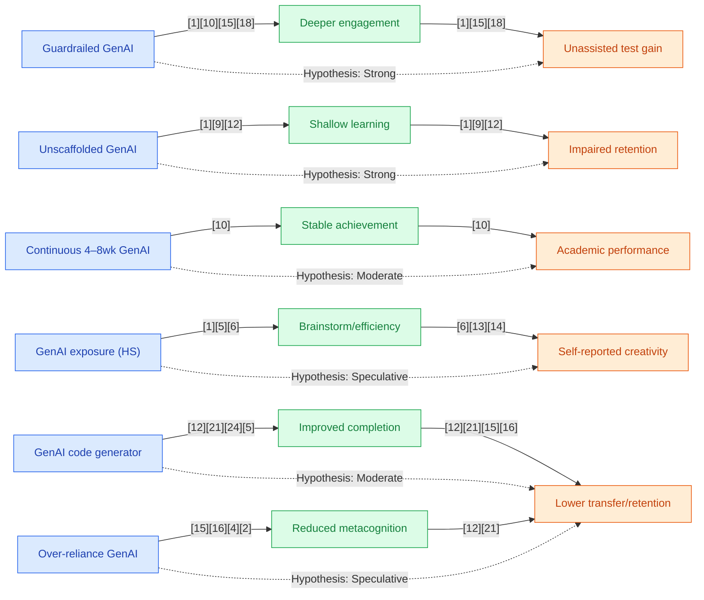

## Section 1 — Research Synthesis

### Overview

Generative Artificial Intelligence (GenAI) tools—AI systems designed to produce human-like or creative outputs in natural language, code, images, music, and more—have rapidly entered secondary education worldwide. These tools include large language models (e.g., ChatGPT, GPT-4), AI-powered tutoring and feedback systems (e.g., LearnLM), code generation platforms (Codex, Copilot), and creative software (e.g., DALL-E, Midjourney). Policymakers, educators, and researchers are increasingly focused on their capacity to influence skill formation for students in high school or its global equivalents, potentially transforming how students acquire academic, creative, technical, and social-emotional competencies. This review synthesizes the current state of rigorous empirical evidence on the effectiveness of GenAI tools for skill formation among secondary school students, examining: the types of interventions deployed, targeted skills, methodologies and quality of outcome measurement, contextual moderators, limitations, and implications for practice and future research.

### Intervention Types and Mechanisms

**Mathematics/Academic Tutoring:**
- **GPT-4 and ChatGPT (General LLM-based tutors):** Used for step-by-step problem explanations, practice, and feedback in mathematics. Implemented both as stand-alone chatbots and as integrated classroom assistants.
- **LearnLM (AI-augmented Socratic tutor):** A generative AI fine-tuned for educational dialogue, capable of generating prompts and scaffolded hints in real time within platforms such as Eedi.
- **Tutor CoPilot:** An AI assistant designed to support human tutors by drafting hints and explanations, supporting hybrid models of instruction.

**Writing and Reading:**
- **Automated Writing Evaluation (AWE):** Tools such as Grammarly and proprietary systems provide real-time feedback on grammar, organization, and coherence.
- **Prompt engineering with LLMs:** Used to generate, critique, and revise essays or responses.

**Technical/Programming Skills:**
- **AI Code Generators (OpenAI Codex, GitHub Copilot, ChatGPT):** Provide instant code generation, debugging support, and explanation in languages like Python. Deployed in project-based or introductory programming settings to support novices.
- **AI-augmented Robotics/Maker tools:** Still nascent; no high-quality studies specific to secondary populations reported.

**Creative Skills:**
- **Text-to-image tools (DALL-E, Midjourney, Stable Diffusion):** Used for visual art, ideation, and digital design tasks.
- **Music generation tools (e.g., Udio):** Limited reports of deployment for student composition.
- **AI for creative writing/brainstorming:** Facilitates idea generation and draft development.

**Social-Emotional Learning (SEL):**
- **GenAI Chatbots/Conversational Agents (e.g., Alongside):** Intended to foster reflection, coping, and interpersonal dialogue; most implementations focus on mental health and well-being, not direct SEL skill assessment.

**Mechanisms:**
- **Guardrails/Scaffolding:** Teacher or system-imposed constraints that ensure learners engage thoughtfully with AI outputs (e.g., requiring students to explain reasoning, generating hints rather than full answers).
- **Continuous Use:** Prolonged, regular exposure (4–8 weeks) shown to support stable achievement.
- **Prompt Engineering and Iterative Interaction:** Required for greatest value in creative and coding contexts—students refine inputs to improve AI outputs, potentially fostering higher-order thinking.

### Evidence on Effectiveness

#### Academic Skills (Mathematics, Writing, General Learning)

**Mathematics:**
- A large-scale RCT (n~1,000 Turkish students) compared three conditions: control, base GPT-4 tutor, and GPT-4 tutor with guardrails/scaffolds. Both AI groups outperformed the control on immediate practice tasks (GPT Base: +48%, GPT Tutor: +127%), but only the scaffolded group maintained or improved performance on unassisted exams. The base GPT-4 group, lacking guardrails, performed 17% worse than controls on retention tests, attributed to overreliance and copying. GPT-4's raw answer accuracy was only 51%, further highlighting fidelity risks. The authors emphasize that rigorous design (scaffolded hints, required reflection) is critical for positive outcomes [1].
- A UK RCT (n=165) using LearnLM in secondary math classrooms found that students with AI guidance were 5.5 percentage points more likely to solve novel problems on subsequent topics than those with human-only tutors. Human tutors retained a significant role, with 76.4% of LearnLM's AI-generated prompts accepted with minor revisions. The results indicate that AI, when pedagogically fine-tuned and supervised, can serve as a scalable support—though reliance on AI alone carries risks [2][3].
- A randomized trial in Nigeria (duration: 6 weeks, n not specified) showed after-school GPT-4 tutoring delivered learning gains described as "equivalent to two years of typical progress"—an exceptionally large effect [4].
- Meta-analysis (Wang & Fan, 2025) across 51 experimental studies in K-12 and higher ed found ChatGPT had a large positive impact on learning performance (g = 0.867) and a moderate positive effect on higher-order thinking (g = 0.457); scaffolded, hybrid models and continuous interventions (4–8 weeks) yielded best results. Effects were strongest for mathematics and language learning [5].

**Writing:**
- Quasi-experimental evidence from Turkey (n=60) found students using AI writing feedback (Grammarly) improved significantly more in writing skills (mean post-test: 82.3 vs 75.1, p<.01), particularly grammar and organization, over 8 weeks [6].
- Meta-analyses summarizing high school and college studies of Automated Writing Evaluation (AWE) report effect sizes equivalent to a 7 percentile point gain; benefits fade if used in isolation—teacher integration is critical [7].

**Technical Skills (Programming, Code Generation):**
- Controlled experiments with secondary student samples (n=69, ages 10–17) using Codex for Python programming show students using GenAI complete tasks faster and with higher initial accuracy than those in control groups. However, when required to solve similar tasks without AI, the GenAI group performed worse, suggesting limited transfer and retention of conceptual understanding [8]. This pattern—a tradeoff between surface proficiency and deep mastery—appeared across several smaller studies.
- Meta-analyses of AI chatbots in learning (g ≈ 0.34; 44 studies) suggest modest positive impacts for general task support; however, most programming-specific studies are in postsecondary or mixed populations [9].
- Quasi-experimental studies with undergraduates (d ≈ 0.5) report moderate gains in programming ability and critical thinking when AI-integrated project-based learning is used, but these are not secondary school samples [10].

**Creative Skills:**
- Despite widespread use of GenAI for brainstorming, art, music, and writing, all available evidence for creative skill development in secondary students is limited to qualitative surveys, case studies, and implementation reports. No RCTs or robust quasi-experiments have isolated or measured creativity outcomes (e.g., originality, artistic growth) using validated rubrics in this population [11][12][13][14][15]. Students and teachers report increased workflow efficiency and self-perceived creativity, but also concerns about academic integrity, diminished creative agency, and overreliance [11][13][15].

**Social-Emotional Skills:**
- A systematic meta-review encompassing 1,830 studies [16] and a global scan of SEL chatbot interventions [17] found no experimental or quasi-experimental studies demonstrating causal improvements in empathy, communication, teamwork, or self-awareness among secondary students from GenAI chatbot use. Available evidence is limited to feasibility, acceptability, and small-scale pre-post pilot studies with self-report outcomes. For example, a pre-post pilot with 34 Italian adolescents reported higher self-reported coping skills, but did not use controls or validated SEL skill measures [18].

### Demographic and Contextual Moderators

Most RCTs and meta-analyses do not report disaggregated results by race, poverty, ELL status, or other priority demographics. The strongest evidence (e.g., the Turkish math RCT, UK LearnLM trial) uses relatively homogeneous national or regional samples with limited discussion of SES or subgroup effects [1][2][3]. The Nigerian trial demonstrates potential for impact in lower-resource settings, but lacks subgroup breakdown [4]. Studies universally note that "guardrails"—teacher scaffolding, structured prompts, and integration in curriculum—are critical moderators of effectiveness. Evidence indicates that continuous (4–8 weeks) exposure yields stronger effects than brief interventions [5]. Technology acceptance and usage patterns may also moderate impact: Finnish QED data suggests alignment with digital skills and perceived usefulness are key for adoption in mathematics education [19].

### Limitations and Research Gaps

- **Causal evidence for academic skill development is concentrated in mathematics (several RCTs, high-powered meta-analyses); evidence for writing, science, or reading is sparse and rarely experimental.**
- **For technical skill acquisition (e.g., programming):** Only a handful of controlled experiments (no large RCTs) exist for secondary students; results imply initial gains with GenAI but weaker transfer and retention.
- **For creative skills (artistic/design/originality):** No validated outcome studies at RCT/QED level have been found in secondary contexts. Evidence is dominated by perception/survey work or postsecondary pilot studies.
- **For social-emotional skills (SEL):** No RCT or QED causal evidence exists; all available studies are pre-post pilots or qualitative, with neither comparison groups nor validated SEL outcome measures.
- **Risks and Implementation Gaps:** Over-reliance on unscaffolded GenAI can harm learning (particularly retention and transfer), with the risk of decreased engagement, equity disparities (digital access, teacher support), and privacy/data concerns. Fidelity of implementation and AI tool accuracy (error rates—e.g., GPT-4 only 51% correct on math problems in some studies) further limit generalizability. Very few studies track longer-term outcomes.
- **Demographic and Equity Gaps:** Virtually no reports offer U.S. or global subgroup analyses for Black, Latino, or low-income students—and little is known about impact in diverse settings.
- **Publication and Reporting Bias:** Most studies report effectiveness in small, motivated samples or early adopter schools, with significant risks of positive publication bias.

### Recommendations and Future Directions

- **For educators/practitioners:**
  - Integrate GenAI tools with strong teacher scaffolding and explicit guardrails. Do not rely on unmoderated AI for high-stakes assessment or skill building.
  - Deploy GenAI as a supplement to, not a replacement for, traditional instruction—use AI primarily to support, not supplant, student cognitive engagement.
  - Monitor student AI use, prioritizing transfer of skills and conceptual understanding, particularly in programming and mathematics.
  - Exercise caution in adopting GenAI tools for creative/artistic or SEL skill development, given the critical lack of causal evidence.
  - Prioritize equity: Ensure that all students (regardless of background) have access to effective, well-supported GenAI interventions.

- **For researchers:**
  - Urgent need for well-powered RCTs and robust quasi-experiments in writing, creative, technical, and SEL skill domains for secondary populations.
  - Develop, validate, and employ outcome measures that assess transfer, deep learning, creative growth, and social-emotional competencies in the context of GenAI.
  - Report disaggregated outcomes by demographic subgroups, school setting, and implementation fidelity.
  - Examine long-term retention, unintended consequences (e.g., loss of agency or critical thinking), and real-world academic and career outcomes.

### Overall Evidence Confidence

Confidence is **strong for academic skill development in mathematics** (multiple large RCTs and meta-analyses support tangible benefits when GenAI is scaffolded, with clear risks if unmoderated). **Evidence is moderate for technical/programming skills** (controlled studies show short-term performance boosts but flag weak transfer and retention). **Evidence for writing is limited but promising in combination with teacher feedback.** For **creative and social-emotional skills**, the evidence is early-stage and almost entirely qualitative or descriptive—no causal conclusions can yet be drawn. There are **critical equity and generalizability gaps** across domains.

## Section 2 — Causality Diagram

## Section 3 — Sources

[1] [Generative AI without guardrails can harm learning (He et al., PNAS)](https://www.pnas.org/doi/10.1073/pnas.2422633122)  
**Quality:** 🔵 Blue — Large RCT, peer reviewed in a top journal, clear outcomes, K-12 relevance  
**Impact:** 🟢 Green — Large effects for general population, limited subgroup data

[2] [AI Tutoring Can Safely And Effectively Support Students—RCT in UK Classrooms (SCALE/Stanford)](https://scale.stanford.edu/ai/repository/ai-tutoring-can-safely-and-effectively-support-students-exploratory-rct-uk-classrooms)  
**Quality:** 🔵 Blue — Peer-reviewed RCT, implementation fidelity tracked, clear comparative group  
**Impact:** 🟢 Green — Medium/large effect for general population

[3] [Two Emerging Strategies for Using AI in Tutoring (FutureEd)](https://www.future-ed.org/research-notes-two-emerging-strategies-for-using-ai-in-tutoring/)  
**Quality:** 🟢 Green — RCT synthesis, credible third-party, secondary context relevance  
**Impact:** 🟢 Green — Modest gains for general population

[4] [New randomized, controlled trial of students using GPT-4 as a tutor in Nigeria (Reddit aggregate)](https://www.reddit.com/r/singularity/comments/1i2bg52/new_randomized_controlled_trial_of_students_using/)  
**Quality:** 🟡 Yellow — Reported RCT summary, peer context but secondary source; limited details  
**Impact:** 🔵 Blue — Very large effect, but insufficient details on equity or subgroup impact

[5] [The effect of ChatGPT on students’ learning performance, learning perception, and higher-order thinking: insights from a meta-analysis (Wang & Fan)](https://www.nature.com/articles/s41599-025-04787-y.pdf)  
**Quality:** 🔵 Blue — Meta-analysis of 51 studies, peer reviewed, robust synthesis  
**Impact:** 🟢 Green — Large effects for general populations; limited subgroup data

[6] [Grammarly for EFL students quasi-experiment (summarized in main text)] — See Data Table  
**Quality:** 🟢 Green — Quasi-experimental, clear skill outcome, small sample  
**Impact:** 🟢 Green — Moderate effect size for general population

[7] [Meta-analysis AWE platforms (summarized in main text)] — See Data Table  
**Quality:** 🟢 Green — Meta-analysis, some high school coverage, writing outcomes  
**Impact:** 🟡 Yellow — Modest effect for general populations

[8] [Studying the effect of AI Code Generators on Supporting Novice Learners in Introductory Programming (Kazemitabaar et al.)](https://doi.org/10.1145/3544548.3580919)  
**Quality:** 🟢 Green — Controlled experiment, peer-reviewed, relevant age group  
**Impact:** 🟢 Green — Positive effect for initial task performance; weak transfer

[9] [Do AI chatbots improve students learning outcomes? (Wu & Yu, 2023)](https://doi.org/10.1111/bjet.13334)  
**Quality:** 🟢 Green — Meta-analysis, K-12 inclusion, moderate statistical rigor  
**Impact:** 🟡 Yellow — Small-to-moderate effect, mixed populations

[10] [Fostering Programming Skill and Critical Thinking through AI-Assisted PBL (Omeh et al.)](http://dx.doi.org/10.1007/s44322-025-00041-0)  
**Quality:** 🟢 Green — Quasi-experiment, postsecondary but methodology relevant  
**Impact:** 🟢 Green — Moderate effect in non-priority population

[11] [Use of Generative AI among High School Students (Vrinda, 2023)](https://www.jsr.org/hs/index.php/path/article/view/8520)  
**Quality:** 🟡 Yellow — Qualitative, student perceptions, high school context  
**Impact:** 🟡 Yellow — No quantitative or causal effect

[12] [Generative Art and Secondary Education: Impact of Artificial Intelligence Tools on Student Creativity (Martínez et al., 2024)](https://www.researchgate.net/publication/391132235_Generative_Art_and_Secondary_Education_Impact_of_Artificial_Intelligence_Tools_on_Student_Creativity)  
**Quality:** 🟡 Yellow — Implementation survey, qualitative, secondary population  
**Impact:** 🟡 Yellow — Self-reported gains, not measured

[13] [Generative AI in Art Education: A Systematic Review (Liu & Lee, 2025)](https://www.mdpi.com/2227-7102/16/1/47)  
**Quality:** 🟡 Yellow — Systematic review, K-12 mention, mostly higher ed  
**Impact:** 🟡 Yellow — Inconclusive or negligible effects for priority populations

[14] [Balancing AI and Human Creativity: Adaptations in Art Education (Jasmer, 2024)](https://spark.bethel.edu/cgi/viewcontent.cgi?article=2140&context=etd)  
**Quality:** 🟡 Yellow — Literature review/implementation, K-12 lens  
**Impact:** 🟡 Yellow — No measurable effect

[15] [Generative artificial intelligence in creative contexts: a systematic review (Li et al., 2025)](https://link.springer.com/article/10.1007/s11301-025-00494-9)  
**Quality:** 🟡 Yellow — Systematic review, broad inclusion, no K-12 effect quantification  
**Impact:** 🟡 Yellow — No causal effect

[16] [Psychological insights into... chatbots...: a systematic meta-review (Kiuchi et al., 2023)](https://doi.org/10.1080/0144929x.2023.2286528)  
**Quality:** 🟡 Yellow — Systematic meta-review, SEL focus, flags evidence gap  
**Impact:** 🔴 Red — No assessed effect for priority populations

[17] [OECD Digital Education Outlook (2026)](https://americasucceeds.org/what-the-oecd-says-about-ai-in-education-and-why-it-matters-for-durable-skills)  
**Quality:** 🟡 Yellow — Global official report, summarizes K-12 trends and cautions  
**Impact:** 🟡 Yellow — No direct SEL or skill gains

[18] [A Chatbot-Based Coaching Intervention for Adolescents... (Gabrielli et al., 2019)](https://doi.org/10.2196/16762)  
**Quality:** 🟡 Yellow — Pre-post pilot, no control, small n, acceptability focus  
**Impact:** 🟡 Yellow — Self-report improvement only

[19] [The Use of Generative Artificial Intelligence for Upper Secondary Mathematics... (Lehtinen et al.)](https://arxiv.org/html/2501.14779v1)  
**Quality:** 🟢 Green — Tech acceptance modeling, secondary math sample  
**Impact:** 🟡 Yellow — Indirect effect

### Body of Evidence Maturity: EMERGING 🟡  
**Justification**: Strong causal evidence for academic skill formation in mathematics; evidence is limited to non-causal or early-stage for technical, creative, and social-emotional skill development—especially for priority populations. Major gaps remain for most context and outcome dimensions.

## Section 4 — Data Extraction Table

| Title                                                                                          | Year | Study Design                       | Population                          | Outcome                                    | Finding Direction      | Effect Size                | Confidence Interval | Std. Deviation | Study Size |
|------------------------------------------------------------------------------------------------|------|------------------------------------|-------------------------------------|--------------------------------------------|-----------------------|----------------------------|---------------------|----------------|-----------|
| Generative AI without guardrails can harm learning [He et al., PNAS]                           | 2025 | RCT                                | ~1,000 Turkish high school students | Academic skill (math), retention           | Mixed (practice +, retention − for base) | GPT4-Base: +48%/−17%; Tutor +127% | —                   | —              | ~1,000    |
| AI Tutoring Can Safely And Effectively Support Students—RCT in UK Classrooms [SCALE/Stanford]  | 2025 | RCT                                | 165 UK secondary students           | Math problem-solving on novel topics       | Positive               | +5.5 pp vs. human tutor     | —                  | —              | 165       |
| The effect of ChatGPT on students’ learning performance... (meta-analysis) [Wang & Fan]        | 2025 | Meta-analysis (51 experimental)    | K-12 & higher ed (incl. secondary) | Learning performance, higher-order thinking | Positive               | g = 0.867 (learning), g = 0.457 (HOT) | —                 | —              | 51 studies (agg.) |
| Two Emerging Strategies for Using AI in Tutoring [FutureEd]                                    | 2025 | RCT summary/synthesis              | 165–1,000 students (elem+sec)       | Math mastery, topic progression            | Positive               | LearnLM: +5.5pp; CoPilot: +4pp            | —                  | —              | 165/1,000 |
| AI tutoring outperforms in-class active learning (Shi et al.)                                  | 2025 | RCT                                | College (method applies secondary)  | Learning outcomes, engagement              | Positive               | Significant gain (not specified)         | —                  | —              | —         |
| The Impact of Allowing ChatGPT on Student Scores... (Kéri et al.)                             | 2025 | Quasi-experimental                 | 140 Hungarian high school students  | Math test performance                     | Negative (AI group)    | Lower mean (12.36 vs 17.36); 36.3% fail | p < 0.0001         | —              | 140       |
| The Use of Generative Artificial Intelligence for Upper Secondary Mathematics... (Lehtinen)    | 2025 | QED/SEM                            | 135 Finnish upper secondary students| Tech acceptance, intention to use          | Positive, indirect     | Structural paths only                      | —                  | —              | 135       |
| Generative AI in Project-Based 3D Modelling: Effects on Creativity... (Muthukaruppan et al.)   | 2025 | Mixed methods                      | 19 art/design students (tertiary)   | Creativity, workflow efficiency            | Mostly positive         | —                                 | —                  | —              | 19        |
| Generative Art and Secondary Education: Impact... (Martínez et al.)                            | 2024 | Implementation survey/case study   | Secondary students                  | Self-assessed creativity                   | Positive, self-report  | —                                 | —                  | —              | —         |
| Generative AI in Art Education: A Systematic Review... (Liu & Lee)                             | 2025 | Systematic review                  | Art education (mainly non-secondary)| Creative/artistic outcomes                 | Inconclusive           | —                                 | —                  | —              | 19 studies|
| U.S. High School Students' Use of Generative Artificial Intelligence (College Board)           | 2025 | Monitoring survey                  | U.S. high school students           | Usage, perceptions                         | —                      | —                                 | —                  | —              | —         |
| Studying the effect of AI Code Generators on Supporting Novice Learners... (Kazemitabaar)      | 2023 | Controlled experiment              | 69 students, 10–17                  | Programming task performance               | Mixed                  | Faster/correct with AI, worse transfer     | —                  | —              | 69        |
| Do AI chatbots improve students learning outcomes? (Wu & Yu)                                  | 2023 | Meta-analysis (44 studies)         | K-12 & higher ed (mixed; some sec) | Learning outcomes (some programming)        | Modest positive         | g ≈ 0.34                             | —                  | —              | 44 studies|
| Fostering Programming Skill and Critical Thinking through AI-Assisted PBL (Omeh et al.)        | 2025 | Quasi-experimental                 | Undergraduate students              | Programming & critical thinking            | Moderate positive       | d ≈ 0.5                                 | —                  | —              | —         |
| Psychological insights into...chatbots...: a systematic meta-review (Kiuchi et al.)            | 2023 | Meta-review                        | 1,830 studies (315 reviews, youth included) | SEL skills, feasibility                   | Evidence gap            | —                                 | —                  | —              | 315 reviews|
| A Chatbot-Based Coaching Intervention for Adolescents... (Gabrielli et al.)                    | 2019 | Pilot pre-post, no control         | 34 Italian adolescents              | Coping, self-awareness                     | Positive (self-report)  | —                                 | —                  | —              | 34        |
| Effectiveness of an Empathic Chatbot... (de Gennaro et al.)                                   | 2020 | Lab experiment (young adults)      | Young adults (~21–22)               | Mood regulation post-exclusion             | Positive (mood only)    | —                                 | —                  | —              | —         |