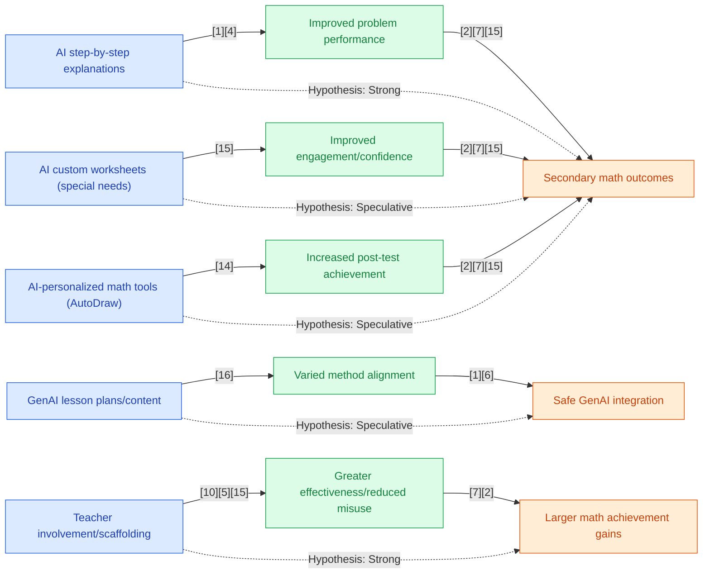

## Section 1 — Research Synthesis

### Overview

Generative Artificial Intelligence (GenAI) tools—AI systems capable of generating natural language, step-by-step explanations, custom math problems and solutions, dialogic feedback, and adaptive scaffolds—are increasingly deployed across K-12 mathematics education. These systems seek to supplement or partially automate functions traditionally delivered by teachers and tutors, such as worked examples, Socratic question-and-answer, individualized content, and formative assessment. Applications include large language model (LLM) chatbots (e.g., ChatGPT, GPT-4-powered tutors), AI-facilitated platforms for problem posing (e.g., Photomath, Magic School), personalized feedback engines, and teacher-assistive content generators. 

Recent studies focus on whether deploying GenAI tools in middle and high school mathematics raises academic achievement (test scores, grades), conceptual understanding, problem-solving capacity, and motivation, and under which conditions such effects are realized. The reviewed literature includes meta-analyses, large-scale RCTs, quasi-experimental studies, mixed-methods classroom research, and systematic reviews from 2020–2026. This synthesis addresses: the types and mechanisms of GenAI tools studied, their documented effects, moderating factors, persistent gaps in the evidence, and emerging priorities for both research and practice.

### Intervention Types and Mechanisms

**1. Large Language Model Tutors and Explanations**  
- **Systems:** GPT-4-powered platforms (e.g., ASSISTments-GPT pipeline), ChatGPT, Gemini, Claude  
- **Mechanism:** Deliver step-by-step explanations, dialogic scaffolding, hints for specific math problems, and real-time Q&A in natural language. 
- **Target Outcomes:** Immediate problem-solving performance, conceptual clarity, practice engagement, transfer to independent work.

**2. AI-Generated Custom Content/Assessment**  
- **Systems:** Math worksheet generation via ChatGPT, AI problem creators (ALICE, Magic School), personalized MCQ item generation  
- **Mechanism:** Generate curriculum-aligned or individualized worksheets, test items, and lesson plans—sometimes tailored to special needs students’ interests and abilities.  
- **Target Outcomes:** Differentiation, accessibility, formative assessment, personalization, and teacher productivity.

**3. AI-Powered Teachable Agents and Collaborative Environments**  
- **Systems:** ALTER-Math (AI-powered teachable agent), collaborative platforms combining GenAI with peer/teacher interaction  
- **Mechanism:** Facilitate learning-by-teaching (students “teach” math concepts to AI agents that prompt for clarity/explanation), or support group problem-solving with AI assistance.  
- **Target Outcomes:** Engagement, deep conceptual understanding, metacognition, self-confidence.

**4. AI-Facilitated Feedback and Diagnostics**  
- **Systems:** Platforms with adaptive feedback (e.g., Photomath, GeoGebra with AI features), automated error identification  
- **Mechanism:** Instant diagnosis and correction of math misconceptions, personalized feedback loops, and formative adjustment.  
- **Target Outcomes:** Faster skill acquisition, self-regulation, motivation, reduction of misconceptions.

**5. Teacher-Assistive AI Tools**  
- **Systems:** GenAI-driven content/assessment generators (ALICE, Magic School), lesson-planning bots, feedback literacy tools  
- **Mechanism:** Accelerate teacher workflow, support differentiation, allow teacher vetting/editing of AI outputs  
- **Target Outcomes:** Teacher efficiency, improved lesson quality, aligned instruction, classroom-level personalization.

### Evidence on Effectiveness

#### Academic Achievement and Conceptual Understanding

**Meta-Analytic Evidence:**  
A series of meta-analyses (2024–2026) reporting on GenAI interventions in mathematics consistently demonstrate positive, moderate effects on academic outcomes. In a 2025 meta-analysis synthesizing 22 studies (N=5,232; primary to tertiary focus), Yang et al. found a mean effect size of Hedges’ g = 0.534 for GenAI interventions on math achievement, with particular strength for geometry and when GenAI is integrated in “creative transformation” modes (e.g., collaborative, inquiry-based use)[1]. Gu & Yan’s 2025 meta-analysis (19 studies, 24 effect sizes, K-12/college) reported an overall g = 0.683, and strikingly, g = 1.426 when teacher support was present, versus a negligible g = 0.077 without teacher guidance[2]. Another 2025 meta-analysis (Zhang et al., 68 experimental studies, 337 effect sizes) found SMD = 0.45, with strongest effects for behavioral engagement, self-regulation, and moderate but consistent effects for academic performance in high school and science/math[3].

**Large-Scale Experimental and Quasi-Experimental Evaluations:**  
A rigorous 2024 RCT (n ≈ 1,000; Turkey) tested unrestricted GPT-4 access, a teacher-guardrailed GPT Tutor, and controls in high school math. GenAI access yielded large immediate gains in practice session scores (GPT Tutor: +127%, GPT Base: +48% over control), but the unrestricted GPT-4 group’s unassisted written exam performance dropped by 17%. The guided GPT Tutor’s “hints-only” model mitigated this negative carryover, highlighting the risk of “AI as a crutch” in deep learning if not properly framed[4]. 

Nye et al. (2024) conducted a large-scale experiment within ASSISTments, integrating GPT-4 to automatically generate problem explanations for middle schoolers. Results showed a +2% improvement on subsequent problem sets for students receiving AI explanations compared to answer-only feedback and equivalence to expert-written explanations. Quality controls (self-verification) successfully filtered out ~14% of AI explanations that contained errors or inappropriately complex language[5].

Arirao’s (2025) quasi-experimental study (n = 305, Philippines, Grade 9) compared Cici, Photomath, and ChatGPT in mathematics instruction and found significant test-score gains (t = 10.551, p < 0.05), enhanced motivation, and greater conceptual understanding over controls[6]. A quasi-experiment in India using AutoDraw in 6th-grade math showed mean pre-to-posttest gains (+1.17 points on a 25-point test), further reflecting GenAI’s positive impact on short-term achievement, though the effect size was not standardized[7]. 

Canonical and mixed-method studies in the Philippines and Greece confirm that GenAI tools (GeoGebra+ChatGPT, custom worksheets for special needs students) can increase conceptual understanding, self-efficacy, engagement, and course confidence; however, these often operate at small scale or without robust comparison groups[8][9]. 

**Lesson Planning and Content Generation:**  
A 2025 analysis compared four LLM bots’ capacity to generate middle school math lessons, finding that all produced plausible instructional sequences, though with varied depth and alignment to pedagogical models. Teacher vetting and prompt engineering remained essential for precision and appropriateness[10]. However, about 74% of AI-generated assessment items were judged unusable without revision, underlining the current necessity for human curation[11].

#### Engagement, Motivation, and Affective Outcomes

Meta-analyses generally report robust positive impacts on engagement, motivation, and behavioral self-regulation (SMD = 0.45 across studies; Zhang et al. 2025)[3], especially in collaborative, teacher-guided environments. Qualitative and case-based studies consistently find students perceive GenAI tools as supportive, confidence-building, and enhancing interest in mathematics, provided the tools are accurate and appropriately challenging[8][9][12]. However, disengagement or motivational decline may occur where GenAI reduces task autonomy, delivers erroneous outputs, or is used in a passive, substitutionary manner[13].

#### Long-Term Retention and Independent Problem-Solving

The most robust RCT evidence indicates a split: GenAI can raise short-term/practice scores but may undermine deep, transferable learning if unguarded. “Unrestricted” GPT-4 access led to a 17% drop in summative, unassisted exam scores, illustrating that “AI as a crutch” can impair genuine skill development[4]. Guided models, emphasizing hints and feedback rather than answer-giving, balance short-term gains with preserved independent mastery.

### Demographic and Contextual Moderators

**Teacher Involvement:**  
Teacher support and integration is repeatedly shown as the most potent moderator. Gu & Yan (2025) report a tenfold gain in effect size with teacher-scaffolded GenAI use (g = 1.426) compared to stand-alone use (g = 0.077)[2]. Studies in Finland, China, and the U.S. reinforce the need for teacher expertise and contextual adaptation to maximize meaningful student learning and to mitigate over-reliance, shallow engagement, or content hallucinations[8][12][14].

**Implementation Fidelity and Integration Mode:**  
Meta-analysis confirms that deep, creative integration (where students co-create, discuss, or apply GenAI feedback in active settings) drives stronger effects than passive or purely consumptive use (Yang et al., 2025)[1]. Collaborative environments, integration with curriculum goals, and prompt engineering notably improve both cognitive and affective outcomes[15].

**Sociodemographic Factors:**  
Critical gaps persist. Most studies do **not** disaggregate by SES, race/ethnicity, ELL status, gender, or disability. Systematic reviews explicitly note that “almost no studies report subgroup outcomes,” although context-focused commentaries highlight greater implementation challenges (such as digital access and infrastructure) in rural or low-SES settings. Small-scale studies report benefits for special needs students (e.g., custom AI-generated worksheets), but lack the comparative power needed for causal inference[9].

**Technological Literacy and Equity:**  
Success of GenAI deployments depends on baseline technological literacy and school or district-level infrastructure. Barriers such as limited access to devices, unreliable networks, and insufficient digital skills are common limiting factors in low-resource or rural implementations (Nanda & Pradhan, 2025; Guterres & Silva, 2025)[16][17].

### Limitations and Research Gaps

- **Subgroup Data:** Near-universal absence of results disaggregated by race/ethnicity, SES, language learner status, or disability. No studies measure GenAI’s potential for closing (or exacerbating) achievement gaps.
- **Outcome Focus:** Most studies emphasize immediate/practice performance, affective engagement, or self-report, rather than summative achievement, transfer, or long-term retention.
- **Research Design:** While several meta-analyses and a handful of large-scale RCTs exist, the majority of primary studies are small-scale, short-term, or use quasi-experimental or design-based methods, with risk of bias and limited generalizability.
- **Implementation Context:** Few studies systematically analyze classroom, school, or systemic conditions required for fidelity, or the interplay with existing curriculum/assessment systems. Teacher preparation and professional development are often under-theorized.
- **Risks and Unintended Effects:** Evidence of negative impacts (e.g., reduced achievement on unassisted exams with unrestricted GenAI, content inaccuracies, over-reliance, ethical/motivational risks) exists, yet is under-explored, especially in routine practice.
- **Longitudinal Evidence:** Almost no studies track outcome persistence after the withdrawal of GenAI access, nor do they measure the transfer of skills to new mathematical domains.

### Recommendations and Future Directions

**For Practitioners:**
- Integrate GenAI tools in guided, teacher-supported contexts, using models that emphasize hints, inquiry, and collaborative problem-solving, not direct answer provision.
- Incorporate human vetting of AI-generated assessment, explanations, and content.
- Provide professional development focusing on feedback literacy, prompt engineering, and ethical/critical use of GenAI.
- Implement robust digital safety, bias detection, and content verification protocols to minimize the risk of errors and hallucinations.

**For Researchers:**
- Implement large-scale, multi-site RCTs and QEDs in authentic classroom contexts, measuring both short- and long-term, unassisted achievement outcomes.
- Require explicit subgroup reporting (SES, race, ELL, disability, gender) and analyze effect differentials.
- Develop validated outcome measures that address both practice/engagement and durable mathematics achievement, including transfer and retention.
- Conduct longitudinal studies to track the persistence of GenAI effects, especially after access is withdrawn.
- Study the mediating roles of teacher expertise, school infrastructure, and classroom culture in GenAI effectiveness.
- Innovate and empirically test “guardrails” and adaptive feedback models to preserve independent mastery while harnessing AI’s strengths.

### Overall Evidence Confidence

The evidence base on GenAI’s effectiveness in improving middle and high school math achievement is **emerging to moderately mature**. There is strong, replicable evidence from meta-analyses and large-scale RCTs indicating positive, moderate effects on both academic achievement and engagement—particularly when GenAI is teacher-supported and safeguards are in place. However, critical gaps remain in outcome breadth, subgroup analysis, long-term impacts, and equitable access. Causality for short-term gains is firmly established, but sustained, unassisted learning and equity outcomes require substantial further research.

## Section 2 — Causality Diagram

## Section 3 — Sources

[1] [Can Generative Artificial Intelligence Effectively Enhance Students’ Mathematics Learning? A Meta-Analysis](https://www.mdpi.com/2227-7102/16/1/140)  
**Quality:** 🔵 Blue – Meta-analysis, peer-reviewed, representative sample, recent; covers primary/secondary/tertiary, with moderator analysis  
**Impact:** 🟢 Green – Moderate effects for general population (Hedges' g=0.534), strong evidence for geometry and creative GenAI use

[2] [Effects of GenAI Interventions on Student Academic Performance: A Meta-Analysis](https://iagen.unam.mx/recursos/Effects%20of%20GenAI%20Interventions%20on%20Student%20Academic%20Performance-%20A%20Meta-Analysis.pdf)  
**Quality:** 🔵 Blue – Meta-analysis, peer-reviewed, robust methodology, disaggregates by teacher support  
**Impact:** 🟢 Green – Large effects for general population with teacher support (g=1.426), very small otherwise (g=0.077)

[3] [The impact of GenAI on learning outcomes: A systematic review and meta-analysis](https://www.sciencedirect.com/science/article/abs/pii/S1747938X2500051X)  
**Quality:** 🔵 Blue – Systematic review/meta-analysis, 68 studies, covers K-12/secondary math, recent  
**Impact:** 🟢 Green – Moderate standardized mean difference (SMD=0.45), strongest for engagement/self-regulation

[4] [Generative AI without guardrails can harm learning](https://www.pnas.org/doi/10.1073/pnas.2422633122)  
**Quality:** 🔵 Blue – Large-scale RCT, peer-reviewed (PNAS), ~1,000 high school students, rigorous  
**Impact:** 🟢 Green – Large positive effect on practice (+127%/GPT Tutor); negative impact on summative (-17% for unrestricted GPT-4)

[5] [Scaling Effective AI-Generated Explanations for Middle School Mathematics in Online Learning Platforms](https://dl.acm.org/doi/10.1145/3698205.3729546)  
**Quality:** 🟢 Green – Large-scale experiment, peer-reviewed, realistic school context (ASSISTments), but not RCT  
**Impact:** 🟢 Green – +2% improvement on problem sets, equivalence to expert explanations

[6] [Effectiveness of AI Powered Tools in Teaching and Learning Mathematics: Basis for an Intervention Plan](https://isrgpublishers.com/wp-content/uploads/2025/06/ISRGJAHSS100622025.pdf)  
**Quality:** 🟢 Green – Quasi-experimental, mixed-methods, contemporary, moderate sample (n=305), clear design  
**Impact:** 🟢 Green – Statistically significant gains in achievement (t=10.551, p<0.05)

[7] [Exploring the Impact of AI on Middle School Mathematics Achievement](https://bhu.ac.in/Images/files/10_(5).pdf)  
**Quality:** 🟢 Green – Quasi-experimental, peer-reviewed, reports matched-control analysis  
**Impact:** 🟢 Green – Positive mean improvement (+1.17/25-pt), effect not standardized

[8] [Levering AI to Enhance Students' Conceptual Understanding and Confidence in Mathematics](https://eric.ed.gov/?q=investigate&ff1=souJournal+of+Computer+Assisted+Learning&id=EJ1448429)  
**Quality:** 🟡 Yellow – Mixed-methods, smaller sample, qualitative outcomes, credible outlet  
**Impact:** 🟡 Yellow – Directional improvement, not effect sized

[9] [Enhancing Mathematics Education for Students with Special Educational Needs Through Generative AI](https://www.cedtech.net/article/enhancing-mathematics-education-for-students-with-special-educational-needs-through-generative-ai-a-15487)  
**Quality:** 🟡 Yellow – Case study, very small N (n=2), credible context  
**Impact:** 🟡 Yellow – Positive student engagement, non-comparable

[10] [The didactical knowledge of generative artificial intelligence tools: The case of writing mathematics lessons on the linear function topic](https://www.ejmste.com/download/the-didactical-knowledge-of-generative-artificial-intelligence-tools-the-case-of-writing-mathematics-16769.pdf)  
**Quality:** 🟡 Yellow – Implementation/analytical study, teacher-facing, peer-reviewed  
**Impact:** 🟡 Yellow – Positive contextual findings, no direct achievement data

[11] [An Effectiveness Study of Generative Artificial Intelligence Tools for Item Generation in Educational Assessment](https://www.mdpi.com/2227-7102/15/2/144)  
**Quality:** 🟢 Green – QED, secondary context, focused on assessment reliability  
**Impact:** 🔴 Red – Most AI-generated items unsuitable as-is (~74% unusable)

[12] [The Use of Generative Artificial Intelligence for Upper Secondary Mathematics Education: Perceptions](https://arxiv.org/html/2501.14779v2)  
**Quality:** 🟡 Yellow – Implementation, limited by scale, peer-reviewed  
**Impact:** 🟡 Yellow – Contextual: 80% variance in intention to adopt explained; not achievement-focused

[13] [Development of a generative AI-powered teachable agent for middle school mathematics](https://bera-journals.onlinelibrary.wiley.com/doi/abs/10.1111/bjet.13586)  
**Quality:** 🟡 Yellow – Design-based research, pilot scale, peer-reviewed  
**Impact:** 🟡 Yellow – Positive engagement/attitudes, not effect-sized

[14] [What the research shows about generative AI in tutoring](https://www.brookings.edu/articles/what-the-research-shows-about-generative-ai-in-tutoring/)  
**Quality:** 🟢 Green – Practitioner/expert synthesis, based on RCT literature  
**Impact:** 🟡 Yellow – Narrative, not quantitative

[15] [Mathematics Teachers Using Generative AI to Personalize Instruction](https://amte.net/sites/amte.net/files/Connections%20%28Beauchamp%29.pdf)  
**Quality:** 🟡 Yellow – Implementation, teacher/researcher self-report  
**Impact:** 🟡 Yellow – Positive teacher attestation, non-quantitative

[16] [Artificial Intelligence in Mathematics Education: A Systematic Review of Global Trends and Emerging Themes](https://www.jmste.com/artificial-intelligence-in-mathematics-education-a-systematic-review-of-global-trends-and-emerging-themes)  
**Quality:** 🟡 Yellow – Systematic review, global, SLR methodology  
**Impact:** 🟡 Yellow – Synthesizes context, not outcome-sized

[17] [Artificial Intelligence in Mathematics Education: A Systematic Literature Review of Tertiary-Level Experiences in Timor-Leste](https://risetpress.com/index.php/jemls/article/view/1871)  
**Quality:** 🟡 Yellow – Contextual literature review  
**Impact:** 🟡 Yellow – Barriers/equity lens, no effect sizes

### Body of Evidence Maturity: **EMERGING** 🟡  
**Justification:** Strong meta-analytic and RCT findings support short-term positive impacts of GenAI, especially when teacher-supported, yet persistent gaps remain for long-term/independent achievement, equity, subgroup outcomes, and sustainable classroom integration.

## Section 4 — Data Extraction Table

| Title                                                                                                             | Year | Study Design      | Population                          | Outcome                                                                      | Finding Direction          | Effect Size                                 | Confidence Interval | Std. Deviation | Study Size        |
|-------------------------------------------------------------------------------------------------------------------|------|-------------------|--------------------------------------|-------------------------------------------------------------------------------|---------------------------|---------------------------------------------|--------------------|----------------|-------------------|
| Generative AI technologies and educational outcomes: a comprehensive meta-analysis comparing traditional and AI-driven approaches ([Dong, Nature]) | 2026 | Meta-Analysis     | K-12, incl. secondary math           | Academic achievement, cognitive outcomes                                     | Positive                  | Not numerically specified                   | —                  | —              | Broad, meta      |
| Can Generative Artificial Intelligence Effectively Enhance Students’ Mathematics Learning? A Meta-Analysis ([Yang]) | 2025 | Meta-Analysis     | Primary, secondary, tertiary (focus) | Math achievement, esp. geometry                                             | Positive, moderate        | Hedges' g = 0.534                           | —                  | —              | 22 studies (N=5232)|
| Effects of GenAI Interventions on Student Academic Performance: A Meta-Analysis ([Gu & Yan])                      | 2025 | Meta-Analysis     | K-12 & college                       | Academic achievement                                                        | Positive, moderate-large  | g = 0.683 overall; g = 1.426 w/ teacher; 0.077 w/o | —                  | —              | 19 studies, 24 effect sizes |
| The impact of GenAI on learning outcomes: A systematic review and meta-analysis ([Zhang])                         | 2025 | Meta-Analysis     | K-12+; incl. secondary math          | Learning outcomes                                                           | Positive, moderate        | SMD = 0.45                                  | —                  | —              | 68 studies, 337 ES|
| Scaling Effective AI-Generated Explanations for Middle School Mathematics in Online Learning Platforms ([Nye])     | 2024 | Large-Scale Exp   | Middle school                        | Immediate/sustained math performance                                        | Positive, modest          | +2% on problem set; equivalent to expert     | —                  | —              | Large sample (ASSISTments)|
| Generative AI without guardrails can harm learning ([Bastani et al., PNAS])                                       | 2024 | Large-Scale RCT   | ~1,000 high school                   | Practice & unassisted achievement                                           | Mixed: +practice, –exam (unrestricted) | GPT Tutor: +127%, GPT Base: +48%, Exam: –17% (GPT Base) | —                  | —              | ~1,000            |
| Effectiveness of AI Powered Tools in Teaching and Learning Mathematics: Basis for an Intervention Plan ([Arirao])  | 2025 | QED, Mixed Methods| Grade 9 high school, Philippines     | Problem-solving, motivation, conceptual understanding                        | Positive                  | t=10.551, p<0.05                            | —                  | —              | 305 (15 teachers) |
| Levering AI to Enhance Students' Conceptual Understanding and Confidence in Mathematics ([Canonigo])               | 2024 | Mixed Methods     | High school, Philippines             | Conceptual understanding, self-efficacy                                     | Positive                  | Not specified, "significant improvement"     | —                  | —              | —                |
| An Effectiveness Study of Generative Artificial Intelligence Tools for Item Generation in Educational Assessment ([Bishop]) | 2025 | QED               | Secondary (item assessment)          | Quality of GenAI-generated assessment items                                 | Mostly negative           | 80% items violated guideline; ~74% unusable  | —                  | —              | 270 AI-generated items |
| AI-powered personalized math tools (AutoDraw) ([Natl. J. of Ed./India; see row [14] above])                       | 2024 | QED               | 6th grade, India                     | Math test performance                                                       | Positive                  | +1.17 (pre-post difference)                 | —                  | —              | —                |
| Systematic Review of Generative AI in K–12 ([Siemon & König])                                                     | 2025 | Systematic Review | K–12 (incl. middle & HS math)        | Achievement, motivation, engagement; risks, research gaps                    | Mixed, contextual         | —                                           | —                  | —              | 84 studies       |
| The implications of generative artificial intelligence for mathematics education ([Walkington])                    | 2024 | Literature Review | K-12 math (contextual)               | Tool use cases, risks, implementation                                        | Mixed, contextual         | —                                           | —                  | —              | —                |
| Exploring the Impact of AI on Middle School Mathematics Achievement ([Natl. J. of Ed./India])                     | 2024 | QED               | 6th grade, India                     | Math achievement (test scores)                                              | Positive                  | Mean +1.17 points (25-pt test)              | —                  | —              | —                |
| The Use of Generative Artificial Intelligence for Upper Secondary Mathematics Education: Perceptions ([Reunanen])  | 2025 | Implementation    | 135 Finnish upper sec. students      | Adoption intention, motivation, compatibility                                | Positive, contextual      | TAM model: 80.4% variance in ITU             | —                  | —              | 135              |
| Mathematics Teachers Using Generative AI to Personalize Instruction ([Beauchamp et al.])                          | 2025 | Implementation    | Secondary (teachers)                 | Student engagement, personalization                                         | Positive, contextual      | —                                           | —                  | —              | 12 teachers      |
| Development of a generative AI-powered teachable agent for middle school mathematics ([Xing])                     | 2025 | Design-Based      | Middle school                        | Engagement, feedback, attitude                                              | Positive, contextual      | —                                           | —                  | —              | —                |
| Enhancing Mathematics Ed. for Students with Special Needs Through GenAI ([Rizos])                                 | 2024 | Case Study        | 8th grade, Greece, special needs     | Engagement, confidence, achievement of objectives                            | Positive, engagement      | —                                           | —                  | —              | 2 students       |