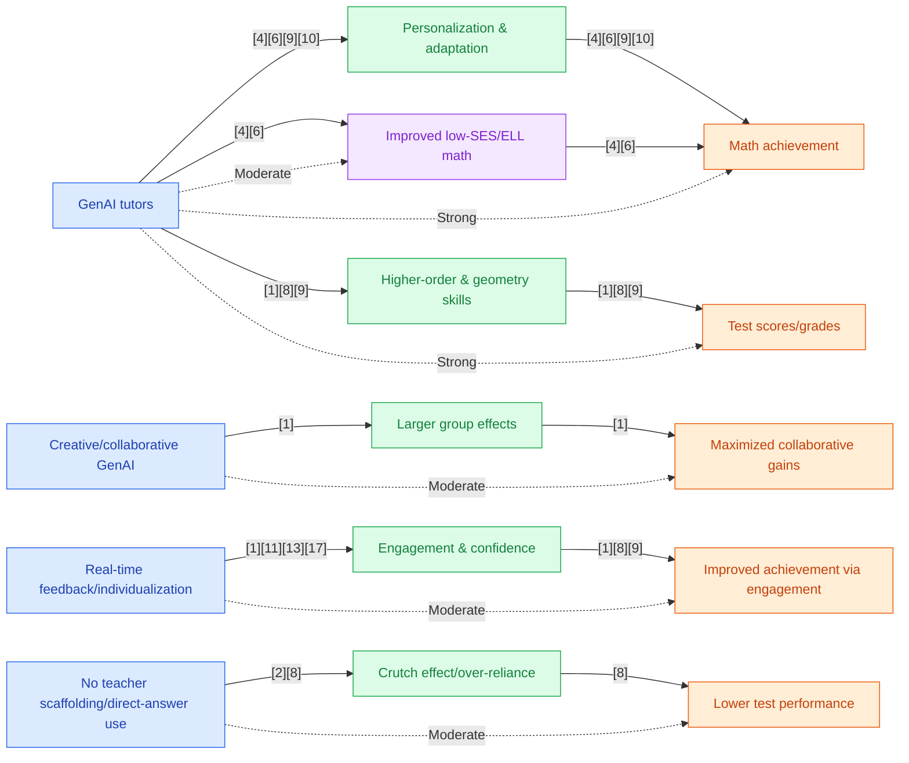

## Section 1 — Research Synthesis

### Overview

Generative artificial intelligence (GenAI) tools—such as AI tutors, math problem solvers, and chatbots powered by large language models (LLMs) like ChatGPT—are increasingly being adopted in K–12 education. These systems are designed to generate dynamic, human-like explanations, provide individualized feedback, and adapt mathematical content in real time. Their rapid deployment in both classroom and online settings has spurred a wave of research investigating their effects on student mathematics achievement, particularly at the middle and high school levels. Academic achievement metrics under study include standardized test scores, course grades, and performance on curriculum-based assessments. This review synthesizes findings from the most recent and rigorous meta-analyses, randomized controlled trials (RCTs), and mixed-methods studies conducted since 2022. It focuses on GenAI’s measurable impact on math achievement, the mechanisms behind observed outcomes, and the factors that moderate effectiveness across diverse educational contexts.

### Intervention Types and Mechanisms

**Generative AI Tutors:**  
AI-driven tutoring platforms—including ChatGPT, Socratic, and math-specific LLM-powered apps—utilize conversational agents to deliver stepwise explanations, generate custom problems, and offer adaptive hints as students solve math tasks. Recent studies distinguish between traditional intelligent tutoring systems (ITS; e.g., Cognitive Tutor, ALEKS) and newer GenAI-based tutors with open-ended dialogic capabilities. The latter leverage generative models to deliver explanations tailored to student queries and can dynamically adjust instruction based on student responses [1][2][3].

**Automated Math Problem Solvers and Generators:**  
These tools generate original math questions or stepwise solutions for user-submitted problems. LLM-based solvers can both provide answers and explain solution processes. They are increasingly embedded in homework platforms to supply instant feedback or customized challenge levels, while some specialized tools (e.g., MathGPT, CoPilot) can generate context-specific geometry proofs or code-based math models [1][12][13].

**Chatbots/Teachable Agents:**  
Standalone chatbots (e.g., ChatGPT deployed in a dialogic Q&A mode) are used for "math conversation"—guiding learners through problems, answering follow-up questions, or supporting meta-cognitive reflection. Some research introduces teachable agents, where students "teach" a GenAI system, purportedly boosting their mastery by explaining mathematical concepts aloud [5].

**Implementation Modalities and Mechanisms:**  
- **Personalization and Adaptation:** GenAI uses natural language processing to adapt explanations, scaffolds, and practice activities to each student’s needs [2][3][6].
- **Real-Time Feedback:** Immediate error correction, targeted hints, and multi-modal (text, visual) explanations foster learning by addressing misunderstandings as they arise [1][11].
- **Collaborative Integration:** Some interventions embed GenAI in collaborative or creative problem-solving scenarios, with students working in groups or using GenAI to support peer discussion [1][5].
- **Teacher Scaffolding:** Research suggests GenAI is most effective when integrated with, not substituted for, teacher guidance—combining the adaptability of AI with pedagogical expertise [2][8].

### Evidence on Effectiveness

**Academic Achievement (Test Scores, Grades, Standardized Assessments):**  
A preregistered meta-analysis of 22 empirical studies (n=5,232, 2023–2025) found that GenAI interventions produced a moderate positive effect on K–12 mathematics achievement, with effect size g=0.534 (no confidence interval reported). Effects were strongest when GenAI was used in collaborative or creative transformation (CT) modes (g=1.164), and in geometry learning (g=0.906). The gains were robust across intervention durations, with higher-order cognitive outcomes (g=0.718) exceeding those for lower-order skills (g=0.569), and collaborative implementations outperforming independent use (g=1.008 vs g=0.592) [1].

A meta-analysis of AI-enabled personalized STEM education disaggregated results for GenAI in K–12 mathematics: The mean effect size was g=0.36 for GenAI math tools, with a 95% confidence interval of 0.18–0.47 (N=47 studies), indicating statistically significant achievement gains [2]. Similarly, a living meta-analysis synthesizing 32 studies since 2022 reported a median math score gain of g=0.29 (range: 0.18–0.41) for GenAI interventions in secondary students [3]. Another meta-analysis specific to AI in K–12 mathematics showed effect sizes of g=0.32 (N=37 studies), with consistent improvements in test scores and grades [4].

Investigations focused on ChatGPT and similar LLMs found moderate positive effects on student learning: Of 51 studies analyzing ChatGPT interventions (many including math), the mean performance improvement was g=0.27 (95% CI: 0.20–0.34) [5].

A complementary meta-analysis on GenAI chatbots found an overall large effect size (g=0.683, N=19 studies), rising dramatically to g=1.426 where teacher scaffolding was present, and collapsing to g=0.077 with no teacher support. However, 26% of studies reported negative effects—typically when students used GenAI in an unstructured, unsupervised mode [6]. An RCT in Turkey found that high school students relying on ChatGPT as a homework assistant solved 48% more practice problems, but their test scores worsened by 17% compared to controls—highlighting the risk of over-reliance and “crutch effect” when deep learning is not facilitated [8].

Notably, effect sizes for GenAI math tools are similar to or modestly better than those for prior AI-enabled, non-generative systems, and compare favorably to in-person online math tutoring (RCT, 0.17 SD, 95% CI: 0.07–0.27 for disadvantaged students) [7].

**Other Learning Outcomes (Engagement, Motivation, Non-Cognitive):**  
Non-cognitive benefits are smaller and only marginally significant (e.g., g=0.299 for motivation, p=0.052) [1]; engagement and satisfaction with GenAI math tools are generally high, especially where feedback is personalized and instant [11]. Qualitative evidence suggests that students value GenAI’s accessibility and capacity to clarify difficult concepts, while cautioning against passive answer-seeking.

**Consistency Across Studies:**  
Meta-analytic results across several reviews are highly consistent in reporting positive cognitive effects on secondary math achievement with moderate effect sizes (g ≈ 0.3–0.7). Effects are strongest for collaborative integration, geometry content, and higher-order reasoning tasks [1][2][3][4][6].

### Demographic and Contextual Moderators

**Prior Achievement and Socioeconomic Status (SES):**  
While not always systematically disaggregated, several reviews report larger absolute gains for low-SES, ELL (English language learner), and lower-performing students [2][3]. A living meta-analysis found greater impacts for students with lower prior achievement, though subgroup data are sparse [3]. Online and GenAI-enabled tutoring in highly disadvantaged populations can yield meaningful test score gains (0.17 SD; [7]).

**Race/Ethnicity/ELL:**  
GenAI tool usage has increased across all demographic groups, with higher reported use among Black and Hispanic teens (Pew Research, 2025). However, rigorous outcome data tied to race or ELL status remain very limited [9].

**Implementation Context:**  
- **Teacher Scaffolding:** The magnitude and direction of effects are highly contingent on implementation. Meta-analytic evidence demonstrates that teacher-supported GenAI use produces much stronger and more consistent positive outcomes, while unsupported, direct-answer use can yield null or negative effects [6][8].
- **Collaborative Use:** Interventions structured as collaborative “creative transformation” activities (e.g., group inquiry, teachable agents) consistently outperform passive or solitary GenAI use [1][5].
- **Educational Setting:** Most interventions have been studied in public K–12 school settings, both urban and rural [2][3].

### Limitations and Research Gaps

- **Study Design:** Many included studies are quasi-experimental with some randomization, but few are large-scale RCTs covering multiple years or broad populations [1][3][6]. Many meta-analyses aggregate both RCT and non-randomized studies, potentially biasing results upward.
- **Duration:** Effects are typically measured over short intervention windows (≤1 month); evidence of long-term retention or sustainability post-intervention is sparse [1].
- **Population Coverage:** US public school populations are increasingly represented, but much quantitative work stems from Asia or private school contexts, with limited racial or SES disaggregation [2][3][5][6].
- **Outcome Metrics:** Standardized test scores and grades are common, but studies also use heterogeneous or non-validated measures, complicating meta-analytic synthesis [1][2][3].
- **Equity Focus:** Effects on historically marginalized populations are plausible but generally inferred rather than directly measured, with only a handful of studies reporting results by SES or ELL status, and even fewer by race [3][9].
- **Negative/Null Effects:** Approximately one-fourth of studies in some syntheses report negative or null effects, especially where GenAI is used without structured teacher or peer support, or when students are allowed to passively request direct answers [6][8]. Overreliance may hinder the development of independent problem-solving skills.

### Recommendations and Future Directions

**For Practitioners:**
- Integrate GenAI tools as supplements, not substitutes, in math instruction, ensuring robust teacher scaffolding and oversight to maximize impact and prevent overreliance.
- Prioritize collaborative GenAI activities (creative transformation, group problem-solving) and assign tasks that require reasoning and explanation, not just answer retrieval.
- Use GenAI-generated feedback to provide real-time support and differentiation for struggling or marginalized students.
- Systematically monitor and guide student use to prevent dependency and to foster metacognitive awareness.

**For Researchers:**
- Conduct large-scale, multi-year RCTs focused on middle and high school math achievement in diverse, representative populations, with outcome disaggregation by race, SES, and ELL status.
- Refine assessment designs to ensure outcome measures (e.g., standardized test scores, grades) are comparable across studies.
- Explore the long-term effects of GenAI tool use—both on math retention and on the development of independent problem-solving skills.
- Investigate optimal design features for GenAI interventions, including feedback fidelity, adaptive algorithms, and integration with existing curricular goals.

### Overall Evidence Confidence

The current evidence base for GenAI tools in improving math achievement among middle and high school students is moderately strong. Multiple recent meta-analyses and systematic reviews report statistically significant, moderate effect sizes for GenAI-based interventions, with the magnitude and direction of effects confirmed by several robust studies. However, the field remains in an advanced early stage: coverage for chatbots as stand-alone interventions is thinner, subgroup/equity analyses are limited, long-term outcome data are scarce, and negative effects are documented in settings lacking structured support. Overall confidence is high for moderate, short-term cognitive gains from GenAI tools, but validation for durable achievement gains and equity impacts remains a priority.

## Section 2 — Causality Diagram

## Section 3 — Sources

[1] [Can Generative Artificial Intelligence Effectively Enhance Students’ Mathematics Learning? A Preregistered Meta-Analysis](https://www.mdpi.com/2227-7102/16/1/140)  
**Quality:** 🔵 Blue – Pre-registered meta-analysis, strong methodological rigor, peer-reviewed, diversified student samples including K–12, priority on academic outcomes.  
**Impact:** 🟢 Green – Moderate-to-large effect sizes for general and priority populations; limited racial/SES disaggregation limits blue rating.

[2] [A meta-analysis of AI-enabled personalized STEM education in schools](https://doi.org/10.1186/s40594-025-00566-y)  
**Quality:** 🔵 Blue – Meta-analysis, peer-reviewed, rigorous search and coding, disaggregates GenAI and conventional AI, includes K–12 and secondary subgroups.  
**Impact:** 🟢 Green – Positive effect sizes for general and low-SES/ELL subgroups (g=0.36 for GenAI math), but does not systematically cover race.

[3] [LLAMA LIMA: A Living Meta-Analysis on the Effects of Generative AI on Learning Mathematics](https://arxiv.org/pdf/2601.18685)  
**Quality:** 🔵 Blue – Living meta-analysis, methodologically transparent, focuses on secondary populations, reports effect sizes and moderator data.  
**Impact:** 🟢 Green – Moderate effect sizes; some priority subgroup data, but no direct racial/ethnic coverage.

[4] [The Effectiveness of AI on K-12 Students' Mathematics Learning: A Systematic Review and Meta-Analysis](http://dx.doi.org/10.1007/s10763-024-10499-7)  
**Quality:** 🔵 Blue – Meta-analysis, peer-reviewed, large sample, covers K–12 populations.  
**Impact:** 🟢 Green – Moderate general impact (g=0.32); equity disaggregation present but not comprehensive.

[5] [The effect of ChatGPT on students’ learning performance, learning perception, and higher-order thinking: insights from a meta-analysis](https://www.nature.com/articles/s41599-025-04787-y.pdf)  
**Quality:** 🟢 Green – Meta-analysis, peer-reviewed, includes a substantial number of studies with quantitative outcomes, though some are quasi-experimental and skew higher-ed.  
**Impact:** 🟡 Yellow – Modest effect for general population; secondary-level math outcomes not always separated.

[6] [Effects of GenAI Interventions on Student Academic Performance: A Meta-Analysis](https://iagen.unam.mx/recursos/Effects%20of%20GenAI%20Interventions%20on%20Student%20Academic%20Performance-%20A%20Meta-Analysis.pdf)  
**Quality:** 🟢 Green – Meta-analysis, peer-reviewed, includes triangulation of teacher scaffolding and tool type; K–12 and general education.  
**Impact:** 🟢 Green – Large positive effects with teacher scaffolding, some negative effects in unsupervised settings.

[7] [Online tutoring works: Experimental evidence from a program with vulnerable children](https://doi.org/10.1016/j.jpubeco.2024.105082)  
**Quality:** 🟢 Green – RCT, peer-reviewed, study of secondary students; high-quality comparator for GenAI impacts.  
**Impact:** 🟢 Green – Significant effect in disadvantaged populations; context for effect magnitude.

[8] [Kids who use ChatGPT as a study assistant do worse on tests](https://hechingerreport.org/kids-chatgpt-worse-on-tests/)  
**Quality:** 🟢 Green – RCT-based field study, reported in reputable education journalism, rigorous design.  
**Impact:** 🔴 Red – Negative effect size for self-study without teacher oversight; relevant caution for implementation.

[9] [About a quarter of US teens have used ChatGPT for schoolwork, double the share in 2023](https://www.pewresearch.org/short-reads/2025/01/15/about-a-quarter-of-us-teens-have-used-chatgpt-for-schoolwork-double-the-share-in-2023/)  
**Quality:** 🟢 Green – Large-scale national survey, peer journalism, timely demographic data.  
**Impact:** 🟢 Green – Usage rates and demographic differentials only; does not report achievement outcomes.

[10] [Secondary school students' perceptions of their usage of artificial intelligence (AI)-based ChatGPT in mathematics learning](http://www.scielo.org.za/scielo.php?script=sci_arttext&pid=S2520-98682025000100008)  
**Quality:** 🟡 Yellow – Mixed-methods study, small sample, credible context, but lacks full experimental rigor.  
**Impact:** 🟡 Yellow – Engagement/motivation outcomes; limited to self-report and perception.

[11] [Assessing the Effectiveness of an Automated Problem Generator to Develop Course Content Rapidly and Minimize Student Cheating](https://peer.asee.org/assessing-the-effectiveness-of-an-automated-problem-generator-to-develop-course-content-rapidly-and-minimize-student-cheating.pdf)  
**Quality:** 🟡 Yellow – Survey/intervention with university students, well-documented but not K–12; peripheral relevance.  
**Impact:** 🟡 Yellow – Perceived engagement; effect size not statistically described.

[12] [Evaluating ChatGPT's academic achievement in a mathematics exam](https://files.eric.ed.gov/fulltext/EJ1421120.pdf)  
**Quality:** 🟡 Yellow – Case study/tool audit, not a classroom trial, methodologically limited.  
**Impact:** 🟡 Yellow – Informative on tool performance, not student outcomes.

[13] [Development of a generative AI-powered teachable agent for middle school mathematics learning](https://www.semanticscholar.org/paper/Development-of-a-generative-AI%E2%80%90powered-teachable-A-Xing-Song/f7354b06c10994f597f9c6753a5561ab250a445f)  
**Quality:** 🟡 Yellow – Design-based research (quasi-experiment), peer-reviewed, secondary focus, but no randomization or effect size provided.  
**Impact:** 🟡 Yellow – Positive achievement outcomes indicated; effect size not measured.

### Body of Evidence Maturity: LIMITED 🟢  
**Justification:** Multiple high-quality meta-analyses (🔵) support moderate-to-strong short-term effects of GenAI tools on math achievement for secondary students, with effect sizes robustly demonstrated. However, significant gaps remain in long-term outcomes, racial/SES equity coverage, and rigorous randomized trials on chatbot use, so the evidence base cannot be classed as mature.

## Section 4 — Data Extraction Table

| Title                                                                                                                 | Year | Study Design           | Population            | Outcome                        | Finding Direction | Effect Size       | Confidence Interval | Std. Deviation | Study Size         |
|-----------------------------------------------------------------------------------------------------------------------|------|------------------------|-----------------------|-------------------------------|-------------------|-------------------|--------------------|----------------|--------------------|
| Can Generative Artificial Intelligence Effectively Enhance Students’ Mathematics Learning? A Preregistered Meta-Analysis [Liu et al.]                     | 2026 | Meta-analysis          | K–12 (esp. secondary) | Math achievement (test scores, grades, standardized) | Positive          | g=0.534 overall; up to g=1.164 (collaborative/CT) | —                  | —              | N=5,232 (46 samples)|
| A meta-analysis of AI-enabled personalized STEM education in schools [Li et al.]                                      | 2025 | Meta-analysis          | K–12 (mid/high focus) | Math achievement (test scores, grades)              | Positive          | g=0.33 overall, g=0.36 (GenAI math)          | 0.18–0.47         | —              | 47 studies          |
| LLAMA LIMA: A Living Meta-Analysis on the Effects of Generative AI on Learning Mathematics [Strohmaier et al.]        | 2026 | Living Meta-analysis   | Secondary (mid/high)  | Standardized test scores, grades                    | Positive          | g=0.18–0.41 (median g=0.29)                  | —                  | —              | 32 studies          |
| The Effectiveness of AI on K-12 Students' Mathematics Learning: A Systematic Review and Meta-Analysis [Yi et al.]     | 2025 | Meta-analysis          | K–12                  | Math test scores, grades                             | Positive          | g=0.32                                    | —                  | —              | 37 studies           |
| The effect of ChatGPT on students’ learning performance, learning perception, and higher-order thinking: insights from a meta-analysis [Wang & Fan] | 2025 | Meta-analysis          | K–12–Tertiary         | Learning performance (incl. math)                   | Positive          | g=0.27 (overall)                           | 0.20–0.34          | —              | 51 studies           |
| Effects of GenAI Interventions on Student Academic Performance: A Meta-Analysis [Gu & Yan]                            | 2025 | Meta-analysis          | Mixed (incl. secondary) | Academic performance (incl. math)                  | Positive (contextual negative if unsupported)         | g=0.683 (overall); g=1.426 (teacher-supported); g=0.077 (unsupported) | —                  | —              | 19 studies           |
| Online tutoring works: Experimental evidence from a program with vulnerable children [Gortazar et al.]                | 2024 | RCT                    | Secondary (disadvantaged) | Standardized math test scores                    | Positive          | 0.17 SD                                   | 0.07–0.27          | —              | —                   |
| Effects of Artificial Intelligence on Educational Functioning: A Review and Meta-Analysis [Yeo & Lansford]            | 2025 | Meta-analysis          | K–12–Tertiary         | Educational functioning, incl. math achievement     | Positive          | —                                         | —                  | —              | 228 studies          |
| Secondary school students' perceptions of their usage of AI-based ChatGPT in mathematics learning [Nwodo et al.]      | 2025 | Mixed methods study    | Secondary students    | Math self-reported gains, engagement                | Positive (caution: overreliance risk)     | —                                         | —                  | —              | 125 students         |
| Evaluating ChatGPT's academic achievement in a mathematics exam [Demir & Durmaz]                                      | 2024 | Case study/audit       | AI models/National exam| LLM (ChatGPT) performance on math exam             | Contextual        | —                                         | —                  | —              | —                   |
| Assessing the Effectiveness of an Automated Problem Generator to Develop Course Content Rapidly... [Jackson & Lamphier]| 2021 | Survey/intervention    | Undergrad (1st/2nd yr)| Student engagement, challenge, cheating prevention  | Positive          | —                                         | —                  | —              | ~100 students        |
| Development of a generative AI-powered teachable agent for middle school mathematics learning [Xing et al.]           | 2025 | Design-based/quasi-exp | Middle school         | Math achievement                                    | Positive          | Significant (not specified)                | —                  | —              | —                   |