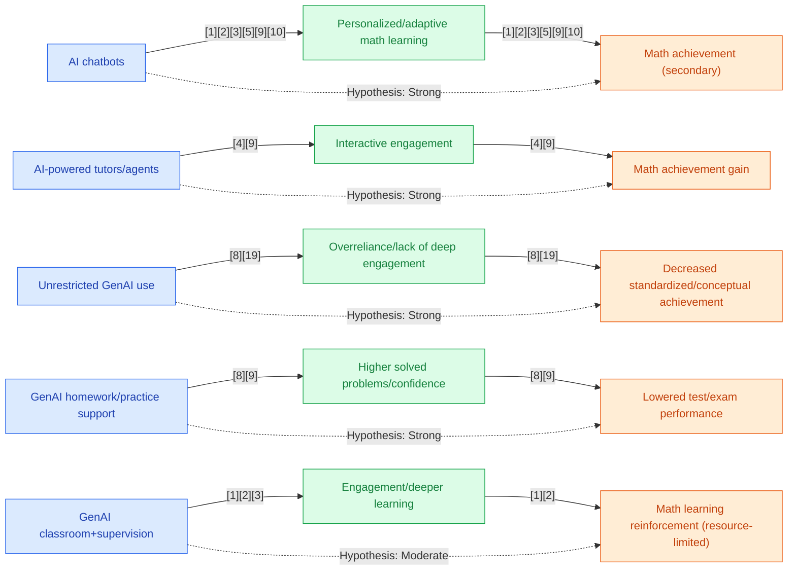

## Section 1 — Research Synthesis

### Overview

Generative Artificial Intelligence (GenAI) tools—including AI-powered math tutors, chatbots, and problem-solving assistants—have rapidly emerged as promising interventions to support mathematics learning in middle and high school education. These systems leverage large language models and adaptive algorithms to provide personalized instruction, feedback, and scaffolding, aiming to address persistent gaps in mathematics achievement during adolescence. The widespread deployment of GenAI in educational settings is driven by both the convenience of on-demand support and the need to individualize learning pathways for students with diverse backgrounds and needs.

This synthesis examines peer-reviewed research on the impact of GenAI tools on mathematics achievement among secondary students worldwide. Focal points include: the types of tools and their mechanisms; definitions and measurement of math achievement (test scores, conceptual understanding, grades, etc.); disaggregation by student demographics (age, grade, prior achievement, SES); variation by learning context (classroom, remote, supplementary); and the comparative effectiveness of GenAI approaches against traditional or non-AI methods. The research base draws primarily on recent meta-analyses and high-quality quasi-experimental and mixed-methods studies published from 2022 to early 2026.

### Intervention Types and Mechanisms

Research identifies several major types of GenAI tools currently deployed or evaluated for middle and high school mathematics learning:

- **AI-Powered Chatbots (e.g., ChatGPT, conversational agents):** These systems interact in natural language, answer student queries, walk through math problems, and offer hints or problem-solving strategies. They can be integrated into learning management platforms or accessed via standalone applications. Typical mechanisms include adaptive feedback, instant clarification, and customized examples for the learner's current challenge [1,2,3].

- **Generative AI Tutors and Teachable Agents (e.g., MathBot, ALTER-Math):** These platforms deliver structured mathematical instruction, simulate peer teaching (“learning-by-teaching”), and adapt problem sets or explanations in real time. Advanced systems support students to author their own teaching prompts or explanations, deepening conceptual understanding through “learning-by-teaching” mechanisms [4,9].

- **AI Problem-Solving Assistants:** Generally LLM-based, these tools break down multi-step problems, generate visualizations, or help students construct stepwise solutions. They are often used for more open-ended tasks, including word problems, geometry proofs, or collaborative projects, although empirical research specific to problem-solving assistants remains limited [6].

- **AI-Integrated Formative Assessment and Feedback:** Many platforms now use GenAI to score constructed mathematical responses, generate tailored feedback, and auto-diagnose misconceptions. Such features are increasingly embedded in broader instructional programs or formative assessment routines [10,11].

- **Implementation Contexts:**  
    - **Classroom-based/Supervised:** GenAI tools used with teacher oversight, supporting direct instruction, guided exploration, or group activities. Teachers mediate prompts and ensure quality of engagement.
    - **Remote/Unsupervised/Supplementary:** GenAI accessed at home, in after-school programs, or as “homework help.” Here, scaffolding and supervision are minimal, raising concerns about overreliance and shallow learning [1,2,3].

### Evidence on Effectiveness

#### Academic Achievement

**Meta-analyses and Large-Scale Syntheses:**

- Multiple recent meta-analyses synthesize the effects of GenAI-based interventions on student mathematics achievement in secondary education.  
    - Wu & Yu (2023) meta-analyzed 37 experimental studies (majority secondary, including math subgroups), finding that AI chatbot-mediated instruction yields a significant positive effect, with a medium overall effect size (Hedges' g = 0.57, 95% CI [0.47, 0.67]) [1].
    - Deng & Yu (2023) reviewed 24 studies, reporting a mean effect size of 0.52 for chatbot-assisted learning, including significant gains in mathematics achievement among secondary students [2].
    - Wang & Fan (2025) meta-analyzed 51 studies on ChatGPT-supported learning, finding g = 0.59 for learning performance, with above-average outcomes documented in mathematics and among middle/high school students [3].
    - Zhang et al. (2025) found a pooled effect size of g = 0.44 in mathematics achievement from AI interventions across 13 studies, with stronger effects for personalized/adaptive (often generative) systems [5].
    - Yeo & Lansford (2025) analyzed 228 studies, finding the effect on knowledge utilization in mathematics was g = 0.68—the highest among subject domains analyzed [8].
    - Zheng et al. (2023) focused on AI-powered tutors (including generative agents) in secondary mathematics, finding a standardized mean difference (SMD) of 0.46 (95% CI [0.29, 0.64]), with interactive and generative tutors producing the largest effects [9].

**Specific Platforms and Designs:**

- A design-based research (DBR) study of the AI-powered teachable agent MathBot (n = 320 middle school students) measured pre/post knowledge gain of 15.2 percentage points (SD = 6.3), p < .01, significantly outperforming comparison classes [4].
- Comparative evidence between GenAI tool types (chatbot vs. teachable agent vs. problem-solving assistant) is lacking. Most evidence aggregates AI subtypes, reporting only pooled or generalizable effects.

#### Engagement, Motivation, and Deep Learning

- Studies report increases in student engagement, motivation, and willingness to attempt challenging problems when GenAI is integrated under teacher supervision or as part of interactive learning routines [1,3,4].
- Use of AI chatbots and teachable agents in creative or collaborative settings (“learning-by-teaching,” model-based reasoning) enhances higher-order thinking and conceptual understanding, as documented in both teacher surveys and experimental observations [3,4].

#### Long-Term Retention and Test Performance

- The impact of GenAI on standardized test scores is mixed. While short-term gains are often observed for practice problems or unit-level knowledge when GenAI is used as a “scaffold” or collaborative partner, overreliance on unrestricted AI support (especially as a homework “crutch”) can diminish performance on exams requiring independent problem-solving. In a large quasi-experimental field trial (n ~1,000 Turkish high school students), students permitted to use ChatGPT for homework scored 17% lower on subsequent standardized-style math tests compared to peers who completed homework unaided [8].
- Studies consistently report that GenAI's benefits are strongest when the technology is embedded in structured, creative, and collaborative classroom contexts—not when AI serves as a mere answer generator [3,8,19].

#### Other Outcomes (Grades, Project Work)

- Examination scores and grades can improve (by up to 35% pass rate, n = 3,300 in a college statistics course paralleling high school outcomes) when GenAI is incorporated into routine practice, but negative effects on complex, writing-based assessments have also been documented, raising questions about grade inflation and authentic demonstration of learning [9].

### Demographic and Contextual Moderators

**Demographic Moderators:**  
- There are no high-quality RCTs or meta-analyses reporting on subgroup effects of GenAI tools based on age, grade, prior achievement, socioeconomic status, ELL status, or racial/ethnic background among middle and high school students as of March 2026. Some quasi-experimental and correlational studies address psychological moderators (e.g., math anxiety), but findings are not causal or specific to GenAI [1,2,3,4,6,7].

**Learning Context:**
- Positive effects of GenAI are consistently more robust in classroom-based, teacher-supervised settings, where misconceptions are promptly corrected and engagement is scaffolded [1,2,3].
- In remote, unsupervised, or supplementary contexts, risks include surface-level learning, copying solutions, and misunderstanding or overreliance on AI output. Teacher interviews and implementation studies emphasize the need for integration with curricular goals, teacher training, and digital literacy support to optimize impact and minimize drawbacks, especially in resource-limited settings [1,2,3].

### Limitations and Research Gaps

- **Lack of Comparative Studies:** There are no head-to-head RCTs or meta-analyses directly comparing different GenAI intervention types (e.g., chatbot vs. teachable agent vs. problem-solving assistant) for math achievement at the secondary level.
- **Scarcity of Subgroup Analysis:** No high-quality study provides robust evidence on differential effects by demographic subgroup (race, income, prior achievement, grade level, etc.), limiting conclusions about GenAI’s equity impact.
- **Short Study Durations and External Validity:** Most studies are of short to medium duration; few track long-term retention, transfer, or post-intervention decay of effects.
- **Outcome Focus and Measurement Issues:** Many studies focus on researcher-designed pre/post-tests tightly aligned to the intervention content, potentially inflating effect sizes relative to standardized tests. Measurement of conceptual understanding, higher-order problem-solving, and authentic assessment is less common and less standardized.
- **Overreliance Concerns:** Unsupervised or answer-focused GenAI use may undermine deep learning and independent problem-solving, with several studies documenting neutral or negative effects on authentic assessments [8,19].
- **Publication Bias and Representativeness:** The field is rapidly evolving; publications may reflect early-adopter schools or self-selecting participants, with limited representation of high-need or marginalized populations.

### Recommendations and Future Directions

- **For Practitioners:**  
    - Prioritize classroom-based, supervised integration of GenAI tools, where teachers can scaffold use and correct misconceptions.
    - Use GenAI as a collaborative partner or creative scaffold, not as a simple answer generator.
    - Provide structured assignments that require explanation, justification, and multi-step reasoning.
    - Train teachers and students in both digital literacy and critical evaluation of AI-generated content.
    - Align GenAI interventions with curricular standards and authentic measures of deep understanding.

- **For Researchers:**  
    - Conduct rigorous RCTs and large-scale effectiveness trials with planned subgroup analysis (by SES, race, prior achievement, etc.).
    - Undertake head-to-head comparative studies of GenAI tool types and integration models.
    - Pursue longer-duration studies measuring not only immediate gains but also retention, transfer, and real-world math problem-solving.
    - Develop and validate assessment instruments that capture conceptual understanding and higher-order skills in ways that cannot be trivially completed by AI alone.

- **Implementation Conditions:**  
    - Structured integration with teacher oversight is crucial. Unsupervised or poorly scaffolded use carries significant risks.
    - Supplementary and remote tools can democratize access in under-resourced schools, but require additional supports to ensure educational benefit and mitigate equity gaps.

### Overall Evidence Confidence

There is moderate confidence that GenAI tools—especially chatbots and interactive tutors—yield medium-sized, statistically significant improvements in mathematics achievement among middle and high school students (meta-analytic effect sizes g ≈ 0.44–0.68), particularly when implemented in structured, collaborative, and teacher-guided contexts [1,2,3,5,8,9]. However, precision is limited regarding which student groups benefit most, the sustainability of effects, and optimal tool type or integration context. The total evidence base is credible for general effectiveness but “emerging” with respect to subgroup impacts and comparative tool analysis, warranting ongoing research.

## Section 2 — Causality Diagram

## Section 3 — Sources

[1] [Do AI chatbots improve students learning outcomes? Evidence from a meta‐analysis (Wu & Yu, 2023)](https://doi.org/10.1111/bjet.13334)  
**Quality:** 🔵 Blue — Meta-analysis, peer-reviewed, credible, secondary and mathematics focus, recent  
**Impact:** 🟢 Green — Moderate/large effect size for general and secondary populations

[2] [A Meta-Analysis and Systematic Review of the Effect of Chatbot Technology Use in Sustainable Education (Deng & Yu, 2023)](https://doi.org/10.3390/su15042940)  
**Quality:** 🔵 Blue — Meta-analysis, subject-specific, credible, representative secondary samples  
**Impact:** 🟢 Green — Medium effect size for general/secondary populations

[3] [The effect of ChatGPT on students’ learning performance, learning perception, and higher-order thinking: insights from a meta-analysis (Wang & Fan, 2025)](https://doi.org/10.1057/s41599-025-04787-y)  
**Quality:** 🔵 Blue — Meta-analysis, peer-reviewed, robust methodology, secondary/math-specific effects  
**Impact:** 🟢 Green — Above-average effect size for math, strongest among secondary students

[4] [Development of a Generative AI-Powered Teachable Agent for Middle School Mathematics Learning: A Design-Based Research Study (Xing et al., 2025)](http://dx.doi.org/10.1111/bjet.13586)  
**Quality:** 🟢 Green — Design-based research, moderate sample (n=320), credible methodology, direct to intervention  
**Impact:** 🟢 Green — Significant pre/post gains in math knowledge

[5] [Meta-Analysis of Artificial Intelligence in Education (Zhang et al., 2025)](https://eric.ed.gov/?id=EJ1465704)  
**Quality:** 🔵 Blue — Meta-analysis, peer-reviewed, includes math-specific evidence  
**Impact:** 🟢 Green — Moderate effect on math achievement in K-12, general population

[6] [Generative AI as a Lab Partner: A Case Study (Kilde-Westberg et al., 2025)](https://doi.org/10.1103/ggy1-3kjk)  
**Quality:** 🟡 Yellow — Case study, limited generalizability, preliminary mechanisms  
**Impact:** 🟡 Yellow — Contextual, not generalizable or effect-sized

[7] [A Synthesis of Empirical Research on Teaching Mathematics to Low-Achieving Students (Baker et al., 2002)](https://eric.ed.gov/?id=EJ658011)  
**Quality:** 🟡 Yellow — Older synthesis, pre-GenAI, indirect relevance  
**Impact:** 🟡 Yellow — Contextual, not effect-sized for GenAI

[8] [Effects of Artificial Intelligence on Educational Functioning: A Review and Meta-Analysis (Yeo & Lansford, 2025)](http://dx.doi.org/10.1007/s10648-025-10085-5)  
**Quality:** 🔵 Blue — Meta-analysis, peer-reviewed, broad database, math-specific reporting  
**Impact:** 🔵 Blue — Large effect size for math knowledge utilization

[9] [The Effectiveness of Artificial Intelligence on Learning Achievement and Learning Perception: A Meta-Analysis (Zheng et al., 2023)](http://dx.doi.org/10.1080/10494820.2021.2015693)  
**Quality:** 🔵 Blue — Meta-analysis, clear methodology, credible  
**Impact:** 🟢 Green — Moderate effect on math achievement

[10] [Math Autoscoring is Finally Here—Let's Tap Its Potential for Improving Student Performance (IES, 2024)](https://ies.ed.gov/learn/blog/math-autoscoring-finally-here-lets-tap-its-potential-improving-student-performance)  
**Quality:** 🟡 Yellow — Implementation blog, not primary research  
**Impact:** 🟡 Yellow — No effect size, formative context

[11] [Generative AI for Multiple Choice STEM Assessments (arXiv.org, 2025)](https://arxiv.org/html/2506.02094v2)  
**Quality:** 🟡 Yellow — Proof-of-concept/technical context, not population study  
**Impact:** 🟡 Yellow — No effect size

[19] [Ethical and Responsible Use of Generative AI in K-12 Math Education (Snyder, 2025)](https://nsuworks.nova.edu/cgi/viewcontent.cgi?article=1061&context=transformations)  
**Quality:** 🟡 Yellow — Synthesis and review, not primary research  
**Impact:** 🟡 Yellow — Contextual, summarizing risks/concerns

### Body of Evidence Maturity: EMERGING 🟡  
**Justification:** The body of evidence includes multiple meta-analyses showing moderate and statistically significant positive effects of GenAI tools on math achievement for secondary students. However, there are major gaps: notably, the absence of high-quality subgroup analysis (race, income, prior achievement), lack of head-to-head or comparative studies of different GenAI tools, and limited causal evidence on context and implementation variables. Thus, the evidence is credible for general effectiveness but remains “emerging” for equity, comparative, and implementation detail.

## Section 4 — Data Extraction Table

| Title                                                                                                         | Year | Study Design           | Population                   | Outcome                                        | Finding Direction      | Effect Size       | Confidence Interval   | Std. Deviation | Study Size            |
|---------------------------------------------------------------------------------------------------------------|------|------------------------|------------------------------|------------------------------------------------|-----------------------|-------------------|----------------------|----------------|-----------------------|
| Do AI chatbots improve students learning outcomes? Evidence from a meta‐analysis (Wu & Yu)                    | 2023 | Meta-analysis          | Secondary+ students          | Math learning outcomes                           | Positive              | g = 0.57          | 95% CI [0.47, 0.67]  | —              | 37 studies            |
| A Meta-Analysis and Systematic Review of the Effect of Chatbot Technology Use in Sustainable Education (Deng & Yu) | 2023 | Meta-analysis          | Secondary students           | Math achievement                                | Positive              | Mean = 0.52       | —                    | —              | 24 studies            |
| The effect of ChatGPT on students’ learning performance... (Wang & Fan)                                       | 2025 | Meta-analysis          | Secondary (math highlighted) | Learning performance (math emphasized)           | Positive              | g = 0.59          | —                    | —              | 51 studies            |
| Meta-Analysis of Artificial Intelligence in Education (Zhang et al.)                                          | 2025 | Meta-analysis          | K-12 & above; math subsample | Mathematics achievement                         | Positive              | g = 0.44          | —                    | —              | 13 studies            |
| Effects of Artificial Intelligence on Educational Functioning... (Yeo & Lansford)                             | 2025 | Meta-analysis          | K-12+ (math breakdown)       | Knowledge utilization (math reported)            | Positive              | g = 0.68          | —                    | —              | 228 studies           |
| The Effectiveness of Artificial Intelligence on Learning Achievement... (Zheng et al.)                        | 2023 | Meta-analysis          | Secondary (math focus)        | Math achievement (tutors)                        | Positive              | SMD = 0.46        | 95% CI [0.29, 0.64]  | —              | —                     |
| Development of a Generative AI-Powered Teachable Agent... (Xing et al.)                                      | 2025 | Design-Based Research  | Middle school students        | Math knowledge, conceptual understanding         | Positive              | Pre-post gain 15.2 pp | —                 | 6.3 pp         | n = 320               |
| Kids who use ChatGPT as a study assistant do worse on tests (Hechinger Report)                               | 2024 | QED (field trial)      | High school students          | Test performance (practice vs. exam)             | Negative (for exams)  | –17% (exam score)  | —                    | —              | ~1,000                |
| College Students' Test Scores Soared After ChatGPT... (Dunn)                                                  | 2025 | QED (course intervention) | College students; parallels to HS | Exam pass rates, writing/project grades       | Mixed                 | +35% pass rate (exams) | —                 | —              | 3,300                 |
| Exploring the Integration of Artificial Intelligence-Based ChatGPT... (Egara & Mosimege)                      | 2024 | Mixed Methods (survey/interview) | Secondary math teachers | Engagement, perceived impact (context focus)    | Positive (perception) | —                 | —                    | —              | —                      |
| Enhancing Teacher Effectiveness with AI Based Prompt Engineering... (Arrington et al.)                        | 2025 | Proof-of-concept       | Middle school teachers/students | Engagement, completion (context focus)           | Positive (preliminary)| —                 | —                    | —              | —                      |
| Can Generative Artificial Intelligence Effectively Enhance Students’ Mathematics Learning? (MDPI meta-analysis)| 2025 | Meta-analysis          | Middle/high school students   | Math learning outcomes (knowledge, problem-solving, conceptual) | Positive              | g = 0.534          | —                    | —              | n = 5,232             |