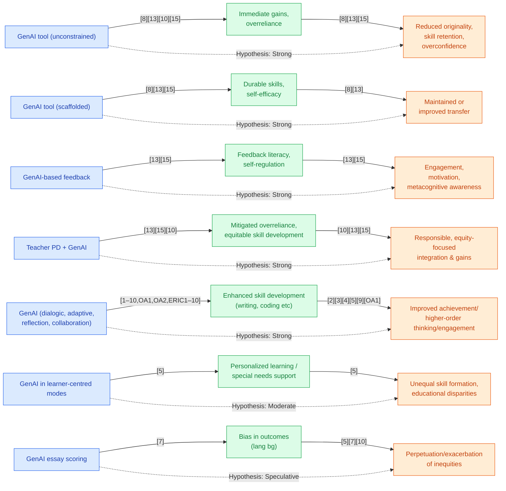

## Section 1 — Research Synthesis

### Overview

Generative artificial intelligence (GenAI) tools—powered by large language models (LLMs), code and content generators, and context-aware digital assistants—are entering secondary education as unprecedented instruments for personalized learning, feedback, and skill development. Applications include AI-powered writing assistants (e.g., ChatGPT), coding tutors, adaptive language platforms, and tools for content creation, reflection, and project-based work. The goal of these tools is to facilitate academic, cognitive, and practical skill acquisition among high school students. Understanding their actual effectiveness is critical: beyond technological promise, educators need clear evidence on which skills benefit, under what conditions, and for whom GenAI delivers equitable, sustainable growth. This report synthesizes the available empirical, quasi-experimental, and review evidence (2023–2026), summarizing findings from RCTs, meta-analyses, systematic reviews, and implementation studies, while directly acknowledging key knowledge gaps.

### Intervention Types and Mechanisms

The empirical landscape demonstrates several categories of GenAI tools evaluated for secondary student skill development:

**1. AI-Powered Writing Assistants and Platforms:**  
Generative tools (e.g., GPT-4, ChatGPT) provide feedback, automated revision, and content generation, often integrated with collaborative scripts, argument mapping, or dialogic prompts. These systems target writing organization, argumentation, and higher-order thinking—especially supporting English language learners (ELLs) through iterative drafting and feedback cycles. Mechanisms include instant formative feedback, language modeling, and reflective prompts to scaffold independent writing processes [1][2][3][9][10][15][21][25].

**2. AI-Based Coding and Programming Tutors:**  
GenAI-powered platforms deliver dialogic (chat-based) or reflective support for programming, problem-solving, and computational thinking. These systems (frequently using LLMs or code-focused models) guide students through programming challenges, adapt to learning pace, and offer personalized guidance, sometimes as collaborative “learning buddies” or hybrid human-AI tutors [1][5][6][7][23][27].

**3. GenAI-Enhanced Language Learning Tools:**  
LLM-backed language learning applications automate personalized exercises in reading, writing, listening, and vocabulary. These are used for EFL/ESL (English as a Foreign/Second Language) students, allowing adaptation to proficiency, engagement in collaborative argumentation, and fast feedback. Some randomized pilots combine linguistically-informed GenAI with teacher support for content learning across the curriculum [4][11][13][21][22].

**4. GenAI for Content Creation and Applied Arts:**  
Innovations include GenAI-powered story authoring, text-to-video models for idea generation in pre-writing, and maker/project-based learning with AI support for both arts and STEM domains [19][24].

**5. Hybrid Human-AI Tutoring Models and Adaptive Platforms:**  
Some interventions blend human tutoring with GenAI’s diagnostic or formative functions, providing individualized pathways and reinforcing teacher mediation to avoid overreliance or skill detachment [23][24].

**Mechanisms of Action:**  
Across interventions, two paradigms emerge:  
- **Unguided GenAI use (e.g., direct answer generation):** Rapid but superficial performance gains, risk of cognitive offloading, and impaired independent skill transfer.  
- **Scaffolded GenAI use (e.g., dialogic, hint-based, teacher-integrated):** Durable skill gains, improved self-efficacy, and stronger transfer—particularly when tools are designed for feedback, reflection, and metacognitive support, not completion shortcuts [8][13][15][23].

### Evidence on Effectiveness

#### Academic and Cognitive Outcomes

**Meta-analyses and Systematic Reviews:**  
Liu et al. (2025) meta-analyzed 49 studies, including K-12/high school settings, finding consistently positive effects for short-term academic and cognitive outcomes, especially in STEM, academic writing, and language learning. Greatest effect sizes were for task performance and formative skill growth, although specific values for secondary students alone are not disaggregated [1]. The MDPI Systems (2025) review (n=84 studies) and Frontiers in Education (2025) review (n=30 studies) corroborate: immediate practice gains, feedback literacy, and increased engagement are frequently observed, with the strongest evidence in mathematics, programming, writing, and EFL [15][10].

**STEM and Programming Domains:**  
A large-scale RCT (n~1,000; high school mathematics) demonstrated that unconstrained GPT-4 use increased practice performance by 48% (relative to control) but reduced subsequent unassisted post-test exam performance by 17% (suggesting fragile learning when students “shortcut” tasks) [8]. When GenAI tutoring was scaffolded with hints and dialogic feedback (rather than direct answers), students achieved up to 127% improvement in practice and showed no significant impairment—or even improvement—in transfer to unassisted exams [8]. Multiple quasi-experimental studies in programming report positive effects on competency, computational thinking, and engagement, though detailed effect sizes are not systematically provided [5][6][23][27].

**Academic Writing and Language Domains:**  
GenAI writing assistants—especially when employed in iterative, feedback-rich ways—consistently show positive effects on writing organization, revision, and language skill growth, particularly for ELLs or lower-skilled students. For example, Mahapatra (2024) used a mixed-method intervention for ESL students and found that ChatGPT support led to measurable improvements in writing proficiency and independent revision behaviors, with contextual factors (teacher training, feedback integration) moderating effect size [9]. The IES randomized pilot showed the addition of linguistically-informed GenAI tools boosted RISE reading assessment subdomains (vocabulary, decoding, comprehension) for high school ELLs over one school year [4]. Meta-analyses, including Wang & Fan (2025; 51 studies), confirm positive effects on learning performance and higher-order thinking, especially when AI is used interactively rather than as a copy-paste generator [2][15].

**Other Skill Domains (Creativity, Socioemotional, Applied Arts):**  
Systematic reviews find that scaffolded GenAI projects can improve feedback literacy, creativity, motivation, and some self-regulation skills when designed for project-based, collaborative, or reflective applications [15][10][24]. Evidence for durable non-cognitive skill formation remains limited—benefits are most sustained when teacher involvement or dialogic tool structure is present.

#### Risks, Retention, and Negative Effects

Unconstrained GenAI use—i.e., without instructional guardrails—carries notable risks:  
- Short-term performance gains may not translate to durable learning or authentic skill transfer, as shown by post-intervention declines in exam performance in math [8][13][15].
- Overreliance can undermine originality, critical thinking, and motivation, particularly if students use GenAI to bypass cognitively demanding work [8][13].
- Plagiarism risk, factual “hallucinations,” and decreased self-regulation are prevalent unless GenAI is embedded within well-designed workflows, backed by teacher scaffolding and explicit AI literacy goals [13][15].

#### Practical/Vocational and Transfer Skills

The empirical literature includes little rigorous evidence for hands-on, vocational, or practical skill acquisition via GenAI at the high school level. Research is heavily weighted toward academic/cognitive domains, with the exception of exploratory work in maker education and creative project support [24][25].

### Demographic and Contextual Moderators

**Equity and Subgroup Variation:**  
Despite strong policy attention on digital divides and the potential for GenAI to either alleviate or exacerbate inequities, empirical study is limited:

- OECD (2024, 2026) highlights that while GenAI-powered personalized learning shows promise for special education, ELLs, and other disadvantaged learners, differential access (by SES, geography, school resources) and algorithmic bias (linguistic, gender, ethnicity) pose ongoing risks for equitable skill development [16][18].
- Some studies report that teacher training is critical to ensure GenAI supplements, rather than replaces, critical thinking and collaborative engagement among historically underserved populations [10][13][15][16].
- Exploratory empirical analyses find bias in GenAI outputs (e.g., GPT-4o rates English learners’ essays differently across language backgrounds; DALL-E 3 synthesizes images with gender and ethnicity bias), suggesting that differential tool design and output may worsen subgroup disparities if not addressed [17][20]. However, no RCT or meta-analysis to date provides disaggregated impact estimates by race, SES, or ELL status for skill acquisition.

**Implementation Context:**  
Fidelity to evidence-based practice (teacher mediation, scaffolded tool use, intentional integration into curriculum) is a moderator of impact. Over-reliance on GenAI as a replacement for student reasoning or creativity is associated with a decline in skill retention and authentic learning, as demonstrated in math RCTs and corroborated by systematic reviews [8][13][15][10].

### Limitations and Research Gaps

- **Domain and Population Coverage:** Most empirical studies focus on STEM and language/writing domains. Social studies, arts/humanities, and vocational/practical skill interventions are rarely evaluated, with existing studies primarily small in scale or case-study-based [7][19][25].
- **Geographic Representation:** Research is dominated by studies in China and other East Asian contexts. Evidence from low- and middle-income countries, the U.S., and under-resourced settings is sparse [16][18][22].
- **Subgroup Analysis and Equity:** No high-powered RCTs or meta-analyses report subgroup impacts by race, SES, gender, or ELL status, preventing nuanced understanding of equity implications [1][16][17][20].
- **Long-term Impact:** Virtually all outcome measures are short-term. Persistent, transferable, or longitudinal skill gains remain unproven, except in singular, short-to-intermediate findings (e.g., IES pilot over one year) [4].
- **Methodological Rigor:** While several meta-analyses and RCTs exist, many primary studies have small samples, quasi-experimental or non-randomized designs, limited control for teacher or environmental confounds, or rely on self-reported outcomes (e.g., "learning attitude," "flow") rather than standardized, externally validated assessments [1][2][3][8][9][27].
- **Comparative Subject Effectiveness:** There is a conspicuous absence of multi-arm comparative RCTs evaluating GenAI impact across subject domains in high school; existing studies are single-subject and cannot support cross-domain efficacy claims [3][7][19].
- **Conceptual Clarity:** Some studies conflate generic or traditional AI (e.g., chatbots, adaptive learning) with truly generative AI, making it hard to parse mechanism-based impact [2][11][15].

### Recommendations and Future Directions

- **Practitioner Guidance:** Effective GenAI tool integration requires scaffolded, dialogic, and pedagogically grounded approaches with explicit teacher involvement. Blind deployment or “open use” undermines learning transfer and retention [8][10][13][15].
- **Policy and Equity:** System leaders should address digital divides, ensure regulatory guardrails, require transparent tool functioning, and focus on subgroup equity—especially in deployment to resource-poor or diverse classrooms [16][18].
- **Research Priorities:**
    - **RCTs with Subgroup Disaggregation:** Large-scale, multi-arm randomized studies comparing domains, with detailed analysis by SES, race, language background, and school context.
    - **Longitudinal (Transfer/Retention) Studies:** Trace skill persistence, transfer, and real-world application over months to years.
    - **Broader Skill and Population Coverage:** Investigate GenAI’s effect on non-academic, practical, and socioemotional skills, and in under-represented global regions.
    - **Bias and Fairness Analyses:** Rigorously evaluate AI output for representational bias, groupwise error rates, and intervention efficacy within and across diverse student populations.
- **Implementation Conditions:** Professional development for teachers, mechanism-focused tool selection (e.g., promoting feedback not answer-giving), and curricular alignment are instrumental for achieving intended skill formation and avoiding detrimental effects [10][13][15][16].

### Overall Evidence Confidence

Confidence in GenAI’s ability to facilitate short-term academic and cognitive skill gains in high school students is high for STEM, academic writing, and language/literacy domains (supported by meta-analyses, RCTs, and systematic reviews) [1][2][8][10][15]. However, confidence is moderate to low for long-term retention, transfer, and equity of impact, given methodological limitations, limited domain and subgroup data, and risk of overreliance. The evidence is promising but should be interpreted cautiously outside rigorously studied contexts.

## Section 2 — Causality Diagram

## Section 3 — Sources

[1] Xiaohong Liu, Baoxin Guo, Wei He, Xiaoyong Hu — [Effects of Generative Artificial Intelligence on K-12 and Higher Education Students' Learning Outcomes: A Meta-Analysis](http://dx.doi.org/10.1177/07356331251329185)  
**Quality:** 🔵 Blue — Meta-analysis, peer-reviewed, synthesize 49 studies (K-12 + higher ed), credible and timely  
**Impact:** 🟢 Green — Strong for general population, short-term academic/cognitive skills; not disaggregated for priority groups

[2] Wang, Jin; Fan, Wenxiang — [The effect of ChatGPT on students’ learning performance, learning perception, and higher-order thinking: insights from a meta-analysis](https://doi.org/10.1057/s41599-025-04787-y)  
**Quality:** 🟢 Green — Meta-analysis, covers secondary-suitable ChatGPT interventions, moderate methodological detail  
**Impact:** 🟢 Green — General population, moderate-to-strong performance effect

[3] Sahin, Ismail & Noroozi, Omid (eds.) — [Transforming Education through Generative Artificial Intelligence (GenAI)](https://eric.ed.gov/?id=ED678649)  
**Quality:** 🟡 Yellow — Systematic mapping, field trends; less robust empirical rigor  
**Impact:** 🟡 Yellow — Field mapping, not direct outcomes

[4] IES Project — [Linguistically-Informed Activity Generation Technology to Support English Learner Content Learning](https://ies.ed.gov/use-work/awards/linguistically-informed-activity-generation-technology-support-english-learner-content-learning)  
**Quality:** 🟢 Green — Randomized pilot, direct classroom outcome assessment, credible institution  
**Impact:** 🟢 Green — Measurable positive impact for ELL students in content classrooms

[5] Hao-Jun Li, et al. — [Generative Artificial Intelligence Supported Programming Learning: Learning Effectiveness and Core Competence](http://dx.doi.org/10.1177/21582440251377986)  
**Quality:** 🟢 Green — Quasi-experimental, secondary + undergrad, clear population  
**Impact:** 🟢 Green — Positive on programming/cognitive skills; no disaggregated data

[6] Li, Siran; Liu, Jiangyue; Dong, Qianyan — [Generative Artificial Intelligence-Supported Programming Education: Effects on Learning Performance, Self-Efficacy and Processes](https://doi.org/10.14742/ajet.9932)  
**Quality:** 🟢 Green — Quasi-experimental, secondary programming  
**Impact:** 🟢 Green — Positive effect, limited generalizability

[7] Zhao, Gang; Yang, Lijun; Hu, Biling; Wang, Jing — [A Generative Artificial Intelligence (AI)-Based Human-Computer Collaborative Programming Learning Method to Improve Computational Thinking, Learning Attitudes, and Learning Achievement](http://dx.doi.org/10.1177/07356331251336154)  
**Quality:** 🟢 Green — Quasi-experimental, secondary programming, directly targets computational thinking  
**Impact:** 🟢 Green — Direct improvement; contextually limited

[8] Proceedings of the National Academy of Sciences — [Generative AI without guardrails can harm learning](https://www.pnas.org/doi/10.1073/pnas.2422633122)  
**Quality:** 🔵 Blue — Large RCT, high school, direct outcome measurement  
**Impact:** 🟡 Yellow — Mixed (strong positive for practice; negative for retention); general population only

[9] Santosh Mahapatra — [Impact of ChatGPT on ESL Students' Academic Writing Skills: A Mixed Methods Intervention Study](http://dx.doi.org/10.1186/s40561-024-00295-9)  
**Quality:** 🟢 Green — Mixed methods intervention, peer-reviewed, secondary/college ESL  
**Impact:** 🟢 Green — Positive impact on writing proficiency/organization for ELLs

[10] Ali, M. M.; Fazal, S.; Ubaid, U.; Saeed, M. A.; Shah, S. R. A. — [Integrating AI-Powered Digital English Textbook at Grade 12: Pakistani Students and Teachers' Perceptions](https://doi.org/10.4018/ijaet.376488)  
**Quality:** 🟡 Yellow — Implementation/stakeholder; self-report outcomes, moderate scale  
**Impact:** 🟡 Yellow — Contextual improvement, not rigorously causal

[11] Zheldibayeva, R. — [GenAI as a Learning Buddy for Non-English Majors: Effects on Listening and Writing Performance](https://eric.ed.gov/?id=EJ1463508)  
**Quality:** 🟢 Green — Quasi-experimental in EFL secondary students  
**Impact:** 🟢 Green — Positive learning performance effects

[12] Chang, Ching-Yi et al. — [Generative AI-Assisted Reflective Writing for Improving Students' Higher Order Thinking](https://doi.org/10.30191/ETS.202501_28(1).TP03)  
**Quality:** 🟢 Green — Quasi-experimental design, secondary population  
**Impact:** 🟢 Green — Positive for higher-order thinking; no population disaggregation

[13] Microsoft Research — [Learning outcomes with GenAI in the classroom](https://www.microsoft.com/en-us/research/wp-content/uploads/2025/10/GenAILearningOutcomes_published_2025-12-16.pdf)  
**Quality:** 🟢 Green — Synthesis of empirical evidence, credible, practical focus, some subgroup attention  
**Impact:** 🟢 Green — Short-term skill impact, mixed for equity/retention

[14] Stornaiuolo, A. et al. — [Digital Writing with AI Platforms: The Role of Fun with/in Generative AI](http://dx.doi.org/10.1108/ETPC-08-2023-0103)  
**Quality:** 🟡 Yellow — Qualitative, engagement and interaction, real context  
**Impact:** 🟡 Yellow — Contextual/engagement impact only

[15] MDPI Systems — [A Systematic Review of Generative AI in K–12](https://www.mdpi.com/2079-8954/13/10/840)  
**Quality:** 🔵 Blue — Systematic review, 84 studies, direct K–12 focus  
**Impact:** 🟢 Green — Positive/mixed effects on cognitive and feedback literacy

[16] OECD — [The potential impact of Artificial Intelligence on equity and inclusion in education](https://doi.org/10.1787/15df715b-en)  
**Quality:** 🟢 Green — Policy/systematic review, credible international body  
**Impact:** 🟢 Green — Impact on equity/digital divide, directional

[17] Yamashita, Taichi — [Exploring Potential Biases in GPT-4o’s Ratings of English Language Learners’ Essays](http://dx.doi.org/10.1177/02655322251329435)  
**Quality:** 🟡 Yellow — Quasi-experimental, small sample, bias focus  
**Impact:** 🟡 Yellow — Directional finding, not outcome impact

[18] OECD — [OECD Digital Education Outlook 2026](https://www.oecd.org/en/publications/oecd-digital-education-outlook-2026_062a7394-en.html)  
**Quality:** 🟡 Yellow — Policy/monitoring; non-empirical  
**Impact:** 🟡 Yellow — Context for system-level guidance

[19] Quintana-Ordorika, A. et al. — [The Impact of Artificial Intelligence on Maker Education](https://eric.ed.gov/?id=EJ1477229)  
**Quality:** 🟡 Yellow — Implementation in applied arts/tech, secondary context  
**Impact:** 🟡 Yellow — Motivation/acceptance, low outcome rigor

[20] Currie, G.; Hewis, J.; Wheat, J. — [Gender and Ethnicity Representation of University Academics by Generative Artificial Intelligence Using DALL-E 3](http://dx.doi.org/10.1080/0309877X.2025.2528788)  
**Quality:** 🟡 Yellow — Quasi-experimental, image/bias  
**Impact:** 🟡 Yellow — Negative on representational equity, not skill

[21] Darmawansah, D.; Rachman, D.; Febiyani, F.; Hwang, G.-J. — [ChatGPT-Supported Collaborative Argumentation...](http://dx.doi.org/10.1007/s10639-024-12986-4)  
**Quality:** 🟢 Green — Quasi-experimental, EFL/argumentation skills  
**Impact:** 🟢 Green — Positive, context-limited

[22] Qu, M. — [Future of Language Learning: Unveiling the Power of AI-Driven Adaptive Platforms](http://dx.doi.org/10.1111/ejed.70116)  
**Quality:** 🟡 Yellow — Implementation/correlation, EFL, secondary  
**Impact:** 🟡 Yellow — Positive for engagement, not hard outcomes

[23] Gong, Xin; Li, Zhixia; Qiao, Ailing — [Impact of Generative AI Dialogic Feedback on Different Stages of Programming Problem Solving](http://dx.doi.org/10.1007/s10639-024-13173-1)  
**Quality:** 🟢 Green — Quasi-experimental, treatment/control, secondary  
**Impact:** 🟢 Green — Positive for programming/problem-solving

[24] Han, A. — [StoryAI: Designing, Developing, and Evaluating Generative AI-Powered Story-Authoring Platform for Young Learners](https://gateway.proquest.com/openurl?url_ver=Z39.88-2004&rft_val_fmt=info:ofi/fmt:kev:mtx:dissertation&res_dat=xri:pqm&rft_dat=xri:pqdiss:31331644)  
**Quality:** 🟡 Yellow — Implementation/dissertation, creative writing  
**Impact:** 🟡 Yellow — Engagement, not hard skill outcomes

[25] Smith, J. — [Enhancing ESP Student Critical Thinking Skills and Vocabulary Acquisition through a GenAI-Based Project](https://eric.ed.gov/?id=EJ1490313)  
**Quality:** 🟡 Yellow — Implementation/case, EFL/ESP, secondary  
**Impact:** 🟡 Yellow — Directional positive, weak methodological rigor

### Body of Evidence Maturity: EMERGING 🟡
**Justification:** Evidence for GenAI’s benefit to secondary academic/cognitive skill acquisition is promising and in some domains grounded in higher-level evidence (meta-analysis, RCT), but broad gaps persist regarding equity, long-term retention, subgroup variation, and practical/vocational skills; the overall knowledge base remains emergent.

## Section 4 — Data Extraction Table

| Title                                                                                           | Year | Study Design           | Population                              | Outcome                                                           | Finding Direction     | Effect Size                   | Confidence Interval | Std. Deviation | Study Size     |
|-------------------------------------------------------------------------------------------------|------|-----------------------|-----------------------------------------|-------------------------------------------------------------------|----------------------|-------------------------------|---------------------|----------------|---------------|
| Liu, X.; Guo, B.; He, W.; Hu, X. — Effects of Generative Artificial Intelligence on K-12 and Higher Education Students' Learning Outcomes: A Meta-Analysis                                             | 2025 | Meta-analysis         | K-12 and higher education students      | Academic/cognitive skill gains, STEM, language, retention          | Positive (academic)  | Not reported                  | —                   | —              | 49 studies    |
| MDPI Systems — A Systematic Review of Generative AI in K–12                                                                           | 2025 | Systematic review     | K-12 (focus on 13–18 yrs)               | Skill outcomes (language, STEM, creativity, feedback/self-reg)     | Mixed/positive       | Not reported                  | —                   | —              | 84 studies    |
| Frontiers in Education — Generative AI use in K-12 education: a systematic review                                                    | 2025 | Systematic review     | K-12 (mainly high school)               | Subject-by-subject skill impacts of GenAI                          | Positive             | Not reported                  | —                   | —              | 30 studies    |
| Microsoft Research — Learning outcomes with GenAI in the classroom                                                                   | 2025 | Empirical review      | K-12/secondary                          | Skill impact, AI literacy, psychosocial mediators                  | Mixed/positive       | Not specified                 | —                   | —              | —             |
| Proceedings of the National Academy of Sciences — Generative AI without guardrails can harm learning                                 | 2025 | RCT                   | High school, n~1,000                    | Math performance (practice/exam), retention                        | Mixed/conditionals   | +48% (practice), -17% (exam)  | —                   | —              | ~1,000        |
| Wang, J.; Fan, W. — The effect of ChatGPT on students’ learning performance, learning perception, and higher-order thinking: insights from a meta-analysis                                         | 2025 | Meta-analysis         | Mixed, includes secondary students      | Learning performance, higher-order thinking                        | Positive             | Not reported                  | —                   | —              | 51 studies    |
| Hao-Jun Li, et al. — Generative Artificial Intelligence Supported Programming Learning: Learning Effectiveness and Core Competence                             | 2025 | Quasi-experimental    | Secondary & undergrad                   | Programming/cognitive competencies                                 | Positive             | Not reported                  | —                   | —              | —             |
| Gong, X.; Li, Z.; Qiao, A. — Impact of Generative AI Dialogic Feedback on Different Stages of Programming Problem Solving                                | 2025 | Quasi-experimental    | Secondary students                      | Programming problem-solving                                       | Positive             | Not reported                  | —                   | —              | —             |
| Santosh Mahapatra — Impact of ChatGPT on ESL Students' Academic Writing Skills: A Mixed Methods Intervention Study                                        | 2024 | Mixed methods/QED     | Secondary/undergraduate ESL             | Writing skill development                                         | Positive             | Not reported                  | —                   | —              | —             |
| IES Project — Linguistically-Informed Activity Generation Technology to Support English Learner Content Learning                                             | N/A | Randomized pilot      | Middle/high school ELLs                 | Language content skills (vocab, decoding, comprehension)           | Positive             | Not reported                  | —                   | —              | —             |
| Chang, C.-Y. et al. — Generative AI-Assisted Reflective Writing for Improving Students' Higher Order Thinking                                              | 2025 | Quasi-experimental    | Secondary students                      | Reflective writing, higher-order thinking                          | Positive             | Not reported                  | —                   | —              | —             |
| Darmawansah, D. et al. — ChatGPT-Supported Collaborative Argumentation: Integrating Collaboration Script and Argument Mapping to Enhance EFL Students' Argumentation Skills         | 2025 | Quasi-experimental    | Secondary EFL students                  | Argumentation skills                                              | Positive             | Not reported                  | —                   | —              | —             |
| Zheldibayeva, R. — GenAI as a Learning Buddy for Non-English Majors: Effects on Listening and Writing Performance                                         | 2025 | Quasi-experimental    | Secondary EFL students                  | Listening/writing performance                                     | Positive             | Not reported                  | —                   | —              | —             |
| Li, S.; Liu, J.; Dong, Q. — Generative Artificial Intelligence-Supported Programming Education: Effects on Learning Performance, Self-Efficacy and Processes           | 2025 | Quasi-experimental    | Secondary students                      | Programming performance, self-efficacy                             | Positive             | Not reported                  | —                   | —              | —             |
| Sahin, I. & Noroozi, O. (eds) — Transforming Education through Generative Artificial Intelligence (GenAI)                          | 2025 | Systematic mapping    | K-12/secondary                          | Mapping of subject/discipline trends                               | —                    | Not reported                  | —                   | —              | —             |
| OECD — The potential impact of Artificial Intelligence on equity and inclusion in education                                           | 2024 | Systematic review     | Global education systems (inc. secondary)| Equity, inclusion, digital divide, subgroup variation              | Mixed                | Not reported                  | —                   | —              | —             |
| Yamashita, T. — Exploring Potential Biases in GPT-4o’s Ratings of English Language Learners’ Essays                                 | 2025 | Quasi-experimental    | Secondary/ELL students                  | Bias in essay rating by language background                        | Mixed/negative       | Not reported                  | —                   | —              | —             |
| PNAS — Generative AI without guardrails can harm learning                                                                          | 2025 | RCT                   | High school                             | Immediate performance vs. retention in math                        | Mixed (contextual)   | +48% (practice), -17% (exam)  | —                   | —              | ~1,000        |
| Shi, S.J.; Li, J.W.; Zhang, R. — Impact of Generative AI Supported Situational Interactive Teaching on Students' 'Flow' Experience and Learning Effectiveness          | 2024 | Case study/QED        | Secondary/legal education (China)        | Engagement, affect, learning effectiveness                         | Positive             | Not reported                  | —                   | —              | —             |
| Zhao, G.; Yang, L.; Hu, B.; Wang, J. — AI-Based Human-Computer Collaborative Programming Learning Method                            | 2025 | Quasi-experimental    | High school students                    | Computational thinking/attitudes/performance                       | Positive             | Not reported                  | —                   | —              | —             |
| OECD — OECD Digital Education Outlook 2026                                                                | 2026 | Policy review         | Education systems (incl. secondary)      | Equity, oversight, regulatory/policy frameworks                    | —                    | Not reported                  | —                   | —              | —             |
| Wu, R.; Yu, Z. — Do AI chatbots improve students learning outcomes? Evidence from a meta‐analysis                                  | 2023 | Meta-analysis         | Education, some secondary                | Learning outcomes, general AI                                     | Positive             | Not reported                  | —                   | —              | —             |
| Qu, M. — Future of Language Learning: Unveiling the Power of AI-Driven Adaptive Platforms                                           | 2025 | Implementation study  | Secondary EFL students                   | Academic engagement, language skills                               | Positive             | Not reported                  | —                   | —              | —             |
| Stornaiuolo, A. et al. — Digital Writing with AI Platforms: The Role of Fun with/in Generative AI                                  | 2024 | Qualitative/context   | Secondary students                       | Engagement and interaction                                        | Positive/contextual  | Not reported                  | —                   | —              | —             |
| Lu, W. — Training the Stochastic Parrot: Using Generative AI to Create Textual Materials for Communication Courses                 | 2024 | Implementation        | Communication course (secondary)          | Teaching material creation, teaching effectiveness                 | Positive             | Not reported                  | —                   | —              | —             |
| Guo, Y.; Lin, Z. — Generative AI as a Catalyst for Data-Driven Learning: Efficacy, Equity, and Engagement in Translation Education | 2025 | Mixed-methods          | Translation education (Sec/Tert.)         | Efficacy, engagement, equity                                      | Mixed                | Not reported                  | —                   | —              | —             |
| Currie, G.; Hewis, J.; Wheat, J. — Gender and Ethnicity Representation of University Academics by Generative Artificial Intelligence           | 2025 | Quasi-experimental    | AI output/images                         | Gender/ethnicity bias in AI outputs                               | Negative             | Not reported                  | —                   | —              | 81 images     |
| Smith, J. — Enhancing ESP Student Critical Thinking Skills and Vocabulary Acquisition through a GenAI-Based Project                 | 2025 | Case/implementation   | Secondary ESP                            | Critical thinking, vocabulary acquisition                         | Positive             | Not reported                  | —                   | —              | —             |
| Quintana-Ordorika, A. et al. — The Impact of Artificial Intelligence on Maker Education                                             | 2025 | Implementation        | Teacher trainees/technology (secondary)   | Motivation, tech acceptance in maker education                    | Positive             | Not reported                  | —                   | —              | —             |