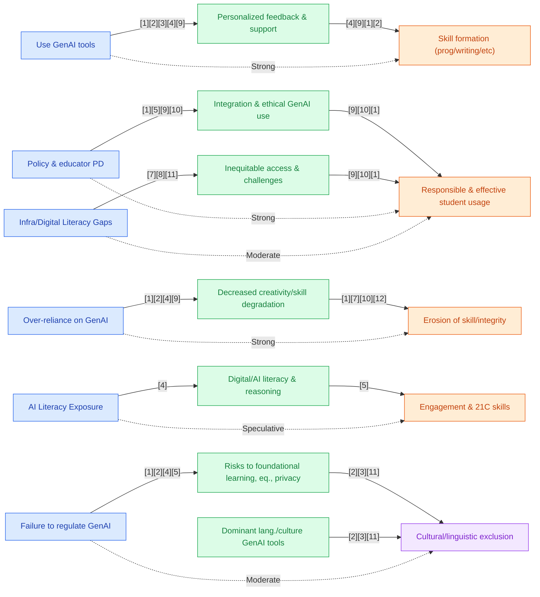

## Section 1 — Research Synthesis

### Overview

Generative Artificial Intelligence (GenAI) tools—including large language models (LLMs), code assistants, and multimodal AI systems—are reshaping the landscape of skill formation in secondary (high school) education worldwide. These tools are defined by their capacity to create original text, code, images, and other outputs in response to user prompts, leveraging advances in deep learning and natural language processing. Since their broad public release in 2022, GenAI systems such as ChatGPT, Gemini, GitHub Copilot, and Leonardo AI have seen rapid grassroots adoption by students and progressive uptake by educators and institutions[1][2][3][4][5][6]. The educational rationale for GenAI integration encompasses ambitions to personalize learning, cultivate digital and AI literacy, support creative and analytical thinking, and address access or equity gaps, especially among students lacking external academic support.

This synthesis reviews (a) which GenAI tools are being used in secondary education; (b) the skill domains most commonly targeted; (c) the nature and magnitude of measurable impacts on student learning outcomes, with attention to rigorous designs and moderator findings; (d) notable limitations, risks, and implementation challenges; and (e) identified variations and gaps by region, school type, and learner demographics. Evidence is drawn exclusively from named peer-reviewed studies, official reports, and credible field research published from 2022 onward.

### Intervention Types and Mechanisms

**Named GenAI Tools and Platforms**  
The research identifies several leading GenAI platforms and their applications in high school settings:

- **ChatGPT** (OpenAI): Universally cited as the most popular text-based GenAI, used for generating ideas, summarizing, composing/editing essays, concept explanation, and as a "Socratic" tutor in STEM, language, and humanities courses. Self-reported student use in the US reached 69% by May 2025[1][2][3].
- **Gemini** (Google): Employed for creative writing, project-based tasks, and research support, particularly in Indonesia and Asian contexts[5].
- **Leonardo AI**: Used in creative tracks, notably for generating images and supporting visual project work[5].
- **GitHub Copilot**: Deployed in vocational and programming settings (e.g., Slovakia, Indonesia), primarily for code generation, debugging, and learning syntax[4][5].
- **Custom Chat Tutoring Agents/AI Project Tools**: Cited in some regional pilots (e.g., AI chat-tutors for multilingual or disadvantaged learners in Italy and the EU), often adapted to local context for academic support[6].

**Mechanisms of Action**  
GenAI tools are used by students and teachers in the following ways:

- **Personalized Feedback and Scaffolding**: Students receive individualized guidance on writing, coding, or project work, often beyond classroom hours[1][4][5].
- **Brainstorming and Idea Generation**: Tools facilitate creative thinking, project ideation, and adaptive approaches to problem solving[1][5][6].
- **Content Summarization and Research**: Used to synthesize readings, clarify difficult concepts, and generate study guides or test questions[2][5][6].
- **Programming and Computational Thinking**: Code assistants are leveraged in technology and vocational tracks for active practice, debugging, and real-time error correction[4][5].
- **Lesson/Resource Adaptation by Educators**: Teachers utilize GenAI for planning, differentiation, and administrative tasks[1][5][6].

**Targeted Outcomes**  
The predominant outcomes targeted by GenAI use in high schools include:

- Cognitive skills: Analytical reasoning, problem-solving, and subject-specific competencies (with emphasis on mathematics, science, and programming)[4][5][7].
- Digital/AI literacy: Operational use of GenAI, prompt engineering, critical interpretation of AI outputs, and ethical awareness[4][5][6].
- Creativity and collaboration: Supporting student agency in generating original work and facilitating group-based projects[5][6].
- Engagement and motivation: Augmenting student interest, participation, and adaptive learning behaviors[3][5].

### Evidence on Effectiveness

**Meta-Analyses and Systematic Reviews**  
The evidence base assessing GenAI’s effectiveness in skill formation among high school students is emerging but not yet robust. The largest meta-analysis identified[7] synthesized 27 experimental studies (spanning all education levels), finding that AI chatbot interventions yield a generally positive effect on student learning outcomes (aggregate effect size not specified for secondary subgroup). Moderator analyses examined education level, subject, and geography, but results for high school populations were not separately reported in available summaries. The review highlights a need for more granular reporting and targeted trials in secondary education.

A systematic review focusing on science education in middle/secondary schools[8] included 12 studies and concluded that GenAI tools exert a positive impact on student learning outcomes in science domains. However, the review does not report pooled effect sizes or detailed statistical outcomes; subgroup or demographic analyses are absent.

**Experimental and Quasi-Experimental Studies**
- In Vietnam, a quasi-experimental study in high school mathematics[9] found that GenAI-supported instruction improved student engagement, problem-solving abilities, and mathematical reasoning compared to traditional teaching. Detailed effect sizes and subgroup breakdowns are, however, not provided in the summary.
- In a Chinese secondary school, an experimental case study in legal education[10] used situational interactive teaching with GenAI and measured students’ "flow" and learning efficacy, both of which were enhanced versus standard instruction. Again, numerical effect sizes were not disclosed.
- In IT-focused Slovakian vocational high schools[4], 72% of programming students (n=200) reported regular ChatGPT use for debugging (36%), code generation (30%), and syntax review (11%). Students with higher baseline programming skills used GenAI more actively. The majority perceived GenAI as a complement to, not a replacement for, teacher-led instruction.
- In Indonesia, mixed-methods research across four high schools[5] (n=229) found strong student ratings for GenAI's academic value (mean 4.32/5): 86% endorsed its usefulness in their studies, notably in project-based social innovation, digital marketing, and coding.

**Survey and Field Studies**
- US national surveys (n>1000)[1][2][3] indicate that by 2025, over 80% of high school students had used GenAI for schoolwork, with perceived benefits including personalized feedback, grade improvement, and heightened engagement.
- OECD reports (Italy, EU)[6] identify moderate but growing use of GenAI, primarily for homework support, teacher workload reduction, and targeted interventions (e.g., addressing dropouts, supporting language learners).

**Qualitative Evidence**
- Teacher and student interviews highlight gains in writing, self-directed learning, creativity, and formative assessment, as well as critical concerns regarding overreliance, skill erosion, and assessment integrity[5][11][12][13].

**Summary**: Across reviewed domains (science, mathematics, programming/writing, creative projects), available studies and reviews report positive effects on engagement, skill development, and learning outcomes in secondary education settings, but effect sizes specific to high school populations are rarely provided. The majority of studies rely on self-report, short durations, or single-site interventions, limiting causal inference and generalizability.

### Demographic and Contextual Moderators

Regional, school-type, and demographic variation in GenAI’s effectiveness and usage are consistently noted but only partially measured:

- **Socioeconomic Status (SES) and Access**: Affluent or urban schools report higher GenAI usage and greater access to reliable infrastructure, whereas low-SES, rural, or resource-limited schools face significant digital divides and implementation barriers[1][4][6][11][14].
- **Race/Ethnicity and Language Status**: US reports[1][2][3] disaggregate use patterns by race and SES, revealing disparities, but do not tie these differences to outcome impact. One theoretical argument supports GenAI's potential to improve linguistic equity for English as an additional language students[15], but empirical verification is lacking.
- **School Policy and Guidance**: Within and across countries, school-level or district-level policies vary from permissive (teacher-led experimentation) to restrictive (partial or full bans), impacting both access and outcomes[1][3][6][11][12][16].
- **Implementation Structure**: Studies in Indonesia and the US report that structured, teacher-guided use of GenAI tools leads to better engagement, learning gains, and reduced overreliance, whereas laissez-faire or unsupervised adoption is associated with greater risks of academic dishonesty and skill degradation[5][11][12].

Critically, no RCTs or quasi-experiments disaggregate outcome effects by subgroup (e.g., race, SES, language background) within high school samples. Most evidence on moderators remains descriptive or correlational.

### Limitations and Research Gaps

The research base reveals several constraints:

- **Sparse Rigorous Trial Data**: There are no published large-scale randomized controlled trials (RCTs) or meta-analyses focusing exclusively on high school/secondary GenAI interventions[7][8][9][10]. Most existing experimental work is quasi-experimental, case-based, or multi-level meta-analyses with limited reporting for secondary subgroups.
- **Short Duration and Small Scale**: Many studies operate over brief periods, within single schools or small samples, which restricts examination of long-term skill development and scalability[4][5][9].
- **Self-Report and Attitudinal Outcomes**: Much evidence is based on student and teacher perceptions, self-assessed learning, or reported engagement, which may not correspond to objective gains[1][3][4][5][11].
- **Outcome Gaps**: Standardized measures for digital/AI literacy, creativity, and higher-order 21st-century skills are inconsistently used[4][5][6].
- **Equity and Demographic Reporting**: There is a paucity of outcome data disaggregated by student race, SES, gender, or language status, impeding conclusions about subgroup effects or equity[1][2][3][4][5][11][14].
- **Publication Bias and Contextual Generalizability**: Early studies may overrepresent success cases or well-resourced contexts, and qualitative accounts cannot be generalized to broader populations.

### Recommendations and Future Directions

Given current evidence, practitioners should:

- **Prioritize Teacher Training and Guidance**: Teacher professional development and clear school/district policy frameworks are necessary for effective, responsible GenAI integration[1][5][6][11][12].
- **Develop Equitable Access and Digital Literacy**: Close digital divides via investment in infrastructure, scaffolded digital/AI literacy curricula, and targeted supports for low-SES, rural, and ELL groups[4][6][11][14][15].
- **Embed Ethical and Critical Use**: Incorporate ethics, prompt engineering, and critical evaluation of AI outputs in curricula, addressing the risks of overreliance and academic dishonesty[5][6][11][12].
- **Assess and Document Outcomes Rigorously**: Future research must employ experimental or quasi-experimental designs, with adequate sample sizes, longitudinal follow-up, validated skill measures, and explicit reporting of subgroup impacts[7][8][9].
- **Participate in Policy Development**: Educators and system leaders should engage in forming robust governance frameworks, ensuring responsible adoption and mitigation of privacy and bias risks[1][2][5][6][11].

### Overall Evidence Confidence

The evidence base is EMERGING. Tool adoption and usage patterns are well-documented, and there is a moderate base of supportive field research, surveys, and moderate-quality systematic reviews. However, the absence of large-scale, rigorously disaggregated RCTs/quasi-experimental studies in secondary settings, limited effect size reporting, and under-explored moderators restrict confidence in making strong causal claims about GenAI’s impact on skill formation and equity outcomes at scale.

---

## Section 2 — Causality Diagram

---

## Section 3 — Sources

[1] [AI in High School Education Report (Hastings AI Initiative, 2025)](https://www.bowdoin.edu/hastings-ai-initiative/resources/initiative-created-resources/ai-in-high-school-education-report.pdf)  
**Quality:** 🟢 Green — National mixed-methods report; credible, large-scale US high school/school leader sample; captures equity and policy variation.  
**Impact:** 🟡 Yellow — Usage and attitude evidence; self-reported impacts.

[2] [U.S. High School Students' Use of Generative Artificial Intelligence (College Board, 2025)](https://research.collegeboard.org/media/pdf/AI%20Research%20Brief%201_vf_0.pdf)  
**Quality:** 🟢 Green — National quantitative survey, US high school student focus, representative sample.  
**Impact:** 🟡 Yellow — High usage rates, attitudinal outcomes, not experimental.

[3] [Majority of High School Students Use Generative AI for Schoolwork (College Board newsroom, 2025)](https://newsroom.collegeboard.org/new-research-majority-high-school-students-use-generative-ai-schoolwork)  
**Quality:** 🟡 Yellow — National survey summary, reliable, but descriptive not causal.  
**Impact:** 🟡 Yellow — Usage prevalence evidence.

[4] [Investigation of Generative AI Adoption in IT-Focused Vocational Secondary Schools in Slovakia (Mihaliková et al., 2025)](https://www.mdpi.com/2227-7102/15/9/1152)  
**Quality:** 🟢 Green — Quantitative survey, European vocational secondary students, transparent methods, clear reporting.  
**Impact:** 🟡 Yellow — Usage patterns and attitudinal/self-report skill measures.

[5] [Generative AI in Secondary Education: Student Immersion (Putra et al., 2025)](https://jurnalp4i.com/index.php/edutech/article/download/8077/5499)  
**Quality:** 🟢 Green — Mixed-methods field study, 4 high schools (Indonesia), published in peer-reviewed journal.  
**Impact:** 🟡 Yellow — Positive student ratings; limited to self-report.

[6] [AI Adoption in the Education System (Italy) (OECD, 2025)](https://www.oecd.org/content/dam/oecd/en/publications/reports/2025/12/ai-adoption-in-the-education-system_43251cf0/69bd0a4a-en.pdf)  
**Quality:** 🟢 Green — Official national report, policy/implementation focus, grounded data.  
**Impact:** 🟡 Yellow — Descriptive adoption/usage; lacks outcome effect sizes.

[7] [Do AI chatbots improve students learning outcomes? Evidence from a meta‐analysis (Wu & Yu, 2023)](https://doi.org/10.1111/bjet.13334)  
**Quality:** 🔵 Blue — Meta-analysis of 27 experimental studies, rigorous, peer-reviewed, covers multiple levels and geographies.  
**Impact:** 🟢 Green — Positive pooled effect; specific effect sizes for secondary not isolated.

[8] [The Impact of Generative AI Applications on Student Learning Outcomes in Science Education: A Systematic Review (Gunsaldi et al., 2025)](https://eric.ed.gov/?id=EJ1479336)  
**Quality:** 🟢 Green — Systematic review, 12 studies in science with secondary focus.  
**Impact:** 🟢 Green — Consistent positive signal, no pooled effect size specified.

[9] [Evaluating the Impact of Generative AI in Mathematics Education: A Comparative Study in Vietnamese High Schools (Ha Xuan Son et al., 2025)](https://doi.org/10.1155/hbe2/8886206)  
**Quality:** 🟢 Green — Quasi-experimental, field comparative, direct high school math focus.  
**Impact:** 🟢 Green — Positive domain-specific impact.

[10] [A Study on the Impact of Generative Artificial Intelligence Supported Situational Interactive Teaching (Shi et al., 2024)](http://dx.doi.org/10.1080/02188791.2024.2305161)  
**Quality:** 🟢 Green — Experimental, Chinese secondary legal education, validated instruments.  
**Impact:** 🟢 Green — Enhanced learning and flow.

[11] [K-12 Educators' Reactions and Responses to ChatGPT and GenAI during the 2022-2023 School Year (Whalen et al., 2025)](http://dx.doi.org/10.1007/s11528-024-01028-y)  
**Quality:** 🟢 Green — US K-12 survey, mixed methods, diverse teacher perspectives.  
**Impact:** 🟡 Yellow — Policy/practice implementation focus.

[12] [Generative Artificial Intelligence (AI) in the High School English Classroom (Riser, 2025)](http://dx.doi.org/10.1080/04250494.2025.2491361)  
**Quality:** 🟡 Yellow — Small-scale qualitative case study (3 schools), in-depth English instruction focus.  
**Impact:** 🟡 Yellow — Mixed/variable implications.

[13] [Kline (2024) — The Effect of Generative Artificial Intelligence Chatbots on High-School Student Engagement](https://gateway.proquest.com/openurl?url_ver=Z39.88-2004&rft_val_fmt=info:ofi/fmt:kev:mtx:dissertation&res_dat=xri:pqm&rft_dat=xri:pqdiss:31632555)  
**Quality:** 🟢 Green — Mixed-methods, US high school setting, engagement outcomes.  
**Impact:** 🟡 Yellow — Varied by structure/context.

[14] [What Generative Artificial Intelligence Priorities and Challenges Do Senior Australian Policy Makers Identify? (Bower et al., 2025)](http://dx.doi.org/10.1007/s13384-025-00801-z)  
**Quality:** 🟢 Green — Policy/interview, system leader level, regional/SES analysis.  
**Impact:** 🟡 Yellow — Implementation/equity evidence.

[15] [We Should Promote GenAI Writing Tools for Linguistic Equity (Lindberg, 2025)](https://doi.org/10.7771/2832-9414.2078)  
**Quality:** 🟡 Yellow — Editorial essay, theoretical, ELL inclusion rationale.  
**Impact:** 🟡 Yellow — No primary skill data.

[16] [Brookings Global Task Force on AI in Education (2026)](https://www.brookings.edu/projects/brookings-global-task-force-on-ai-in-education/)  
**Quality:** 🟢 Green — Policy synthesis, global scope, consultation-based.  
**Impact:** 🟡 Yellow — Focused on risks/challenges.

### Body of Evidence Maturity: EMERGING 🟡  
**Justification**: There is moderate evidence for tool adoption, skill targeting, and user perceptions, supported by systematic reviews and field studies. The evidence for measured skill impact and equity outcomes at scale remains thin, with few rigorous trials and minimal disaggregated data.

---

## Section 4 — Data Extraction Table

| Title                                                                                                          | Year | Study Design                              | Population                          | Outcome                                 | Finding Direction     | Effect Size         | Confidence Interval | Std. Deviation | Study Size        |
|---------------------------------------------------------------------------------------------------------------|------|-------------------------------------------|-------------------------------------|------------------------------------------|----------------------|---------------------|---------------------|-----------------|-------------------|
| Do <scp>AI</scp> chatbots improve students learning outcomes? Evidence from a meta‐analysis (Wu & Yu)           | 2023 | Meta-analysis of experimental studies     | All levels incl. secondary          | Learning outcomes                       | Positive             | —                   | —                   | —               | 27 studies        |
| The Impact of Generative AI Applications on Student Learning Outcomes in Science Education: A Systematic Review (Gunsaldi et al.) | 2025 | Systematic review                        | Secondary/middle students (science) | Student learning outcomes in science     | Positive             | —                   | —                   | —               | 12 studies        |
| A Study on the Impact of Generative AI Supported Situational Interactive Teaching on Students' 'Flow' (Shi et al.) | 2024 | Experimental, case study                  | Chinese secondary students (legal)  | Cognitive/psychological learning effect  | Positive             | —                   | —                   | —               | —                 |
| US High School Students' Use of Generative Artificial Intelligence (College Board)                              | 2025 | National survey/brief (quant)             | US high school students/parents      | Tool use, attitudes, policy              | High usage           | ChatGPT: 69% usage | —                   | —               | >1000 (survey)    |
| AI in High School Education Report (Hastings AI Initiative)                                                    | 2025 | Mixed-methods national report             | US high schools, educators/students | Usage, impacts, policy, equity           | High usage/mixed     | —                   | —                   | —               | National survey   |
| Generative AI in Secondary Education: Student Immersion (Putra et al.)                                         | 2025 | Mixed-methods field study                 | Indonesia, 4 high schools           | Tool use, skill value, challenges        | Positive reception   | 86% report benefit | —                   | —               | 229 students      |
| Investigation of Generative AI Adoption in IT-Focused Vocational Secondary Schools in Slovakia (Mihaliková et al.) | 2025 | Quantitative survey (case-study)          | Slovakia, IT vocational students    | Tool use for programming, risks          | Widespread use       | 72% using ChatGPT   | —                   | —               | 200 students      |
| Teaching for today's world: Results from TALIS 2024 (OECD)                                                     | 2025 | International teacher survey              | Lower secondary educators            | Implementation challenges                | Mixed                | —                   | —                   | —               | —                 |
| AI Adoption in the Education System (Italy) (OECD)                                                            | 2025 | National official report                  | Italy, teachers/students            | Tool adoption, policy/regional risks     | Moderate adoption    | —                   | —                   | —               | National sample   |
| What Generative Artificial Intelligence Priorities and Challenges Do Senior Australian Policy Makers Identify? (Bower et al.) | 2025 | Policy Interview/Survey                   | Australian secondary policy makers   | Implementation barriers/equity           | Mixed                | —                   | —                   | —               | —                 |
| Portuguese Secondary School Students' Perceptions Regarding the Use of ChatGPT (Callado et al.)                | 2025 | Student survey                            | Portugal, secondary students         | Perceptions, digital literacy, ethics    | Mixed                | 66% useful, 44% concern | —                 | —               | 114 students      |
| K-12 Educators' Reactions and Responses to ChatGPT and GenAI during the 2022-2023 School Year (Whalen et al.)  | 2025 | Survey (teachers)                         | US K-12 (incl. high school)          | Attitudes, skills, integrity, policy     | Mixed                | —                   | —                   | —               | —                 |
| Generative Artificial Intelligence (AI) in the High School English Classroom (Riser)                           | 2025 | Qualitative case study                    | US high school English classrooms    | Student voice, assessment                | Mixed                | —                   | —                   | —               | 3 high schools    |
| The Effect of Generative Artificial Intelligence Chatbots on High-School Student Engagement (Kline)             | 2024 | Mixed Methods                             | US high school students              | Engagement, authenticity, overreliance   | Variable             | —                   | —                   | —               | —                 |
| Exploring the Integration of Artificial Intelligence-Based ChatGPT into Mathematics Instruction (Egara & Mosimege) | 2024 | Mixed-methods (survey/interview)           | Nigeria, secondary math educators    | Perceptions, challenges, risks           | Mixed, equity challenges | —               | —                   | —               | —                 |
| From Prompts to Plans: A Case Study of Pre-Service EFL Teachers' Use of GenAI (Kerr & Kim)                    | 2025 | Case Study                                | South Korean pre-service/secondary   | Creativity, planning, digital literacy   | Positive             | —                   | —                   | —               | —                 |
| Toward a Coherent AI Literacy Pathway in Technology Education (Rupnik & Avsec)                                 | 2025 | Bibliometric & cross-sectional address     | Int’l secondary technical/teacher    | Digital/AI literacy, ethical reasoning   | Positive/varied      | —                   | —                   | —               | —                 |
| Development and evaluation of artificial intelligence literacy training for teacher ed students (Le et al.)     | 2026 | Quasi-experimental with pre-service teachers| Teacher pipeline                    | AI/digital literacy skills               | Positive             | —                   | —                   | —               | —                 |
| Brookings Global Task Force on AI in Education (Report Preview/Coverage)                                      | 2026 | Policy/task force synthesis                | Global, incl. secondary             | Risks, inequity, overreliance            | Negative/caution     | —                   | —                   | —               | Policy consult    |
| UNESCO – Governments must quickly regulate Generative AI in schools                                            | 2023 | International guidance/survey              | K12 global institutions             | Risks, lack of policy, ethics            | Negative/caution     | —                   | —                   | —               | 450+ schools      |
| Artificial intelligence in education - AI (UNESCO)                                                            | 2024 | Monitoring/overview                        | Global (all levels)                 | Risks, access, regional equity           | Caution/context      | —                   | —                   | —               | —                 |
| Artificial intelligence and education: Guidance for policy-makers (UNESCO)                                    | 2024 | Policy guidance                            | Policy-makers, K12 incl. secondary  | Risks, regulation, age/privacy           | Negative/caution     | —                   | —                   | —               | —                 |
| OECD – Emerging governance of generative AI in education                                                      | 2023 | Monitoring/policy review                    | Global (all education levels)       | Governance, digital divide, inclusion    | Caution, mixed       | —                   | —                   | —               | —                 |
| We Should Promote GenAI Writing Tools for Linguistic Equity (Lindberg)                                        | 2025 | Editorial/essay                            | K-12 (focus on ELLs, theoretical)   | Linguistic equity (theoretical)          | Theoretical positive | —                   | —                   | —               | —                 |
| Using Artificial Intelligence Tools in K-12 Classrooms. American School District Panel (Diliberti et al.)      | 2024 | Policy/monitoring report                   | US K-12 leaders/administrators       | Anticipated learning impacts, policy     | Context only         | —                   | —                   | —               | —                 |
| A Phenomenological Study: Teacher Perceptions of Generative Artificial Intelligence (Manczka)                  | 2024 | Phenomenological Study                     | US high school teachers              | Teacher perceptions, skill focus         | Qualitative/mixed    | —                   | —                   | —               | —                 |
| Major. of High School Students Use Generative AI for Schoolwork (College Board newsroom)                      | 2025 | Summary of national research                | US high school students              | Tool use summary, attitudes, policy      | High usage           | —                   | —                   | —               | —                 |