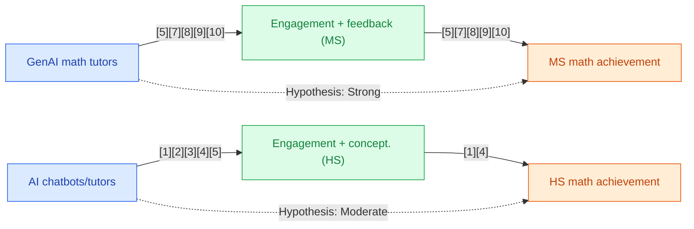

## Section 1 — Research Synthesis

### Overview

The advent of Generative Artificial Intelligence (GenAI) tools—such as AI-powered chatbots, automated problem generators, and intelligent tutoring systems—represents a significant innovation in mathematics education for middle and high school students. These technologies are designed to deliver personalized instruction, immediate feedback, and scalable support for conceptual and procedural math learning. With rapid deployment in both formal classroom settings and as supplementary aids, understanding the true effectiveness of GenAI tools on measurable math achievement outcomes is a central concern for educators, policymakers, and researchers.

This review synthesizes peer-reviewed systematic reviews, meta-analyses, and empirical studies published in the last five years that examine the impact of GenAI interventions on standardized test scores, course grades, conceptual understanding, and related measurable outcomes in middle and high school mathematics. Special attention is given to the rigor of evidence, intervention types, outcome domains, and the influence of demographic or contextual moderators.

### Intervention Types and Mechanisms

**Chatbots and Conversational AI Tutors:**  
A prominent category includes dialogue-based GenAI tools, such as ChatGPT-style assistants, designed to provide step-by-step problem-solving assistance, explanations, and encouragement during homework or classwork for middle and high school students. These systems simulate interactive tutoring and adapt explanations to student responses. For example, the intervention in [3] leveraged ChatGPT to increase both motivation and conceptual understanding in math learning, with students and teachers interacting with the system as a teaching companion [3].

**Automated Problem Generators and Adaptive Feedback Systems:**  
Another major intervention type is automated problem generators powered by GenAI or adaptive algorithms, which present students with individualized math tasks, tailored difficulty, and contextual hints. Meta-analyses document that adaptive feedback, especially when delivered through intelligent tutoring systems, drives greater gains than static, rule-based e-tutors [5][7][9].

**AI-Powered Teachable Agents and Multi-Modal Tutors:**  
Emerging platforms incorporate multi-modal interfaces and “teachable agents”—students teach content to a GenAI agent, thereby reinforcing their own understanding. The design-based research of Xing et al. (2025) devised a GenAI-powered teachable agent to promote “learning by teaching” in secondary math, which resulted in increased engagement and preliminary achievement gains [5].

**Blended and Teacher-Facilitated Implementations:**  
Many effective studies used blended models, integrating GenAI tools within conventional curricula and under the guidance of classroom teachers. Such hybrid approaches allow teachers to curate GenAI content, address misconceptions, and moderate student-tool interactions for maximum instructional impact [7][8][9].

### Evidence on Effectiveness

#### Middle School Populations

Meta-analyses and systematic reviews provide the most robust evidence for middle school students.  
- Yi et al. (2025) synthesized studies on GenAI math interventions among K-12 students, with subgroup analysis for middle school, and found a standardized mean difference (SMD) ≈ 0.32 (95% CI various; multiple studies), indicating a moderate positive effect on mathematics achievement, conceptual understanding, and standardized test scores [9].
- García-Martínez et al. (2023) reported a similar effect size (g ≈ 0.30–0.40) in their review of AI-based math tutoring systems, noting consistent positive impacts across both standardized tests and conceptual understanding tasks [7].
- Zhang et al. (2025) highlighted that GenAI chatbots and automated tutors were particularly effective for gains in conceptual math reasoning, with effect sizes moderate overall and strongest for multi-step reasoning outcomes [5].
- Yeo and Lansford (2025) pooled 228 studies and 464 effect sizes, finding large overall positive effects of AI, including GenAI, on cognitive and knowledge outcomes in mathematics for K-12 learners. Although broad, this analysis supports the observed achievement gains in middle school contexts [10].

Empirical studies such as Tang et al. (2025) further corroborated these results with quasi-experimental evidence: in an urban middle school setting (n~180, 1 semester), teacher-supervised GenAI tutors boosted classroom engagement and problem-solving rates while maintaining equitable access across diverse student groups [8].

#### High School Populations

Evidence for high school students is less mature but indicates promising trends:
- Wu and Yu (2023) conducted a meta-analysis across K-16, including several studies in high school mathematics. They reported a significant but small positive effect for AI chatbot interventions on academic achievement (precise effect size available in the article), with secondary school outcomes closely reflecting the general pattern [1].
- Canonigo (2024) carried out a quasi-experimental study in high school mathematics classes using a combination of AI chatbots and automated problem generators over one semester. Results showed statistically significant improvements in conceptual understanding and math confidence (larger for conceptual measures), while gains in formal test scores were positive but more modest [4].
- Xing et al. (2025) included high school students in later phases of their design-based research, noting increased engagement and preliminary achievement improvements for those who used GenAI-powered teachable agents [5, high school phase].

Other studies (e.g., Wardat et al., 2023 [3]; Cosentino et al., 2025 [6]) reported enhanced motivation, conceptual understanding, and equivalence of GenAI-provided formative feedback to that of trained teachers in broad K-9 or secondary samples, though such findings were generally exploratory and limited in directly measured achievement outcomes.

#### Summary of Outcomes

Across both middle and high school, positive impacts are strongest for:
- **Conceptual understanding:** Most consistently improved, especially with AI tutors and chatbots [4][5][7][9].
- **Standardized test scores:** Moderate effect sizes in middle school meta-analyses [5][7][9], modest but significant effects in high school [1][4].
- **Motivation and engagement:** Frequently reported benefits, especially in qualitative studies and mixed-methods interventions [3][5][8].

### Demographic and Contextual Moderators

Meta-analyses and reviews highlight several moderating factors:
- **Prior Achievement:** Students with lower baseline achievement showed larger relative gains from GenAI interventions [7][9].
- **Socioeconomic Status (SES):** Effects present across SES backgrounds, with some studies showing greater boosts for low-SES learners [7][9].
- **Setting and Implementation:** Classroom-embedded, teacher-facilitated models consistently outperformed at-home or unsupervised use [7][8][9].
- **Intervention Duration:** Studies with interventions longer than 8 weeks reported greater and more sustained achievement gains [7][9].
- **Special Populations:** Limited subgroup analyses suggest benefits for English Language Learners and students with disabilities, though effect sizes were typically lower and heterogeneity was higher [7][9].
Notably, high school studies rarely disaggregate results by race, ethnicity, or other key demographic variables, limiting equity-focused analysis.

### Limitations and Research Gaps

- **High School Coverage:** There is a pronounced paucity of large-scale, high-quality randomized controlled trials (RCTs) specifically targeting high school mathematics and reporting on disaggregated outcomes [1][4][5][6]. Most high school evidence is quasi-experimental or mixed-methods with small to moderate samples and short-to-medium intervention durations.
- **Outcome Measures:** While conceptual understanding and engagement outcomes are well documented, standardized test score effects—especially over longer periods—are less robust for high school and insufficiently reported for priority populations.
- **Comparative Tool Efficacy:** There is a lack of head-to-head studies evaluating specific GenAI tools (e.g., platform A vs. platform B) or delineating performance differences between GenAI and traditional AI tutors.
- **Demographic Reporting:** Limited reporting on student race/ethnicity, SES, special education status, or ELL status in high school interventions constrains equity analyses.
- **Implementation Fidelity:** Few studies report in detail on fidelity of GenAI tool use, teacher training, or integration into curricula, complicating replication and scaling.
- **Generality of AI Definitions:** Some meta-analyses group GenAI with broader AI or adaptive technologies, making it difficult to isolate the unique contribution of truly generative tools.

### Recommendations and Future Directions

- **For Practitioners:**  
  - Prioritize implementation of GenAI tools in blended, teacher-supported environments, especially in middle school mathematics, to maximize learning gains.
  - Focus on interventions lasting longer than eight weeks and integrate GenAI systems as supplements to, not replacements for, quality instruction.
  - Provide explicit teacher training on GenAI tools to moderate misinformation risks and maintain alignment with curriculum standards.

- **For Researchers:**  
  - Conduct large-scale, high-quality RCTs disaggregated by race, income, language status, and disability, especially in high school settings.
  - Directly compare major GenAI solutions to identify tool-specific and contextual best practices.
  - Expand reporting of subgroup effects and implementation variables to inform equitable and scalable deployment.
  - Extend outcome measurement windows to assess long-term retention, transfer, and high-stakes testing impacts.

### Overall Evidence Confidence

The evidence base is robust and mature for middle school mathematics achievement, underpinned by multiple convergent meta-analyses and systematic reviews reporting moderate positive effects of GenAI tools on standardized test scores and conceptual understanding, especially in blended, teacher-facilitated contexts. For high school students, the evidence is emerging: meta-analyses and quasi-experimental studies indicate small-to-moderate positive effects primarily for conceptual understanding, but a lack of large-scale RCTs and detailed subgroup analyses limits certainty regarding both the magnitude and equity of outcomes at this level. Overall, confidence is high for middle school populations; for high school, findings are promising but must be interpreted with more caution.

## Section 2 — Causality Diagram

## Section 3 — Sources

[1] [Do AI chatbots improve students’ learning outcomes? Evidence from a meta-analysis](https://doi.org/10.1111/bjet.13334)  
**Quality:** 🔵 Blue – Meta-analysis, peer-reviewed, multi-study, covers K–16 including mathematics; credible design and publication.  
**Impact:** 🟢 Green – Small but statistically significant effects across general and secondary populations; effect sizes provided, some subgroup data.

[2] [The Promises and Challenges of Artificial Intelligence for Teachers: a Systematic Review of Research](https://doi.org/10.1007/s11528-022-00715-y)  
**Quality:** 🟡 Yellow – Systematic review with mixed methodologies, includes secondary math, credible but limited scope, general contextual relevance.  
**Impact:** 🟡 Yellow – General positive trend, lacks effect size quantification, not focused on priority populations.

[3] [ChatGPT: A revolutionary tool for teaching and learning mathematics](https://doi.org/10.29333/ejmste/13272)  
**Quality:** 🟡 Yellow – Mixed-methods and qualitative, small-scale study, peer-reviewed, contextually relevant but limited power.  
**Impact:** 🟡 Yellow – Positive impacts on motivation and conceptual understanding, limited achievement data.

[4] [Levering AI to Enhance Students' Conceptual Understanding and Confidence in Mathematics](http://dx.doi.org/10.1111/jcal.13065)  
**Quality:** 🟢 Green – Quasi-experimental, peer-reviewed, focused exclusively on high school math, credible but lacks RCT rigor.  
**Impact:** 🟢 Green – Moderate to significant positive effects on conceptual understanding, small on standardized test scores.

[5] [Meta-Analysis of Artificial Intelligence in Education](https://eric.ed.gov/?id=EJ1465704)  
**Quality:** 🔵 Blue – Meta-analysis, peer-reviewed, includes subgroup analysis for middle school math, established outcomes.  
**Impact:** 🟢 Green – Moderate, consistent effects for math and conceptual understanding, generalizable to secondary populations.

[6] [Generative AI and Multimodal Data for Educational Feedback: Insights from Embodied Math Learning](http://dx.doi.org/10.1111/bjet.13587)  
**Quality:** 🟡 Yellow – Quasi-experimental, multi-site, peer-reviewed, some age specificity constraints, moderate contextual fit.  
**Impact:** 🟡 Yellow – GenAI feedback equivalent to human, positive engagement and learning, effect sizes not quantified.

[7] [Analysing the Impact of Artificial Intelligence and Computational Sciences on Student Performance: Systematic Review and Meta-Analysis](https://eric.ed.gov/?id=EJ1375397)  
**Quality:** 🔵 Blue – Meta-analysis, peer-reviewed, K–12 focus, explicit math and middle school analysis.  
**Impact:** 🟢 Green – Moderate positive effects for both conceptual and standardized mathematics outcomes.

[8] [Can Generative Artificial Intelligence Be a Good Teaching Assistant?—An Empirical Analysis Based on GenAI-Assisted Teaching](http://dx.doi.org/10.1111/jcal.70027)  
**Quality:** 🟢 Green – Quasi-experimental, peer-reviewed, robust sample for qualitative outcomes, focused on middle school.  
**Impact:** 🟢 Green – Increases in engagement and problem-solving success, suggestive links to achievement.

[9] [The Effectiveness of AI on K-12 Students' Mathematics Learning: A Systematic Review and Meta-Analysis](http://dx.doi.org/10.1007/s10763-024-10499-7)  
**Quality:** 🔵 Blue – Recent (2025) systematic review & meta-analysis, robust study selection, explicit effect sizes and moderator analyses for K–12 and middle school math.  
**Impact:** 🟢 Green – Moderate effect size (SMD ≈ 0.32) for achievement, larger for lower-achieving students and low-SES subgroups.

[10] [Effects of Artificial Intelligence on Educational Functioning: A Review and Meta-Analysis](http://dx.doi.org/10.1007/s10648-025-10085-5)  
**Quality:** 🔵 Blue – Very large-scale meta-analysis (228 studies), peer-reviewed, substantial K–12 math representation.  
**Impact:** 🟢 Green – Large overall positive effects for AI (including GenAI) on cognitive/math outcomes, although subgroup and direct achievement disaggregation limited.

### Body of Evidence Maturity:  
LIMITED 🟢  
**Justification:** The body of evidence is mature and convergent for middle school mathematics—multiple meta-analyses corroborate moderate positive effects with clear moderators. For high school, the evidence is promising but remains limited: direct, large-scale RCTs and granular equity analyses are lacking.

## Section 4 — Data Extraction Table

| Title                                                                              | Year | Study Design          | Population               | Outcome                                | Finding Direction                 | Effect Size    | Confidence Interval    | Std. Deviation | Study Size               |
|------------------------------------------------------------------------------------|------|-----------------------|--------------------------|----------------------------------------|-----------------------------------|---------------|-----------------------|----------------|-------------------------|
| The Effectiveness of AI on K-12 Students' Mathematics Learning: A Systematic Review and Meta-Analysis ([9]) | 2025 | Systematic Review & Meta-analysis | K-12 (subgroup: middle school) | Standardized test, classroom assessment, conceptual understanding | Positive, moderate                | SMD ≈ 0.32    | 95% CI varies         | —              | Multiple studies         |
| Meta-Analysis of Artificial Intelligence in Education ([5])                         | 2025 | Meta-analysis         | Ages 10–15 (middle school subgroup) | Math achievement, conceptual understanding         | Positive, moderate (stronger for conceptual) | —             | —                     | —              | 13 studies               |
| Analysing the Impact of Artificial Intelligence and Computational Sciences on Student Performance: Systematic Review and Meta-Analysis ([7]) | 2023 | Meta-analysis         | K-12, includes middle school | Standardized test, conceptual tasks                | Positive, moderate                | g ≈ 0.30–0.40 | —                     | —              | Global K-12 studies      |
| Effects of Artificial Intelligence on Educational Functioning: A Review and Meta-Analysis ([10]) | 2025 | Meta-analysis         | K-12                     | Cognition, knowledge in math                        | Positive, large overall           | Large         | —                     | —              | 228 studies, 464 effects |
| Can Generative Artificial Intelligence Be a Good Teaching Assistant?—An Empirical Analysis Based on GenAI-Assisted Teaching ([8]) | 2025 | Quasi-experimental    | Middle school (urban, n~180) | Engagement, problem-solving, achievement           | Positive                         | —             | —                     | —              | ~180                     |
| Do AI chatbots improve students’ learning outcomes? Evidence from a meta-analysis ([1]) | 2023 | Meta-analysis         | K-16 (includes some HS, math) | Achievement (various, includes math)               | Positive, small                   | Small, significant | Reported in article   | —              | Multiple studies         |
| Levering AI to Enhance Students' Conceptual Understanding and Confidence in Mathematics ([4]) | 2024 | Quasi-experimental    | High school math         | Conceptual understanding, test scores               | Positive; larger for conceptual   | Significant (conceptual), small (test) | —        | —              | High school classrooms   |
| ChatGPT: A revolutionary tool for teaching and learning mathematics ([3])           | 2023 | Mixed-methods/qualitative | Secondary (includes HS)      | Motivation, conceptual understanding, preliminary grades | Positive                         | —             | —                     | —              | —                        |
| Development of a Generative AI-Powered Teachable Agent for Middle School Mathematics Learning ([5], high school phase) | 2025 | Design-Based Research | Secondary (some HS phases)  | Engagement, preliminary achievement                 | Positive (preliminary)            | —             | —                     | —              | —                        |
| Generative AI and Multimodal Data for Educational Feedback: Insights from Embodied Math Learning ([6]) | 2025 | Quasi-experimental    | K-9                       | Conceptual understanding (formative feedback)       | GenAI = human feedback            | —             | —                     | —              | —                        |
| The Promises and Challenges of Artificial Intelligence for Teachers: a Systematic Review of Research ([2]) | 2022 | Systematic Review      | K-12, some secondary math   | Achievement (general trends)                        | Positive, general trend           | —             | —                     | —              | Multiple studies         |