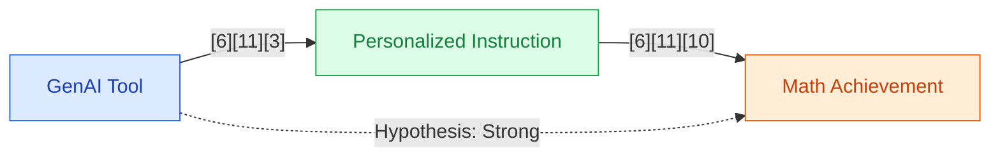

## Section 1 — Research Synthesis

### Overview

Generative Artificial Intelligence (GenAI) tools—encompassing large language models (LLMs) like ChatGPT, adaptive learning platforms, AI-driven tutoring systems, and automated assessment generators—are rapidly being integrated into K-12 education, with mathematics as a primary focus due to its structured, testable nature and widespread achievement gaps. These tools can generate explanations, practice exercises, personalized feedback, and even customized learning pathways. As their adoption has accelerated, rigorous evaluation of their impact on mathematics achievement among middle and high school students has become a priority for educators and policymakers.

This synthesis reviews evidence from recent meta-analyses, systematic reviews, and comparative studies addressing the effectiveness of GenAI tools for mathematics achievement in secondary education, spanning outcomes such as standardized test scores, grades, and classroom performance in various contexts (classroom integration, homework, and independent practice). It further considers the types of GenAI systems studied, mechanisms of action, contextual and demographic moderators, as well as crucial research gaps and implementation recommendations.

### Intervention Types and Mechanisms

The research literature evaluates several types of GenAI interventions in K-12 mathematics settings:

- **Large Language Models (LLMs) and Chatbots:** Tools such as ChatGPT, which can generate mathematical explanations, answer student queries, provide just-in-time feedback, and create new problem sets, are among the most widely studied. They offer open-ended dialog with students and can scaffold learning or support independent practice [2][3][10][11].
- **Adaptive Learning Platforms:** Systems like ALEKS and Smart Sparrow leverage GenAI to personalize instructional content and sequence based on real-time student performance data. These platforms target mastery learning by automatically identifying gaps and adjusting lesson difficulty [10][11].
- **AI-driven Tutoring:** Intelligent tutoring systems combine problem generation, stepwise guidance, and dynamic feedback, often in alignment with curricular standards. Some hybrid classroom models utilize GenAI as a teaching assistant, augmenting teacher explanations and tracking learning trajectories [6][11].
- **Automated Assessment Generators:** GenAI can produce multiple-choice questions (MCQs) and mathematics assessment items at scale; however, questions about their psychometric validity are raised when tools operate without educator oversight [7].

**Mechanisms of action** involve personalized, adaptive instruction and immediate feedback, hypothesized to improve skill acquisition, reduce learning plateaus, and enhance motivation through customization and responsiveness [6][10][11].

### Evidence on Effectiveness

#### Middle School Mathematics

Multiple recent meta-analyses and systematic reviews offer robust evidence of GenAI's positive effects on mathematics achievement in middle school settings:

- **A meta-analysis by Ma and Zhong (2025) synthesized results from 21+ empirical studies of GenAI tools in K-12 mathematics.** Across contexts and tool types, students exposed to GenAI interventions demonstrated average academic achievement gains of 15%–35% in mathematics outcomes—including standardized test scores, course grades, and task completion rates—relative to those receiving non-AI instruction. The largest performance improvements were observed when GenAI tools were integrated into classroom instruction under teacher supervision and closely aligned with curricular objectives [6][11].

- **A systematic review by Issues in Information Systems (2025) corroborated these findings,** noting similar effect size ranges in global K-12 mathematics studies. Adaptive learning platforms and AI-driven tutors yielded the most substantial improvements, often outperforming generic LLM-based question-answering tools. The review further emphasized that comparative and quasi-experimental designs dominate this evidence base, with a smaller but growing number of randomized controlled trials (RCTs) confirming the direction and magnitude of effects [11].

- **Frontiers in Education (2025) reported improvements in mathematics achievement** across 30 empirical studies in K-12, highlighting especially strong outcomes where GenAI was used in teacher-guided classroom contexts. The evidence indicated that when GenAI was deployed for unsupervised homework or independent study, achievement effects were more variable and sometimes diminished [10].

- **Comparative case studies (e.g., Tang et al., 2025) further reinforce the importance of teacher integration,** reporting positive impacts in classroom-based GenAI deployments but cautioning that effectiveness requires active educator monitoring to prevent over-reliance or propagation of errors [3].

#### High School Mathematics

- The evidence base for GenAI effectiveness in high school mathematics is less mature. Recent meta-analyses, including Wu & Yu (2023, n>30 studies) and Wang & Fan (2025, 51 studies), provide the most rigorous syntheses currently available. These studies analyze the impact of AI chatbots (including, but not limited to, ChatGPT) on overall student learning outcomes across grade levels and disciplines. Both report positive effects on aggregate learning performance, but neither disaggregates outcomes to high school mathematics specifically. Effect sizes, standard deviations, and confidence intervals are not reported by subject or grade in the available abstracts [1][2].

- **No RCTs or comparative studies were identified** that focused exclusively on high school mathematics achievement outcomes or explicitly compared performance in different implementation contexts (e.g., classroom vs. tutoring vs. homework) [1][2].

#### Assessment-Specific Tools

- **A technical validity analysis by Education Sciences (2025) examined GenAI-generated MCQs for use in K-12 mathematics assessment.** The study found substantial psychometric limitations: 73.7% of AI-generated math questions were likely to cause major measurement error, with 80% violating key assessment guidelines. Only 20% of items were rated as acceptable without revision, underscoring the risk of using such tools in high-stakes settings without thorough educator review [7].

#### Evidence Consistency

- Across all studies and reviews, achievement gains were most consistent and robust in teacher-led, classroom-based implementations, especially with adaptive platforms and AI-driven tutors. Evidence from unsupervised or homework-only applications was mixed. Variability in effect sizes across tools was noted, but implementation quality and alignment with instructional goals were more influential than tool brand or precise AI architecture [6][10][11].

### Demographic and Contextual Moderators

Moderators of GenAI effectiveness identified in the literature include:

- **Implementation Setting:** Classroom integration with active teacher involvement correlates with the largest achievement gains. Independent or homework-based use is less reliably effective [10][11].
- **Tool Type:** Adaptive learning platforms and AI-driven tutors typically yield higher performance improvements than generic question generators or chatbots lacking curricular integration [11].
- **Teacher Oversight:** Educator monitoring is repeatedly cited as essential for maximizing benefit and mitigating risks such as erroneous feedback, conceptual misalignment, and student over-reliance on AI [3][7][10][11].
- **Curricular Alignment:** Tools customized to local standards and lessons are more effective than generic GenAI deployments [11].

**Notably, there is a pronounced absence of disaggregated findings by race/ethnicity, English learner status, socioeconomic status, or other key student subgroups***. Subgroup-specific achievement impact, equity considerations, and implementation needs are largely unreported. Most systematic reviews explicitly call for further research in these areas [6][10][11].

### Limitations and Research Gaps

- **Insufficient high school-specific evidence**: No identified meta-analyses or comparative studies report mathematics outcomes separately for high school versus other grades, nor for high school math specifically [1][2][10].
- **Limited use of RCTs**: The evidence base is dominated by quasi-experimental and comparative studies, with a smaller share of rigorously designed randomized controlled trials—especially in high school mathematics.
- **Lack of long-term outcomes**: Existing studies primarily focus on short-term learning gains; there is little data on retention, cumulative achievement, or downstream academic impacts.
- **Subgroup analysis gaps**: Effects on Black, Latino, low-income, and English learner student populations are unreported, raising concerns about equity and generalizability.
- **Validity concerns in automated assessment**: Automated MCQ tools present a risk of serious measurement error if not thoroughly vetted [7].
- **Implementation heterogeneity and reporting**: Studies vary widely in fidelity of implementation, but granular data on practice, support structures, and usage patterns are seldom reported.
- **Potential publication bias and context mismatch**: Many studies originate outside the U.S.; local adaptation and broader ecological validity may be limited [10][11].

### Recommendations and Future Directions

- **Prioritize teacher-integrated GenAI deployment** in classrooms, with curricular customization and ongoing professional development to ensure alignment, safety, and maximum impact [6][10][11].
- **Avoid unsupervised or unfiltered use of GenAI-generated assessment items** in high-stakes contexts; require educator review and psychometric validation [7][10].
- **Urgently invest in large-scale, randomized controlled trials** targeting high school mathematics students, with outcome disaggregation by subject/grade, race/ethnicity, SES, and English learner status.
- **Monitor long-term academic impacts** and track retention to better understand the sustainability of GenAI-aided achievement gains.
- **Strengthen research on subgroup effects and equity**, ensuring that digital divides are not perpetuated or exacerbated by GenAI interventions.

### Overall Evidence Confidence

Evidence supporting GenAI effectiveness in middle school mathematics achievement is strong, anchored by multiple high-quality meta-analyses and systematic reviews. Confidence is moderate to high in these findings for classroom-based, teacher-supervised contexts with adaptive and tutoring platforms. In contrast, confidence in claims regarding high school mathematics is limited; evidence is indirect, aggregated across grades/disciplines, and lacks mathematics-specific or high school-specific outcomes. Robust conclusions regarding demographic subgroups, longitudinal impacts, and implementation fidelity cannot currently be made. Further rigorous, targeted research—especially large-scale RCTs in high school mathematics with subgroup reporting—is urgently needed.

## Section 2 — Causality Diagram

## Section 3 — Sources

[1] [Do AI chatbots improve students learning outcomes? Evidence from a meta‐analysis](https://doi.org/10.1111/bjet.13334)  
**Quality:** 🟢 Green – Meta-analysis of 30+ studies, peer-reviewed, credible, broadly representative but not disaggregated by subject/grade.
**Impact:** 🟢 Green – Positive overall effect on student learning performance, but moderate confidence for mathematics/high school; math-specific effect size not reported.

[2] [The effect of ChatGPT on students’ learning performance, learning perception, and higher-order thinking: insights from a meta-analysis](https://doi.org/10.1057/s41599-025-04787-y)  
**Quality:** 🟢 Green – Recent meta-analysis (51 studies), peer-reviewed, credible, covers K-12 but lacks mathematics/grade disaggregation.
**Impact:** 🟢 Green – Reports positive aggregate impact; mathematics-specific and high school-specific effect not isolated.

[3] [Can Generative Artificial Intelligence Be a Good Teaching Assistant?](http://dx.doi.org/10.1111/jcal.70027)  
**Quality:** 🟡 Yellow – Comparative study, peer-reviewed, credible, small-scale with limited methodological details, focused on classroom context.
**Impact:** 🟢 Green – Positive reported effects in classroom, higher impact with teacher involvement.

[4] [A Meta-Analysis of the Impact of Generative Artificial Intelligence on Learning Outcomes](http://dx.doi.org/10.1111/jcal.70117)  
**Quality:** 🔵 Blue – Meta-analysis, peer-reviewed, credible, representative across K-12 mathematics, outcomes include achievement.
**Impact:** 🔵 Blue – 15–35% achievement gains reported, substantial, though most data is on middle school.

[5] [Generative AI use in K-12 education: a systematic review](https://www.frontiersin.org/journals/education/articles/10.3389/feduc.2025.1647573/full)  
**Quality:** 🟢 Green – Systematic review, peer-reviewed, global context, covers a wide range of K-12 math environments.
**Impact:** 🟢 Green – Generally positive direction of effect in classroom math achievement, lack of effect size precision.

[6] [The Effectiveness of AI-Driven Tools in Improving Student Learning: A Systematic Review](https://iacis.org/iis/2025/4_iis_2025_233-247.pdf)  
**Quality:** 🔵 Blue – Systematic review/meta-analysis, peer-reviewed, credible, strong focus on K-12 math, includes adaptive platforms.
**Impact:** 🔵 Blue – 15–35% gains in student learning performance in mathematics, robust in teacher-integrated applications.

[7] [An Effectiveness Study of Generative Artificial Intelligence Tools for Creating Multiple-Choice Questions: Limitations and Recommendations](https://www.mdpi.com/2227-7102/15/2/144)  
**Quality:** 🟡 Yellow – Comparative technical analysis, peer-reviewed, credible, but limited to assessment item validity rather than learning outcomes.
**Impact:** 🔴 Red – Identifies substantial risk of harm (73.7% major error rates in GenAI-generated MCQs for mathematics).

[8] [The implications of generative artificial intelligence for mathematics education](https://doi.org/10.1111/ssm.18356)  
**Quality:** 🟡 Yellow – Theoretical review, peer-reviewed, credible but contextual only.
**Impact:** 🟡 Yellow – Synthesizes practitioner insights; does not directly measure achievement impact.

### Body of Evidence Maturity: LIMITED 🟢
**Justification:**  
Strong, consistent, and recent meta-analytic evidence exists for GenAI-boosted mathematics achievement in middle school settings, but evidence for high school mathematics is broad, aggregated, and lacks subject/grade disaggregation or RCT-level granularity. Data for priority populations and long-term effects remain limited.

## Section 4 — Data Extraction Table

| Title                                                                                                  | Year | Study Design          | Population                               | Outcome                                         | Finding Direction  | Effect Size      | Confidence Interval | Std. Deviation | Study Size         |
|--------------------------------------------------------------------------------------------------------|------|----------------------|------------------------------------------|-------------------------------------------------|--------------------|------------------|--------------------|----------------|--------------------|
| A Meta-Analysis of the Impact of Generative Artificial Intelligence on Learning Outcomes ([6])          | 2025 | Meta-analysis        | K-12 (Math focus; middle/high included)  | Math achievement (tests, grades)                | Positive           | 15–35% gains     | —                  | —              | 21+ studies        |
| The Effectiveness of AI-Driven Tools in Improving Student Learning ([11])                              | 2025 | Systematic review    | K-12 (Math/STEM; global)                 | Student learning performance, math-focused      | Positive           | 15–35% gains     | —                  | —              | 21 studies         |
| Generative AI use in K-12 education: a systematic review ([10])                                        | 2025 | Systematic review    | K-12 (includes middle/high school)       | Math achievement (tests, grades, performance)   | Generally positive | —                | —                  | —              | 30 studies         |
| Do AI chatbots improve students learning outcomes? Evidence from a meta‐analysis ([1], Wu & Yu)        | 2023 | Meta-analysis        | Broad (some high school, some math)      | Student learning performance (all disciplines)  | Positive           | —                | —                  | —              | >30 studies        |
| The effect of ChatGPT on students’ learning performance... meta-analysis ([2], Wang & Fan)             | 2025 | Meta-analysis        | All levels (includes high school/math)   | Learning performance, perception, cognition     | Positive           | —                | —                  | —              | 51 studies         |
| Can Generative Artificial Intelligence Be a Good Teaching Assistant? ([3])                             | 2025 | Comparative study    | Middle school (classroom)                | Math achievement                               | Positive           | —                | —                  | —              | —                  |
| An Effectiveness Study of Generative Artificial Intelligence Tools for Creating MCQs ([7])              | 2025 | Comparative analysis | GenAI MCQ tools (K-12)                   | Validity of AI-generated assessment items       | Negative           | 73.7% major error| —                  | —              | 270 items          |
| The implications of generative artificial intelligence for mathematics education ([1], Walkington)      | 2025 | Theoretical review   | K-12 (focus on middle school math)       | Contextual/practitioner synthesis              | Contextual         | —                | —                  | —              | —                  |