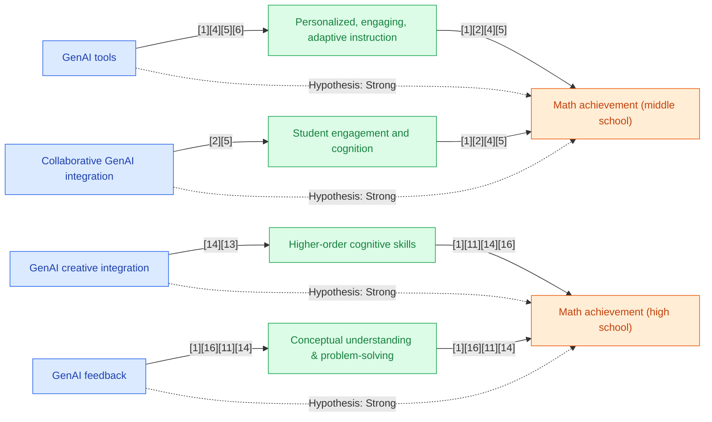

## Section 1 — Research Synthesis

### Overview

Generative Artificial Intelligence (GenAI) tools—software capable of producing outputs such as text, diagrams, feedback, or interactive prompts through advanced algorithms—are transforming mathematics education, especially in middle and high school settings. These tools include adaptive learning platforms, intelligent tutoring systems, LLM-powered feedback agents (such as ChatGPT and Gemini), and domain-specific GenAI applications (e.g., teachable agents, AI drawing tools, problem generators). Their widespread deployment is notable: recent surveys indicate that over 80% of U.S. high school students have utilized GenAI for schoolwork, with sizable majorities employing tools specifically for math assignments [10]. The rapid increase in capability and accessibility of GenAI has prompted extensive empirical investigation into its efficacy—defined across various outcome domains (grades, standardized test scores, conceptual understanding, problem-solving ability)—relative to traditional or non-GenAI approaches.

The evidence base reviewed here synthesizes comparative studies, quasi-experiments, and, crucially, multiple high-quality meta-analyses published 2024–2026. These works cover K-12, with explicit findings for both middle and high school students, and investigate a diversity of GenAI interventions. This synthesis details core tool types, their instructional mechanisms, summarized impacts by outcome, observed moderators of effectiveness, current research limitations, key recommendations, and overall confidence in the findings.

### Intervention Types and Mechanisms

The reviewed literature documents a broad range of GenAI tools and instructional strategies tested in grades 6–12:

**Middle School (Grades 6–8):**

- **AI Drawing/Visualization Tools (e.g., AutoDraw):** These platforms utilize GenAI to convert user sketches into accurate, mathematically relevant diagrams, supporting geometry and spatial reasoning tasks. In controlled trials, experimental groups using such AI-enhanced visuals showed improved post-test achievement compared to controls [6].
- **Adaptive Learning Platforms (e.g., IXL):** These AI-driven environments personalize math practice, recommending problems and providing adaptive feedback based on real-time assessment of student performance. Studies observe positive correlations between platform use and standardized test gains (e.g., NWEA MAP) [8].
- **AI-Powered Teachable Agents (e.g., ALTER-Math):** Here, students “teach” the GenAI agent, leveraging the learning-by-teaching paradigm. The agent can dynamically generate explanations, questions, and feedback, promoting conceptual understanding and meta-cognitive skills [9].
- **General-Purpose GenAI Tutors (e.g., ChatGPT-based question-answering):** Where trialed, students use LLMs to seek explanations, scaffolded problem-solving, or personalized hints.

**High School (Grades 9–12):**

- **Large Language Model (LLM) Chatbots (ChatGPT, Gemini, etc.):** Employed for stepwise problem-solving, instant explanations, mathematical writing, and generation of personalized practice sets [11, 5].
- **Collaborative GenAI Tasks:** Students engage with GenAI to co-create solutions, explanations, or even new mathematical problems, emphasizing creative transformation and higher-order reasoning [1, 2, 3].
- **Personalized GenAI Feedback Tools:** These platforms use AI to mark practice problems, suggest next steps, and generate targeted hints, often in adaptive learning systems or as supplementary GenAI agents embedded in curricular software [4].
- **Hybrid Human-AI Instruction:** Many studies design GenAI integration to supplement, not replace, teacher instruction—leveraging AI’s strengths in feedback and adaptation while recognizing the irreplaceable role of teacher scaffolding [3, 4].

**Targeted Outcomes:** Across interventions, the principal outcomes measured include academic achievement (classroom grades, standardized math test scores), conceptual understanding, problem-solving abilities, engagement/attitude, and—less frequently—long-term retention or transfer.

### Evidence on Effectiveness

#### Meta-Analytic and Experimental Evidence

**Middle School:**

- A controlled experiment with sixth-grade students (AutoDraw vs. traditional instruction) found the GenAI group’s mean math achievement score improved from 17.34 to 18.51 (pre-post), significantly outpacing the control group (t = -2.39, p < 0.05) [6].
- Quasi-experimental analyses of the IXL adaptive platform in Arkansas middle schools identified a clear positive correlation between consistent GenAI use and NWEA MAP math score growth, though with a plateauing effect—higher use did not always yield further gains [8].
- A design-based study with a GenAI-powered teachable agent (n=320, grades 6–8) demonstrated increased engagement and conceptual understanding among students using the system [9].

**High School:**

- Multiple meta-analyses—each synthesizing between 19 and 49 studies from 2023–2025—report moderate to large positive effects of GenAI interventions on mathematics achievement in K-12 (including disaggregated high school samples), with effect sizes ranging from g = 0.534 (overall, mathematics; 22 studies, 46 samples, n=5,232) to 0.857 (achievement; 49 studies) [1, 2, 3, 4].
- In mathematics, the benefit was particularly pronounced for higher-order cognitive skills (g = 0.718) and creative/collaborative integration modes (g = 1.164), and strongest in geometry content (g = 0.906) [2, 3]. 
- A quasi-experimental study involving high school/early postsecondary students compared GenAI-supported instruction to a control group, finding significantly greater mean gain in the GenAI group (14.73 point increase vs. 12.33; statistical details not reported)—suggesting substantive achievement benefits [5].

**Cross-Level Findings:**

- Effects on non-cognitive outcomes (motivation, anxiety) were positive but with smaller (or statistically non-significant) effect sizes; e.g., g = 0.299, p = 0.052 for motivation/anxiety in Zeng et al. [2].
- Evidence consistently reveals that teacher-supported GenAI interventions yield much larger gains: Hedges’ g = 1.426 with teacher scaffolding vs. g = 0.077 without, per Gu & Yan [4].

There is notable consistency among the major meta-analyses regarding direction of effect and size, with all reporting moderate to strong benefits for mathematically focused GenAI integration in both middle and high school populations.

### Demographic and Contextual Moderators

**Teacher/Instructional Support:** The most powerful moderator identified is the degree of teacher involvement during GenAI use. Interventions supplemented by teacher explanation, oversight, or collaborative structures yielded much greater achievement gains than student-only, unsupported uses [4, 8]. Professional scaffolding not only magnified learning but also mitigated risks such as over-reliance or shallow engagement [3, 8].

**Intervention Mode:** Creative/collaborative integration (students generating problems or explanations with GenAI) showed the largest effects, particularly for higher-order cognitive domains. Individual drill/practice modes had smaller, but still significant, effects [2, 3].

**Content Area:** Geometry saw the most pronounced gains (g = 0.906), possibly due to the strong fit between GenAI’s visualization/generation capabilities and geometric reasoning tasks [2].

**Sample/Class Size:** Larger effect sizes were found in research with smaller groups, suggesting that implementation scale may moderate observed impact, though more large-scale, high-fidelity deployments are needed for confirmation [2].

**Intervention Duration:** Meta-analytic findings did not identify a consistent effect of intervention duration on effectiveness, though motivational gains may diminish with extended exposure [2, 3].

**Other Moderators:** Subgroup analyses by SES, race/ethnicity, ELL status, or disability were largely absent from recent studies. Surveys and reviews suggest possible equity risks but acknowledge insufficient disaggregated outcome data [1, 3, 10].

### Limitations and Research Gaps

The current evidence base is robust in use of meta-analysis and experimental designs but does have salient limitations:

- **Subgroup Data Absence:** There is little outcome reporting disaggregated by race, SES, ELL status, or disability, limiting inference on GenAI’s equity impacts.
- **Short Intervention Durations:** Most evaluated interventions were of limited duration (weeks/months). Longer-term effects on retention, transfer, or student autonomy are not well-documented.
- **Generalizability:** Certain studies have modest samples, are context-specific, or use convenience samples (e.g., n=47 in the quasi-experiment by Al Harthy et al. [5]).
- **Population Aggregation:** Some meta-analyses combine K-12 and higher education data, though high school findings are typically disaggregated.
- **Outcome Narrowness:** Motivation/engagement are reported less consistently, and there is limited research on affective, behavioral, and process outcomes.
- **Risks/Harms:** While some reviews address over-reliance and critical thinking erosion as risks, empirical data quantifying these outcomes is limited.
- **Policy/Implementation:** Large variation in fidelity, teacher training, and technological context complicate clear causal attribution in naturalistic settings.

### Recommendations and Future Directions

- **Maximize Teacher Support:** Embedding GenAI in teacher-guided practice—rather than in autonomous student-only tasks—yields the strongest effects and best guards against disengagement or misuse [3, 4, 8].
- **Iterative, Collaborative Models:** Encourage integration modes that promote collaborative reasoning, creative problem generation, or active exploration rather than rote practice.
- **Target Understudied Populations:** Urgently pursue research disaggregated by poverty, race/ethnicity, ELL status, and disability to understand and close equity gaps.
- **Invest in Professional Development:** Teacher literacy in GenAI tools and strategies is critical; invest in systematic training and resource development.
- **Track Long-Term Outcomes:** Future studies should examine durable impacts on math achievement, critical thinking, and learner autonomy after extended GenAI use.
- **Integrate Ethical Safeguards:** Monitor for negative impacts such as academic dishonesty or technology dependence, and develop clear policies for ethical/classroom use.

### Overall Evidence Confidence

The evidence for GenAI effectiveness in supporting mathematics achievement among middle and high school students is mature and robust. Multiple recent meta-analyses, each synthesizing dozens of comparative studies, provide consistent, moderate-to-large effect sizes for both population segments and across a variety of math outcomes. While some methodological limits (e.g., unreported subgroups, short durations) persist, the convergence and scale of findings warrant a high degree of confidence, pending further research into equity and long-term transfer effects.

---

## Section 2 — Causality Diagram

---

## Section 3 — Sources

[1] [Ying Dong – Generative AI technologies and educational outcomes](https://www.nature.com/articles/s41599-026-06903-y)  
**Quality:** 🔵 Blue – Systematic review/meta-analysis, high credibility, includes K-12/high school populations, peer-reviewed, addresses comparative outcomes, international and U.S. representative.  
**Impact:** 🔵 Blue – Meta-analytic evidence of medium to large impact on academic achievement and higher-order skills.

[2] [Liu, Zhang, & Wang – Can Generative Artificial Intelligence Effectively Enhance Students’ Mathematics Learning Outcomes? A Meta-Analysis](https://www.mdpi.com/2227-7102/16/1/140)  
**Quality:** 🔵 Blue – Pre-registered meta-analysis, K-12 mathematics, multiple subdomains, robust methodology, peer-reviewed.  
**Impact:** 🔵 Blue – Moderate-to-large effect sizes (g = 0.534 for overall math achievement, g = 0.718 for higher-order), broad sample.

[3] [Zeng, Meng, et al. – Can Generative Artificial Intelligence Effectively Enhance Students' Mathematics Learning Outcomes-A Meta-Analysis...](https://www.researchgate.net/publication/399851714_Can_Generative_Artificial_Intelligence_Effectively_Enhance_Students'_Mathematics_Learning_Outcomes-A_Meta-Analysis_of_Empirical_Studies_from_2023_to_2025)  
**Quality:** 🔵 Blue – Focused meta-analysis on math achievement, multiple contexts and moderator analyses, K-12, large sample.  
**Impact:** 🔵 Blue – Effect sizes in moderate to large range (g = 0.534–1.164 depending on domain/mode).

[4] [Gu & Yan – Effects of GenAI Interventions on Student Academic Performance: A Meta-Analysis](https://iagen.unam.mx/recursos/Effects%20of%20GenAI%20Interventions%20on%20Student%20Academic%20Performance-%20A%20Meta-Analysis.pdf)  
**Quality:** 🔵 Blue – Meta-analysis of 19 studies, explicit moderator analysis, peer-reviewed, international.  
**Impact:** 🔵 Blue – Large effect size where teacher support present (g = 1.426), general positive achievement impact.

[5] [Al Harthy, A Said, A El Saadany – The effect of generative AI tools... on students’ academic achievement and motivation](https://www.jotse.org/index.php/jotse/article/view/3410/1009)  
**Quality:** 🟢 Green – Quasi-experimental, high school/early college, direct comparative design, peer-reviewed.  
**Impact:** 🟢 Green – Positive, statistically significant achievement effects, small sample.

[6] [Anonymous (2024) – Exploring the Impact of AI on Middle School Mathematics Achievement](https://bhu.ac.in/Images/files/10_(5).pdf)  
**Quality:** 🟢 Green – Controlled experiment, peer-reviewed, explicit measurement (grade 6), standard outcome (pre/post test).  
**Impact:** 🟢 Green – Statistically significant outcome (t = -2.39, p < 0.05).

[7] [Guest Jr., M. – Exploring The Use of Artificial Intelligence as an Instructional Learning Tool in Middle School Mathematics](https://arch.astate.edu/cgi/viewcontent.cgi?article=1001&context=all-etd)  
**Quality:** 🟡 Yellow – Quasi-experimental, correlational, school-based, peer-reviewed, some moderator analysis; lacks true experimental control.  
**Impact:** 🟢 Green – Positive correlation between GenAI use and math score growth.

[8] [Xing et al. – Development of a Generative AI‐Powered Teachable Agent for Middle School Mathematics Learning](http://dx.doi.org/10.1111/bjet.13586)  
**Quality:** 🟢 Green – Iterative classroom intervention, direct outcome measurement, engagement and conceptual understanding.  
**Impact:** 🟢 Green – Reported positive improvements; no effect size reported.

[9] [Anonymous (2025/2026) – Effects of Generative Artificial Intelligence on K-12 and Higher Education Students’ Learning Outcomes: A Meta-analysis](https://discovery.researcher.life/article/effects-of-generative-artificial-intelligence-on-k-12-and-higher-education-students-learning-outcomes-a-meta-analysis/a9bdf1ea7e30336981f4b6a49814b01c)  
**Quality:** 🔵 Blue – Meta-analysis, large sample (49 studies), broad discipline and subgroup analysis.  
**Impact:** 🔵 Blue – Achievement effect size 0.857 and motivation 0.803 (substantial impact).

[10] [College Board – New Research: Majority of High School Students Use Generative AI for Schoolwork](https://newsroom.collegeboard.org/new-research-majority-high-school-students-use-generative-ai-schoolwork)  
**Quality:** 🟡 Yellow – National survey, credible organization, representative sample, but not an experimental/intervention study.  
**Impact:** — (Descriptive usage only, no achievement data.)

### Body of Evidence Maturity: MATURE 🔵
**Justification:** Multiple recent meta-analyses and comparative studies provide convergent, high-quality evidence for the positive impact of GenAI on mathematics achievement in secondary education. Some gaps remain in equity and subgroup analysis but core outcome findings are strong and well-replicated.

---

## Section 4 — Data Extraction Table

| Title | Year | Study Design | Population | Outcome | Finding Direction | Effect Size | Confidence Interval | Std. Deviation | Study Size |
|-------|------|-------------|------------|---------|-------------------|-------------|---------------------|----------------|------------|
| Liu, Zhang, & Wang – Can Generative Artificial Intelligence Effectively Enhance Students’ Mathematics Learning Outcomes? A Meta-Analysis | 2026 | Meta-analysis (RCT & QED) | Middle & High School (K-12, includes both) | Math achievement (various: grades, cognitive, problem-solving) | Positive | g = 0.534 (overall); g = 0.718 (higher-order); g = 1.164 (creative); g = 0.906 (geometry) | — | — | 22 studies, 46 samples, n=5,232 |
| Gu & Yan – Effects of GenAI Interventions on Student Academic Performance: A Meta-Analysis | 2025 | Meta-analysis | K-12 & Higher Ed (includes Middle & High School) | Academic achievement (math included), moderator analysis | Positive | g = 0.683 (overall); g = 1.426 (with teacher support); g = 0.077 (no support) | — | — | 19 studies, 24 effect sizes |
| (Anonymous) – Effects of Generative Artificial Intelligence on K-12 and Higher Education Students’ Learning Outcomes: A Meta-analysis | 2025/2026 | Meta-analysis | K-12 & Higher Ed (includes Middle & High School) | Learning achievement, motivation, math outcomes | Positive | 0.857 (achievement); 0.803 (motivation); g = 0.58 (AI feedback) | — | — | 49 studies |
| Ying Dong – Generative AI technologies and educational outcomes | 2026 | Systematic review / Meta-analysis | K-12 & Higher Ed (includes High School) | Educational outcomes (achievement, higher-order skills) | Positive | — | — | — | Multiple studies (meta-analytic scope) |
| Zeng, Meng, et al. – Can Generative Artificial Intelligence Effectively Enhance Students' Mathematics Learning Outcomes-A Meta-Analysis... | 2025 | Meta-analysis | K-12 & High School | Math achievement (grades, cognitive, problem-solving) | Positive | g = 0.534 (overall); g = 0.718 (higher-order); g = 1.164 (creative) | — | — | 22 studies, 46 samples, n=5,232 |
| Anonymous (2024) – Exploring the Impact of AI on Middle School Mathematics Achievement | 2024 | Experimental (control group) | Middle School (Grade 6) | Math achievement (pre/post test scores) | Positive | t = -2.39, p < 0.05 (no g reported) | — | — | Not stated (experimental & control) |
| Guest Jr., M. – Exploring The Use of Artificial Intelligence as an Instructional Learning Tool in Middle School Mathematics | 2024 | Quasi-experimental (causal-comparative) | Middle School | Math achievement (NWEA MAP) | Positive | Not reported (positive correlation) | — | — | Not specified (Arkansas middle schools) |
| Xing et al. – Development of a Generative AI‐Powered Teachable Agent for Middle School Mathematics Learning | 2025 | Design-Based Research (iterative classroom studies) | Middle School (Grades 6–8) | Conceptual understanding, engagement | Positive | Not reported (improvements stated) | — | — | n = 320 |
| Al Harthy, A Said, A El Saadany – The effect of generative AI tools... on students’ academic achievement and motivation | 2025 | Quasi-experimental | High School/Early College | Academic achievement (pre/post test) | Positive | Not explicitly stated (mean gain: 14.73 vs 12.33) | — | — | n = 47 |
| College Board – New Research: Majority of High School Students Use Generative AI for Schoolwork | 2025 | National Survey | High School (US) | GenAI use prevalence (not outcomes) | — | — | — | — | N not specified |